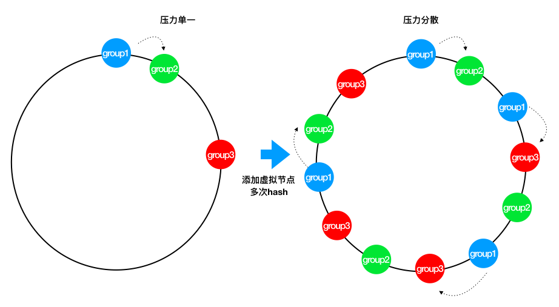
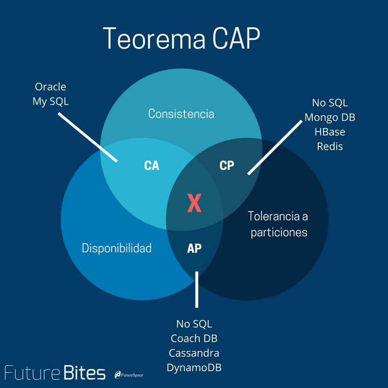

## Paxos算法

```text

1. Proposal提案，即分布式系统的修改请求，可以表示为[提案编号N，提案内容value]

2. Client用户，类似社会民众，负责提出建议

3. Propser议员，类似基层人大代表，负责帮Client上交提案

4. Acceptor投票者，类似全国人大代表，负责为提案投票，不同意比自己以前接收过的提案编号要小的提案，其他提案都同意，例如A以前给N号提案表决过，那么再收到小于等于N号的提案时就直接拒绝了

5. Learner提案接受者，类似记录被通过提案的记录员，负责记录提案

```

### Basic Paxos算法

```text

1. Propser准备一个N号提案

2. Propser询问Acceptor中的多数派是否接收过N号的提案，如果都没有进入下一步，否则本提案不被考虑

3. Acceptor开始表决，Acceptor无条件同意从未接收过的N号提案，达到多数派同意后，进入下一步

4. Learner记录提案

```

节点故障：

1. 若Proposer故障，没关系，再从集群中选出Proposer即可

2. 若Acceptor故障，表决时能达到多数派也没问题

潜在问题-活锁：
假设系统有多个Proposer，他们不断向Acceptor发出提案，还没等到上一个提案达到多数派下一个提案又来了，就会导致Acceptor放弃当前提案转向处理下一个提案，于是所有提案都别想通过了。


### Multi Paxos算法


**据Basic Paxos的改进：整个系统只有一个Proposer，称之为Leader**

```text

1. 若集群中没有Leader，则在集群中选出一个节点并声明它为第M任Leader。

2. 集群的Acceptor只表决最新的Leader发出的最新的提案

3. 其他步骤和Basic Paxos相同


```

算法优化

Multi Paxos角色过多，对于计算机集群而言，可以将Proposer、Acceptor和Learner三者身份集中在一个节点上，此时只需要从集群中选出Proposer，其他节点都是Acceptor和Learner，这就是接下来要讨论的Raft算法


### Raft算法

说明：Paxos算法不容易实现，Raft算法是对Paxos算法的简化和改进
概念介绍

```text

1. Leader总统节点，负责发出提案

2. Follower追随者节点，负责同意Leader发出的提案

3. Candidate候选人，负责争夺Leader

```


步骤：Raft算法将一致性问题分解为两个的子问题，**Leader选举** 和 **状态复制**

#### Leader选举
1. 每个Follower都持有一个定时器
2. 当定时器时间到了而集群中仍然没有Leader，Follower将声明自己是Candidate并参与Leader选举，同时将消息发给其他节点来争取他们的投票，若其他节点长时间没有响应Candidate将重新发送选举信息
3. 集群中其他节点将给Candidate投票
4. 获得多数派支持的Candidate将成为第M任Leader（M任是最新的任期）
5. 在任期内的Leader会不断发送心跳给其他节点证明自己还活着，其他节点受到心跳以后就清空自己的计时器并回复Leader的心跳。这个机制保证其他节点不会在Leader任期内参加Leader选举。
6. 当Leader节点出现故障而导致Leader失联，没有接收到心跳的Follower节点将准备成为Candidate进入下一轮Leader选举
7. 若出现两个Candidate同时选举并获得了相同的票数，那么这两个Candidate将随机推迟一段时间后再向其他节点发出投票请求，这保证了再次发送投票请求以后不冲突

#### 状态复制
1. Leader负责接收来自Client的提案请求
2. 提案内容将包含在Leader发出的下一个心跳中
3. Follower接收到心跳以后回复Leader的心跳
4. Leader接收到多数派Follower的回复以后确认提案并写入自己的存储空间中并回复Client
5. Leader通知Follower节点确认提案并写入自己的存储空间，随后所有的节点都拥有相同的数据
6. 若集群中出现网络异常，导致集群被分割，将出现多个Leader
7. 被分割出的非多数派集群将无法达到共识，即脑裂，如图中的A、B节点将无法确认提案
8. 当集群再次连通时，将只听从最新任期Leader的指挥，旧Leader将退化为Follower，如图中B节点的Leader（任期1）需要听从D节点的Leader（任期2）的指挥，此时集群重新达到一致性状态

### ZAB算法

说明：ZAB也是对Multi Paxos算法的改进，大部分和raft相同

和raft算法的主要区别：

```text
1. 对于Leader的任期，raft叫做term，而ZAB叫做epoch
2. 在状态复制的过程中，raft的心跳从Leader向Follower发送，而ZAB则相反。
```

### Gossip算法
说明：Gossip算法每个节点都是对等的，即没有角色之分。
Gossip算法中的每个节点都会将数据改动告诉其他节点（类似传八卦）。有话说得好："最多通过六个人你就能认识全世界任何一个陌生人"，因此数据改动的消息很快就会传遍整个集群。

```text
1. 集群启动,设置多个节点
2. 某节点收到数据改动，并将改动传播给其他4个节点(base 4)
3. 收到数据改动的节点重复上面的过程直到所有的节点都被感染
```


### 一致性哈希算法 Consistent Hashing

```text
一致哈希 是一种特殊的哈希算法。

在使用一致哈希算法后，哈希表槽位数（大小）的改变平均只需要对 K/n 个关键字重新映射，

其中K是关键字的数量， n是槽位数量。

然而在传统的哈希表中，添加或删除一个槽位的几乎需要对所有关键字进行重新映射。
```




### CAP

```text
CAP理论：

一个分布式系统最多只能同时满足一致性（Consistency）、

可用性（Availability）和

分区容错性（Partition tolerance）这三项中的两项。

```


### BASE

BASE是指

```text

基本可用（Basically Available）、

软状态（ Soft State）、

最终一致性（ Eventual Consistency）。
```

ACID，是指数据库管理系统（DBMS）在写入或更新资料的过程中，为保证事务（transaction）是正确可靠的，所必须具备的四个特性：原子性（atomicity，或称不可分割性）、一致性（consistency）、隔离性（isolation，又称独立性）、持久性（durability）。