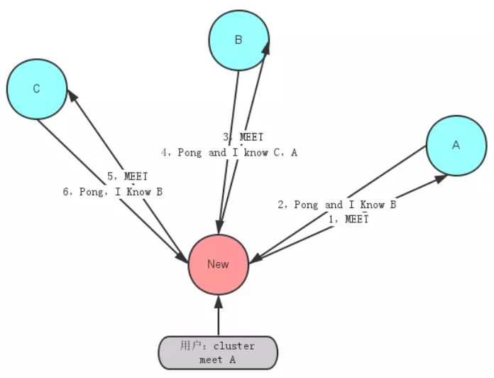

##### Redis 是如何判断数据是否过期的呢

Redis 通过一个叫做过期字典（可以看作是 hash 表）来保存数据过期的时间。过期字典的键指向 Redis 数据库中的某个 key(键)，过期字典的值是一个 long long 类型的整数，这个整数保存了 key 所指向的数据库键的过期时间（毫秒精度的 UNIX 时间戳）。

过期字典是存储在 redisDb 这个结构里的：

```c++
typedef struct redisDb {
    ...

    dict *dict;     //数据库键空间,保存着数据库中所有键值对
    dict *expires   // 过期字典,保存着键的过期时间
    ...
} redisDb;
```


##### 过期的数据的删除策略

惰性删除 ：只会在取出 key 的时候才对数据进行过期检查。这样对 CPU 最友好，但是可能会造成太多过期 key 没有被删除。
定期删除 ： 每隔一段时间抽取一批 key 执行删除过期 key 操作。并且，Redis 底层会通过限制删除操作执行的时长和频率来减少删除操作对 CPU 时间的影响。
定期删除对内存更加友好，惰性删除对 CPU 更加友好。两者各有千秋，所以 Redis 采用的是 定期删除+惰性/懒汉式删除 。

但是，仅仅通过给 key 设置过期时间还是有问题的。因为还是可能存在定期删除和惰性删除漏掉了很多过期 key 的情况。这样就导致大量过期 key 堆积在内存里，然后就 Out of memory 了。

怎么解决这个问题呢？答案就是： **Redis 内存淘汰机制**。


##### Redis 内存淘汰机制

6 种数据淘汰策略

```text
1. volatile-lru（least recently used）：从已设置过期时间的数据集（server.db[i].expires）中挑选最近最少使用的数据淘汰

2. volatile-ttl：从已设置过期时间的数据集（server.db[i].expires）中挑选将要过期的数据淘汰

3. volatile-random：从已设置过期时间的数据集（server.db[i].expires）中任意选择数据淘汰

4. allkeys-lru（least recently used）：当内存不足以容纳新写入数据时，在键空间中，移除最近最少使用的 key（这个是最常用的）

5. allkeys-random：从数据集（server.db[i].dict）中任意选择数据淘汰

6. no-eviction：禁止驱逐数据，也就是说当内存不足以容纳新写入数据时，新写入操作会报错

4.0 版本后增加以下两种：

7. volatile-lfu（least frequently used）：从已设置过期时间的数据集(server.db[i].expires)中挑选最不经常使用的数据淘汰
8. allkeys-lfu（least frequently used）：当内存不足以容纳新写入数据时，在键空间中，移除最不经常使用的 key


```


##### Redis 持久化机制(怎么保证 Redis 挂掉之后再重启数据可以进行恢复)

###### 快照（snapshotting）持久化（RDB）

Redis 可以通过创建快照来获得存储在内存里面的数据在某个时间点上的副本。Redis 创建快照之后，可以对快照进行备份，可以将快照复制到其他服务器从而创建具有相同数据的服务器副本（Redis 主从结构，主要用来提高 Redis 性能），还可以将快照留在原地以便重启服务器的时候使用。

快照持久化是 Redis 默认采用的持久化方式，在 Redis.conf 配置文件中默认有此下配置：

```text

save 900 1           #在900秒(15分钟)之后，如果至少有1个key发生变化，Redis就会自动触发BGSAVE命令创建快照。

save 300 10          #在300秒(5分钟)之后，如果至少有10个key发生变化，Redis就会自动触发BGSAVE命令创建快照。

save 60 10000        #在60秒(1分钟)之后，如果至少有10000个key发生变化，Redis就会自动触发BGSAVE命令创建快照。
```


###### AOF（append-only file）持久化

与快照持久化相比，AOF 持久化 的实时性更好，因此已成为主流的持久化方案。默认情况下 Redis 没有开启 AOF（append only file）方式的持久化，可以通过 appendonly 参数开启：

appendonly yes
开启 AOF 持久化后每执行一条会更改 Redis 中的数据的命令，Redis 就会将该命令写入硬盘中的 AOF 文件。AOF 文件的保存位置和 RDB 文件的位置相同，都是通过 dir 参数设置的，默认的文件名是 appendonly.aof。

在 Redis 的配置文件中存在三种不同的 AOF 持久化方式，它们分别是：
```text

appendfsync always    #每次有数据修改发生时都会写入AOF文件,这样会严重降低Redis的速度
appendfsync everysec  #每秒钟同步一次，显示地将多个写命令同步到硬盘
appendfsync no        #让操作系统决定何时进行同步
```

为了兼顾数据和写入性能，用户可以考虑 appendfsync everysec 选项 ，让 Redis 每秒同步一次 AOF 文件，Redis 性能几乎没受到任何影响。而且这样即使出现系统崩溃，用户最多只会丢失一秒之内产生的数据。当硬盘忙于执行写入操作的时候，Redis 还会优雅的放慢自己的速度以便适应硬盘的最大写入速度。


##### AOF 重写

AOF 重写可以产生一个新的 AOF 文件，这个新的 AOF 文件和原有的 AOF 文件所保存的数据库状态一样，但体积更小。

AOF 重写是一个有歧义的名字，该功能是通过读取数据库中的键值对来实现的，程序无须对现有 AOF 文件进行任何读入、分析或者写入操作。

在执行 BGREWRITEAOF 命令时，Redis 服务器会维护一个 AOF 重写缓冲区，该缓冲区会在子进程创建新 AOF 文件期间，记录服务器执行的所有写命令。当子进程完成创建新 AOF 文件的工作之后，服务器会将重写缓冲区中的所有内容追加到新 AOF 文件的末尾，使得新旧两个 AOF 文件所保存的数据库状态一致。最后，服务器用新的 AOF 文件替换旧的 AOF 文件，以此来完成 AOF 文件重写操作


##### 不支持 rollback

Redis 是不支持 roll back 的，因而不满足原子性的（而且不满足持久性）。

Redis 官网也解释了自己为啥不支持回滚。简单来说就是 Redis 开发者们觉得没必要支持回滚，这样更简单便捷并且性能更好。Redis 开发者觉得即使命令执行错误也应该在开发过程中就被发现而不是生产过程中。


##### 创建快照的办法有如下几种：

```text

1. BGSAVE命令： 客户端向Redis发送 BGSAVE命令 来创建一个快照。对于支持BGSAVE命令的平台来说（基本上所有平台支持，除了Windows平台），Redis会调用fork来创建一个子进程，然后子进程负责将快照写入硬盘，而父进程则继续处理命令请求。

2. SAVE命令： 客户端还可以向Redis发送 SAVE命令 来创建一个快照，接到SAVE命令的Redis服务器在快照创建完毕之前不会再响应任何其他命令。SAVE命令不常用，我们通常只会在没有足够内存去执行BGSAVE命令的情况下，又或者即使等待持久化操作执行完毕也无所谓的情况下，才会使用这个命令。

3. save选项： 如果用户设置了save选项（一般会默认设置），比如 save 60 10000，那么从Redis最近一次创建快照之后开始算起，当“60秒之内有10000次写入”这个条件被满足时，Redis就会自动触发BGSAVE命令。

4. SHUTDOWN命令： 当Redis通过SHUTDOWN命令接收到关闭服务器的请求时，或者接收到标准TERM信号时，会执行一个SAVE命令，阻塞所有客户端，不再执行客户端发送的任何命令，并在SAVE命令执行完毕之后关闭服务器。

5. 一个Redis服务器连接到另一个Redis服务器： 当一个Redis服务器连接到另一个Redis服务器，并向对方发送SYNC命令来开始一次复制操作的时候，如果主服务器目前没有执行BGSAVE操作，或者主服务器并非刚刚执行完BGSAVE操作，那么主服务器就会执行BGSAVE命令
```


##### 重写/压缩AOF
AOF虽然在某个角度可以将数据丢失降低到最小而且对性能影响也很小，但是极端的情况下，体积不断增大的AOF文件很可能会用完硬盘空间。另外，如果AOF体积过大，那么还原操作执行时间就可能会非常长。

为了解决AOF体积过大的问题，用户可以向Redis发送 BGREWRITEAOF命令 ，这个命令会通过移除AOF文件中的冗余命令来重写（rewrite）AOF文件来减小AOF文件的体积。BGREWRITEAOF命令和BGSAVE创建快照原理十分相似，所以AOF文件重写也需要用到子进程，这样会导致性能问题和内存占用问题，和快照持久化一样。更糟糕的是，如果不加以控制的话，AOF文件的体积可能会比快照文件大好几倍。

## Redis 数据类型及编码

### String类型的内部编码情况
字符串是 Redis最基本的数据类型，Redis 中字符串对象的编码可以是 int，raw 或者 embstr 中的某一种，分别介绍如下：
```
1. int 编码：保存long 型的64位有符号整数
2. embstr 编码：保存长度小于44字节的字符串
3. raw 编码：保存长度大于44字节的字符串
```

Redis 是使用 SDS（“简单动态字符串”）这个结构体来存储字符串，代码里定义了 5种 SDS结构体：

```c++

struct __attribute__ ((__packed__)) sdshdr5 {
    unsigned char flags; /* 3 lsb of type, and 5 msb of string length */
    char buf[];
};
struct __attribute__ ((__packed__)) sdshdr8 {
    uint8_t len; /* used */
    uint8_t alloc; /* excluding the header and null terminator */
    unsigned char flags; /* 3 lsb of type, 5 unused bits */
    char buf[];
};
struct __attribute__ ((__packed__)) sdshdr16 {
    uint16_t len; /* used */
    uint16_t alloc; /* excluding the header and null terminator */
    unsigned char flags; /* 3 lsb of type, 5 unused bits */
    char buf[];
};
struct __attribute__ ((__packed__)) sdshdr32 {
    uint32_t len; /* used */
    uint32_t alloc; /* excluding the header and null terminator */
    unsigned char flags; /* 3 lsb of type, 5 unused bits */
    char buf[];
};
struct __attribute__ ((__packed__)) sdshdr64 {
    uint64_t len; /* used */
    uint64_t alloc; /* excluding the header and null terminator */
    unsigned char flags; /* 3 lsb of type, 5 unused bits */
    char buf[];
};


```

#### INT 编码格式
字符串键值的内容可以用一个 64位有符号整形 来表示时，Redis会将键值转化为 long型来进行存储，此时即对应 OBJ_ENCODING_INT 编码类型

Redis 启动时会预先建立 10000 个分别存储 0~9999 的 redisObject 变量作为共享对象，这就意味着如果 set字符串的键值在 0~10000 之间的话，则可以 直接指向共享对象 而不需要再建立新对象，此时键值不占空间！

#### EMBSTR编码格式
Redis 在保存长度小于 44 字节的字符串时会采用 OBJ_ENCODING_EMBSTR 编码方式

EMBSTR 顾名思义即：embedded string，表示嵌入式的String。从内存结构上来讲 即字符串 sds结构体与其对应的 redisObject 对象分配在 **同一块连续的内存空间**，这就仿佛字符串 sds 嵌入在 redisObject 对象之中


#### RAW 编码格式

当字符串的键值为长度大于 44 的 超长字符串 时，Redis 则会将键值的内部编码方式改为 OBJ_ENCODING_RAW 格式，这与上面的 OBJ_ENCODING_EMBSTR 编码方式的不同之处在于 此时动态字符串 sds 的内存与其依赖的 redisObject 的 **内存不再连续** 


基于redis 5.0.5）来分析下
在redis中，的每个键值内部都是使用一个名字叫做 redisObject 这个 C语言结构体保存的

```c++
typedef struct redisObject {
    unsigned type:4;
    unsigned encoding:4;
    unsigned lru:LRU_BITS; /* LRU time (relative to global lru_clock) or
                            * LFU data (least significant 8 bits frequency
                            * and most significant 16 bits access time). */
    int refcount;
    void *ptr;
} robj

```

type：表示键值的数据类型，包括 String、List、Set、ZSet、Hash
refcount：表示该键值被引用的数量，即一个键值可被多个键引用
encoding：表示键值的内部编码方式，从 Redis源码看目前取值有如下几种：

```c++
/* Objects encoding. Some kind of objects like Strings and Hashes can be
 * internally represented in multiple ways. The 'encoding' field of the object
 * is set to one of this fields for this object. */
#define OBJ_ENCODING_RAW 0     /* Raw representation */
#define OBJ_ENCODING_INT 1     /* Encoded as integer */
#define OBJ_ENCODING_HT 2      /* Encoded as hash table */
#define OBJ_ENCODING_ZIPMAP 3  /* Encoded as zipmap */
#define OBJ_ENCODING_LINKEDLIST 4 /* No longer used: old list encoding. */
#define OBJ_ENCODING_ZIPLIST 5 /* Encoded as ziplist */
#define OBJ_ENCODING_INTSET 6  /* Encoded as intset */
#define OBJ_ENCODING_SKIPLIST 7  /* Encoded as skiplist */
#define OBJ_ENCODING_EMBSTR 8  /* Embedded sds string encoding */
#define OBJ_ENCODING_QUICKLIST 9 /* Encoded as linked list of ziplists */
#define OBJ_ENCODING_STREAM 10 /* Encoded as a radix tree of listpacks */
```

### list类型的内部编码情况
1、使用压缩列表（ziplist）实现的列表对象
2、使用双端链表（quicklist）实现的列表对象

 ziplist 与 quicklist 之间存在着一种编码转换机制，当列表对象可以同时满足下列两个条件时
 列表对象采用ziplist编码，否则采用quicklist编码
```text
（1）列表对象保存的所有字符串元素的长度都小于64字节
（2）列表元素保存的元素数量小于512个
```

### hash
1. dict  512<节点数量 && 64<字符长度
2. ziplist  节点数量 < 512 || 字符长度 < 64

### set 
1. intset 整数集合, 元素都为整数且 节点数量 <= 512
2. dict 元素不为整数或者节点数量 > 512

### zset
1. skiplist 跳表，数量>128 || 字符长度 > 64

理想的跳表结构的问题：增删改查 
利用概率解决：一个节点出发，每次插入的时候按概率1/4生成 层级(最多32层)。
按照数学期望来说，理想的跳表结构的时间复杂度趋于 O(logn), 但是概率需要基于大量的数据才能趋于稳定，而这里经过验证，为 128

2. ziplist 否则压缩列表

#### hash 与 zset 谁更占内存？

hash 最差的情况应该是 5n(准备扩容时：有 fork 操作时，服务器正在执行BGSAVE或BGREWRITEAOF命令，并且哈希表负载因子大于等于5)


## 扩容方式

1. Redis 没有fork 操作时(bgsave, bgrewriteaof)，hashtable 负载因子>=1 时 扩容
2. 有 fork 操作时，服务器正在执行BGSAVE或BGREWRITEAOF命令，并且哈希表负载因子大于等于5

区分这两种情况的目的在于，因为执行BGSAVE与BGREWRITEAOF过程中，Redis都需要创建子进程，

而大多数操作系统都采用写时复制技术来优化子进程使用效率，所以在子进程存在期间，

服务器会提高执行扩展操作所需的负载因子，

从而尽可能避免在子进程存在期间进行哈希表扩展操作，这可以避免不必要的内存写入，最大限度的节约空间。

### 缩容
当哈希表负载因子小于0.1时，程序自动开始对哈希表执行收缩操作

### 渐进式rehash

　　Redis中的rehash动作并不是一次性、集中式完成的，而是分多次、渐进式的完成的。

　　这样做的目的是，如果服务器中包含很多键值对，要一次性的将这些键值对全部rehash到ht[1]的话，庞大的计算量可能导致服务器在一段时间内停止服务。

　　为了避免这种影响，Redis采用了渐进式Rehash：

1. 每次增删改查，rehash 1次(数组某个槽位的所有数据)
2. 在 redis 没有 fork 操作的时候，定时执行，每次执行 1ms ，每次执行 100次(数组相邻100个槽位中所有数据)


```text

　　1、为ht[1]分配空间，让字典同时持有ht[0]和ht[1]两个哈希表。

　　2、在字典中维持一个索引计数器变量rehashidx，并将它置为0，表示rehash工作开始。

　　3、在rehash进行期间，每次对字典执行添加、删除、查找或者更新操作时，程序除了执行指定操作以外，还会顺带将ht[0]哈希表在rehashidx索引上的所有键值对rehash到ht[1]中，当rehash工作完成之后，程序将rehashidx属性的值+1。

　　4、随着字典操作的不断进行，最终在某个时间点上，ht[0]的所有键值对都被rehash到ht[1]上，这时将rehashidx属性设为-1，表示rehash完成。

　　渐进式rehash 的好处在于其采取分而治之的方式，将rehash键值对所需要的计算工作均摊到字典的每个添加、删除、查找和更新操作上，从而避免了集中式rehash而带来的庞大计算量。
```

渐进式rehash执行期间的哈希表操作

　　因为在渐进式rehash的过程中，字典会同时使用ht[0]和ht[1]两个哈希表，所以在渐进式rehash进行期间，字典的删除、查找、更新等操作都是在两个表上进行的。

　　例如，查找操作会先在ht[0]上进行，如果没找到再在ht[1]上进行。

　　添加操作的键值对会一律保存到ht[1]中，这一措施保证ht[0]包含的键值对只会减少不会增加。

### BloomFilter 布隆过滤器


### Redis cluster 

Redis Cluster采用虚拟槽分区，所有的key根据哈希函数映射到0~16383槽内，计算公式：

slot = CRC16(key) & 16383

每个节点负责维护一部分槽以及槽所映射的键值对。

Redis虚拟槽分区的特点，解耦数据与节点之间的关系，简化了节点扩容和收缩难度。但其存在如下限制：

1. key批量操作支持有限。只支持具有相同slot值的key执行批量操作。

2. 事务操作支持有限。只支持同一个节点上的多个key的事务操作。

3. key是数据分区的最小粒度，因为不能讲一个大的键值对象，如hash，list等映射到不同的节点上。

4. 不支持多数据库，单机下的Redis可以支持16个数据库，但集群之只能使用一个数据库空间，即db 0。

5. 复制结构只支持一层，从节点只能复制主节点，不支持嵌套树状复制结构。

#### Cluster 故障切换


故障节点变为客观下线后，如果下线节点是持有槽的主节点则需要在它的从节点中选出一个替换它，从而保证集群的高可用。下线主节点的所有从节点承担故障恢复的义务，当从节点通过内部定时任务发现自身复制的主节点进入客观下线时，将会触发故障切换流程。

1.资格检查

每个从节点都要检查最后与主节点断线时间，判断是否有资格替换故障的主节点。如果从节点与主节点断线时间超过cluster-node-time*cluster-slave-validity-factor，则当前从节点不具备故障转移资格。参数cluster-slavevalidity-factor用于从节点的有效因子，默认为10。

2.准备选举时间

当从节点符合故障切换资格后，更新触发切换选举的时间，只有到达该时间后才能执行后续流程。

这里之所以采用延迟触发机制，主要是通过对多个从节点使用不同的延迟选举时间来支持优先级问题。复制偏移量越大说明从节点延迟越低，那么它应该具有更高的优先级来替换故障主节点。

3.发起选举

当从节点定时任务检测到达故障选举时间（failover_auth_time）到达后，发起选举流程如下：

1> 更新配置纪元

2> 广播选举消息

在集群内广播选举消息（FAILOVER_AUTH_REQUEST），并记录已发送过消息的状态，保证该从节点在一个配置纪元内只能发起一次选举。

4.选举投票

只有持有槽的主节点才会处理故障选举消息（FAILOVER_AUTH_REQUEST），因为每个持有槽的节点在一个配置纪元内都有唯一的一张选票，当接到第一个请求投票的从节点消息时回复FAILOVER_AUTH_ACK消息作为投票，之后相同配置纪元内其他从节点的选举消息将忽略。

Redis集群没有直接使用从节点进行领导者选举，主要因为从节点数必须大于等于3个才能保证凑够N/2+1个节点，将导致从节点资源浪费。使用集群内所有持有槽的主节点进行领导者选举，即使只有一个从节点也可以完成选举过程。

5.替换主节点

当从节点收集到足够的选票之后，触发替换主节点操作：

1> 当前从节点取消复制变为主节点。

2> 执行clusterDelSlot操作撤销故障主节点负责的槽，并执行clusterAddSlot把这些槽委派给自己。

3> 向集群广播自己的pong消息，通知集群内所有的节点当前从节点变为主节点并接管了故障主节点的槽信息。


## Redis Gossip Protocol


分散式的元数据模式有多种可选的算法进行元数据的同步，比如说 Paxos、Raft 和 Gossip。Paxos 和 Raft 等都需要全部节点或者大多数节点(超过一半)正常运行，整个集群才能稳定运行，而 Gossip 则不需要半数以上的节点运行。

Gossip 协议又称 epidemic 协议（epidemic protocol），是基于流行病传播方式的节点或者进程之间信息交换的协议，在P2P网络和分布式系统中应用广泛，它的方法论也特别简单：

```text
在一个处于有界网络的集群里，如果每个节点都随机与其他节点交换特定信息，经过足够长的时间后，集群各个节点对该份信息的认知终将收敛到一致。
```

Gossip 协议的最大的好处是，即使集群节点的数量增加，每个节点的负载也不会增加很多，几乎是恒定的.

这就允许 Redis Cluster 或者 Consul 集群管理的节点规模能横向扩展到数千个。

### Redis Gossip 通信机制


Redis Cluster 中的每个节点都维护一份自己视角下的当前整个集群的状态，主要包括：

```text

1. 当前集群状态

2. 集群中各节点所负责的 slots信息，及其migrate状态

3. 集群中各节点的master-slave状态

4. 集群中各节点的存活状态及怀疑Fail状态
```


Redis Cluster 的节点之间会相互发送多种消息，较为重要的如下所示：

```text

MEET：通过「cluster meet ip port」命令，已有集群的节点会向新的节点发送邀请，加入现有集群，然后新节点就会开始与其他节点进行通信；

PING：节点按照配置的时间间隔向集群中其他节点发送 ping 消息，消息中带有自己的状态，还有自己维护的集群元数据，和部分其他节点的元数据；

PONG: 节点用于回应 PING 和 MEET 的消息，结构和 PING 消息类似，也包含自己的状态和其他信息，也可以用于信息广播和更新；

FAIL: 节点 PING 不通某节点后，会向集群所有节点广播该节点挂掉的消息。其他节点收到消息后标记已下线。
```





```text

Gossip算法又被称为反熵（Anti-Entropy），熵是物理学上的一个概念，代表杂乱无章，而反熵就是在杂乱无章中寻求一致.

这充分说明了Gossip的特点：在一个有界网络中，每个节点都随机地与其他节点通信，经过一番杂乱无章的通信，最终所有节点的状态都会达成一致。

每个节点可能知道所有其他节点，也可能仅知道几个邻居节点，只要这些节可以通过网络连通，最终他们的状态都是一致的

```

### Redis Gossip 源码

#### 调度Gossip通信

```c++
/* Run the Redis Cluster cron. */
// 如果服务器运行在集群模式下，那么执行集群操作
run_with_period(100) {
    if (server.cluster_enabled)     clusterCron();
}
```

#### 节点加入集群

```c++
// 为未创建连接的节点创建连接
if (node->link == NULL) {
    // .....
    /* Queue a PING in the new connection ASAP: this is crucial
     * to avoid false positives in failure detection.
     *
     * If the node is flagged as MEET, we send a MEET message instead
     * of a PING one, to force the receiver to add us in its node
     * table. */
    // 向新连接的节点发送 PING 命令，防止节点被识进入下线
    // 如果节点被标记为 MEET ，那么发送 MEET 命令，否则发送 PING 命令
    old_ping_sent = node->ping_sent;
    clusterSendPing(link, node->flags & REDIS_NODE_MEET ?
            CLUSTERMSG_TYPE_MEET : CLUSTERMSG_TYPE_PING);
    // 这不是第一次发送 PING 信息，所以可以还原这个时间
    // 等 clusterSendPing() 函数来更新它
    if (old_ping_sent) {
        /* If there was an active ping before the link was
         * disconnected, we want to restore the ping time, otherwise
         * replaced by the clusterSendPing() call. */
        node->ping_sent = old_ping_sent;
    }
    /* We can clear the flag after the first packet is sent.
     *
     * 在发送 MEET 信息之后，清除节点的 MEET 标识。
     *
     * If we'll never receive a PONG, we'll never send new packets
     * to this node. Instead after the PONG is received and we
     * are no longer in meet/handshake status, we want to send
     * normal PING packets. 
     *
     * 如果当前节点（发送者）没能收到 MEET 信息的回复，
     * 那么它将不再向目标节点发送命令。
     *
     * 如果接收到回复的话，那么节点将不再处于 HANDSHAKE 状态，
     * 并继续向目标节点发送普通 PING 命令。
     */
    node->flags &= ~REDIS_NODE_MEET;
    redisLog(REDIS_DEBUG,"Connecting with Node %.40s at %s:%d",
            node->name, node->ip, node->port+REDIS_CLUSTER_PORT_INCR);
}
```


#### 随机周期性发送PING消息

```c++

/* Ping some random node 1 time every 10 iterations, so that we usually ping
 * one random node every second. */
// clusterCron() 每执行 10 次（至少间隔一秒钟），就向一个随机节点发送 gossip 信息
if (!(iteration % 10)) {
    int j;
    /* Check a few random nodes and ping the one with the oldest
     * pong_received time. */
    // 随机 5 个节点，选出其中一个
    for (j = 0; j < 5; j++) {
        // 随机在集群中挑选节点
        de = dictGetRandomKey(server.cluster->nodes);
        clusterNode *this = dictGetVal(de);
        /* Don't ping nodes disconnected or with a ping currently active. */
        // 不要 PING 连接断开的节点，也不要 PING 最近已经 PING 过的节点
        if (this->link == NULL || this->ping_sent != 0) continue;
        if (this->flags & (REDIS_NODE_MYSELF|REDIS_NODE_HANDSHAKE))
            continue;
        // 选出 5 个随机节点中最近一次接收 PONG 回复距离现在最旧的节点
        if (min_pong_node == NULL || min_pong > this->pong_received) {
            min_pong_node = this;
            min_pong = this->pong_received;
        }
    }
    // 向最久没有收到 PONG 回复的节点发送 PING 命令
    if (min_pong_node) {
        redisLog(REDIS_DEBUG,"Pinging node %.40s", min_pong_node->name);
        clusterSendPing(min_pong_node->link, CLUSTERMSG_TYPE_PING);
    }
}

```

#### 防止节点假超时及状态过期

```c++

/* If we are waiting for the PONG more than half the cluster
 * timeout, reconnect the link: maybe there is a connection
 * issue even if the node is alive. */
// 如果等到 PONG 到达的时间超过了 node timeout 一半的连接
// 因为尽管节点依然正常，但连接可能已经出问题了
if (node->link && /* is connected */
    now - node->link->ctime >
    server.cluster_node_timeout && /* was not already reconnected */
    node->ping_sent && /* we already sent a ping */
    node->pong_received < node->ping_sent && /* still waiting pong */
    /* and we are waiting for the pong more than timeout/2 */
    now - node->ping_sent > server.cluster_node_timeout/2)
{
    /* Disconnect the link, it will be reconnected automatically. */
    // 释放连接，下次 clusterCron() 会自动重连
    freeClusterLink(node->link);
}
/* If we have currently no active ping in this instance, and the
 * received PONG is older than half the cluster timeout, send
 * a new ping now, to ensure all the nodes are pinged without
 * a too big delay. */
// 如果目前没有在 PING 节点
// 并且已经有 node timeout 一半的时间没有从节点那里收到 PONG 回复
// 那么向节点发送一个 PING ，确保节点的信息不会太旧
// （因为一部分节点可能一直没有被随机中）
if (node->link &&
    node->ping_sent == 0 &&
    (now - node->pong_received) > server.cluster_node_timeout/2)
{
    clusterSendPing(node->link, CLUSTERMSG_TYPE_PING);
    continue;
}

```

#### 处理failover和标记疑似下线

```c++

/* If we are a master and one of the slaves requested a manual
 * failover, ping it continuously. */
// 如果这是一个主节点，并且有一个从服务器请求进行手动故障转移
// 那么向从服务器发送 PING 。
if (server.cluster->mf_end &&
    nodeIsMaster(myself) &&
    server.cluster->mf_slave == node &&
    node->link)
{
    clusterSendPing(node->link, CLUSTERMSG_TYPE_PING);
    continue;
}
/* Check only if we have an active ping for this instance. */
// 以下代码只在节点发送了 PING 命令的情况下执行
if (node->ping_sent == 0) continue;
/* Compute the delay of the PONG. Note that if we already received
 * the PONG, then node->ping_sent is zero, so can't reach this
 * code at all. */
// 计算等待 PONG 回复的时长
delay = now - node->ping_sent;
// 等待 PONG 回复的时长超过了限制值，将目标节点标记为 PFAIL （疑似下线）
if (delay > server.cluster_node_timeout) {
    /* Timeout reached. Set the node as possibly failing if it is
     * not already in this state. */
    if (!(node->flags & (REDIS_NODE_PFAIL|REDIS_NODE_FAIL))) {
        redisLog(REDIS_DEBUG,"*** NODE %.40s possibly failing",
            node->name);
        // 打开疑似下线标记
        node->flags |= REDIS_NODE_PFAIL;
        update_state = 1;
    }
}

```

### 集群是如何做到 key 迁移不阻塞集群服务的呢？


key 迁移过程中，涉及到 CLUSTER SETSLOT slot8 MIGRATING node 命令和 CLUSTER SETSLOT slot8 IMPORTING node 命令，前者用于将给定节点 node 中的槽 slot8 迁移出节点，而后者用于将给定槽 slot8 导入到节点 node ：


```text

(1)、如果一个槽被设置为 MIGRATING 状态时，原本持有该槽的节点会继续接受关于这个槽的命令请求，但只有当键存在于该节点时，节点才会处理这个请求。如果命令所使用的键不存在于该节点，那么节点将向客户端返回一个 ASK 转向（redirection）错误，告知客户端，要将命令请求发送到槽的迁移目标节点。


(2)、如果一个槽被设置为 IMPORTING 状态时，节点仅在接收到 ASKING 命令之后，才会接受关于这个槽的命令请求。如果客户端向节点发送该槽的数据请求，命令为非 ASKING 时，那么节点会使用 MOVED 转向错误将命令请求转向至真正负责处理这个槽的节点。

```


## 高并发点赞

1. mq 削峰
2. redis (不需要列表的话，就记录个人的，用hash 没关系，记录视频的用hash 应该也没问题，我看看这步能不能优化)
3. 异步刷DB，补偿计算，将结果同步回 redis
4. 还可以将点赞数高的，expire 可以调高一点，点赞数低的 expire 调小一点
5. hyperloglog 统计(如果需要的话)

缓存设计    HyperLogLog
Redis HyperLogLog 是用来做基数统计的算法，HyperLogLog 的优点是，在输入元素的数量或者体积非常非常大时，计算基数所需的空间总是固定 的、并且是很小的。
在 Redis 里面，每个 HyperLogLog 键只需要花费 12 KB 内存，就可以计算接近 2^64 个不同元素的基 数。这和计算基数时，元素越多耗费内存就越多的集合形成鲜明对比。
但是，因为 HyperLogLog 只会根据输入元素来计算基数，而不会储存输入元素本身，所以 HyperLogLog 不能像集合那样，返回输入的各个元素。

Redis HyperLogLog 的应用场景
鉴于 HyperLogLog 不保存数据内容的特性，所以，它只适用于一些特定的场景。我这里给出一个最常遇到的场景需要：计算日活、7日活、月活数据。

分析：如果我们通过解析日志，把 ip 信息（或用户 id）放到集合中，例如：HashSet。如果数量不多则还好，但是假如每天访问的用户有几百万。无疑会占用大量的存储空间。且计算月活时，还需要将一个整月的数据放到一个 Set 中，这随时可能导致我们的程序 OOM


### 集群同步

PSYNC。自行判断 是全量同步 还是 增量同步 效率比较高

部分重同步功能由下面几个部分构成：
主服务器的复制偏移量和从服务器的复制偏移量：当主服务器在向从服务器进行命令同步时，主服务器和从服务器会各自记录一个复制偏移量，当主从服务器的数据库状态一致时这两个复制偏移量是相同的，如果这两个偏移量不一致说明当前主从服务器的状态不一致
主服务器的复制积压缓冲区：复制积压缓冲区是一个固定大小的FIFO队列，当队列已满时会弹出最早插入的数据，在主服务器进行命令传播时会同时把命令放到缓冲区中，缓冲区包含两部分数据，偏移量和字节。在进行复制时从服务器会将偏移量上报到主服务器，主服务检查当前偏移量是否还存在缓冲区中，如果存在进行部分重同步，如果不存在进行完整重同步。因为这个积压缓冲区是一个固定大小的队列，所以当从服务器长时间断线时，从服务器的复制偏移量很可能已不再缓冲区中，这时候只能进行完整重同步
服务器的运行ID：初次同步时主服务器会把ID发给从服务器，从服务器保存主服务器ID，当断线重连后，会把之前保存的主服务器ID上报给主服务器，主服务器检查从服务器之前复制的主服务器ID是否和自己的ID相同，如果相同，执行部分重同步，如果不同说明从服务器之前记录的状态不是当前主服务器，这时候需要执行完整重同步
PSYNC命令实现

1）初始复制或者之前执行过SLAVEOF no one命令，执行完整重同步：发送PSYNC ? -1命令到主服务器
2）如果从服务器已经复制过某个主服务器，在开始新复制时向主服务器发送PSYNC <runid> <offset>命令，runid是上次复制的主服务器id，offset是从服务器的复制偏移量
3）主服务器会根据这个两个参数来决定做哪种同步，判断服务器id是否和本机相同，复制偏移量是否在缓冲区中，主服务器有三种回复：

回复+FULLRESYNC <runid> <offset>执行完整重同步，从服务器把offset当做初始复制偏移量
回复+CONTINUE，表示执行部分重同步，从服务器等待主服务器发送缺少的数据
回复-ERR，表示主服务器版本低于2.8，不支持PSYNC命令

心跳检测
在命令传播阶段，从服务器默认每秒一次的频率向主服务器发送命令：REPLCONF ACK <replication_offset>，replication_offset是从服务器的复制偏移量，该命令有三个作用：

1）检测从服务器的网络连接状态，检测主从服务器连接是否正常，如果主服务器超过一定时间没有收到从服务器的REPLCONF ACK 命令，那么它们的连接可能出了问题
2）辅助实现min-slaves选项，min-slaves-to-write和min-slaves-max-lag两个选项可以防止主服务器在不安全的情况下执行写命令，min-slaves-to-write 3 min-slaves-max-lag 10 表示如果从服务器少于3个，或者3个从服务器的延迟都大于10秒时，主服务器拒绝写命令
3）检测命令丢失，主服务器接收到从服务器的REPLCONF ACK 命令之后会检查从服务器的偏移量是否和主服务器的一致，如果不一致会把积压缓冲区中的从服务器偏移量后面的命令发送到从服务器

关闭主服务器持久化时，复制功能的数据安全

当配置Redis复制功能时，强烈建议打开主服务器的持久化功能。 否则的话，由于延迟等问题，部署的服务应该要避免自动拉起。为了帮助理解主服务器关闭持久化时自动拉起的危险性，参考一下以下会导致主从服务器数据全部丢失的例子：
假设节点A为主服务器，并且关闭了持久化。 并且节点B和节点C从节点A复制数据
节点A崩溃，然后由自动拉起服务重启了节点A. 由于节点A的持久化被关闭了，所以重启之后没有任何数据
节点B和节点C将从节点A复制数据，但是A的数据是空的， 于是就把自身保存的数据副本删除。
在关闭主服务器上的持久化，并同时开启自动拉起进程的情况下，即便使用Sentinel来实现Redis的高可用性，也是非常危险的。 因为主服务器可能拉起得非常快，以至于Sentinel在配置的心跳时间间隔内没有检测到主服务器已被重启，然后还是会执行上面的数据丢失的流程。无论何时，数据安全都是极其重要的，所以应该禁止主服务器关闭持久化的同时自动拉起

主服务器只在有至少 N 个从服务器的情况下，才执行写操作

从 Redis 2.8 开始， 为了保证数据的安全性， 可以通过配置， 让主服务器只在有至少 N 个当前已连接从服务器的情况下， 才执行写命令。不过， 因为 Redis 使用异步复制， 所以主服务器发送的写数据并不一定会被从服务器接收到， 因此， 数据丢失的可能性仍然是存在的。以下是这个特性的运作原理：
    从服务器以每秒一次的频率 PING 主服务器一次， 并报告复制流的处理情况。
    主服务器会记录各个从服务器最后一次向它发送 PING 的时间。
    用户可以通过配置， 指定网络延迟的最大值 min-slaves-max-lag ， 以及执行写操作所需的至少从服务器数量 min-slaves-to-write
    如果至少有 min-slaves-to-write 个从服务器， 并且这些服务器的延迟值都少于 min-slaves-max-lag 秒， 那么主服务器就会执行客户端请求的写操作。你可以将这个特性看作 CAP 理论中的 C 的条件放宽版本： 尽管不能保证写操作的持久性， 但起码丢失数据的窗口会被严格限制在指定的秒数中。
    如果条件达不到 min-slaves-to-write 和 min-slaves-max-lag 所指定的条件， 那么写操作就不会被执行， 主服务器会向请求执行写操作的客户端返回一个错误 

Redis可扩展集群搭建
1. 主动复制避开Redis复制缺陷

既然Redis的复制功能有缺陷，不妨放弃Redis本身提供的复制功能，我们可以采用主动复制的方式来搭建我们的集群环境。所谓主动复制是指由业务端或者通过代理中间件对Redis存储的数据进行双写或多写，通过数据的多份存储来达到与复制相同的目的，主动复制不仅限于 用在Redis集群上，目前很多公司采用主动复制的技术来解决MySQL主从之间复制的延迟问题，比如Twitter还专门开发了用于复制和分区的中间件gizzard(https://github.com/twitter/gizzard) 。

主动复制虽然解决了被动复制的延迟问题，但也带来了新的问题，就是数据的一致性问题，数据写2次或多次，如何保证多份数据的一致性呢？如果你的应用 对数据一致性要求不高，允许最终一致性的话，那么通常简单的解决方案是可以通过时间戳或者vector clock等方式，让客户端同时取到多份数据并进行校验，如果你的应用对数据一致性要求非常高，那么就需要引入一些复杂的一致性算法比如Paxos来保证 数据的一致性，但是写入性能也会相应下降很多。
通过主动复制，数据多份存储我们也就不再担心Redis单点故障的问题了，如果一组Redis集群挂掉，我们可以让业务快速切换到另一组Redis上，降低业务风险。

2. 通过presharding进行Redis在线扩容

通过主动复制我们解决了Redis单点故障问题，那么还有一个重要的问题需要解决：容量规划与在线扩容问题。我们前面分析过Redis的适用场景是全部数据存储在内存中，而内存容量有限，那么首先需要根据业务数据量进行初步的容量规划，比如你的业务数据需 要100G存储空间，假设服务器内存是48G，至少需要3~4台服务器来存储。这个实际是对现有 业务情况所做的一个容量规划，假如业务增长很快，很快就会发现当前的容量已经不够了，Redis里面存储的数据很快就会超过物理内存大小，如何进行 Redis的在线扩容呢？Redis的作者提出了一种叫做presharding的方案来解决动态扩容和数据分区的问题，实际就是在同一台机器上部署多个Redis实例的方式，当容量不够时将多个实例拆分到不同的机器上，这样实际就达到了扩容的效果