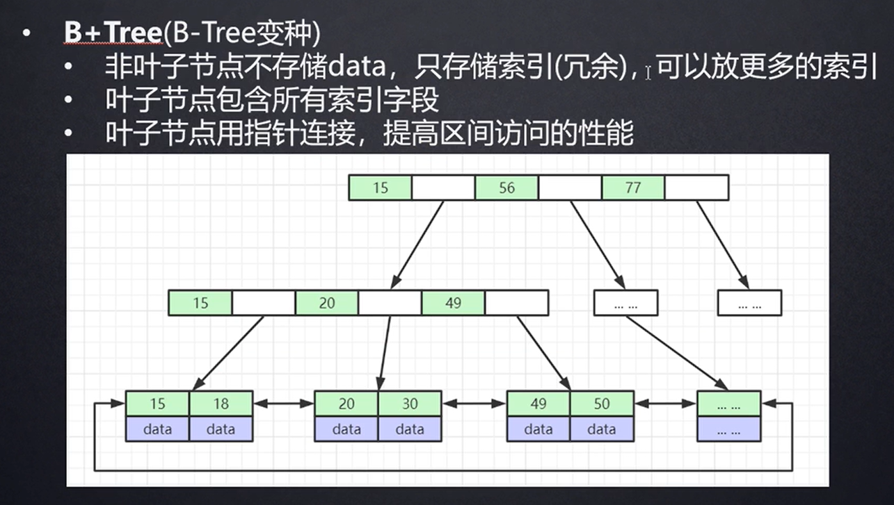
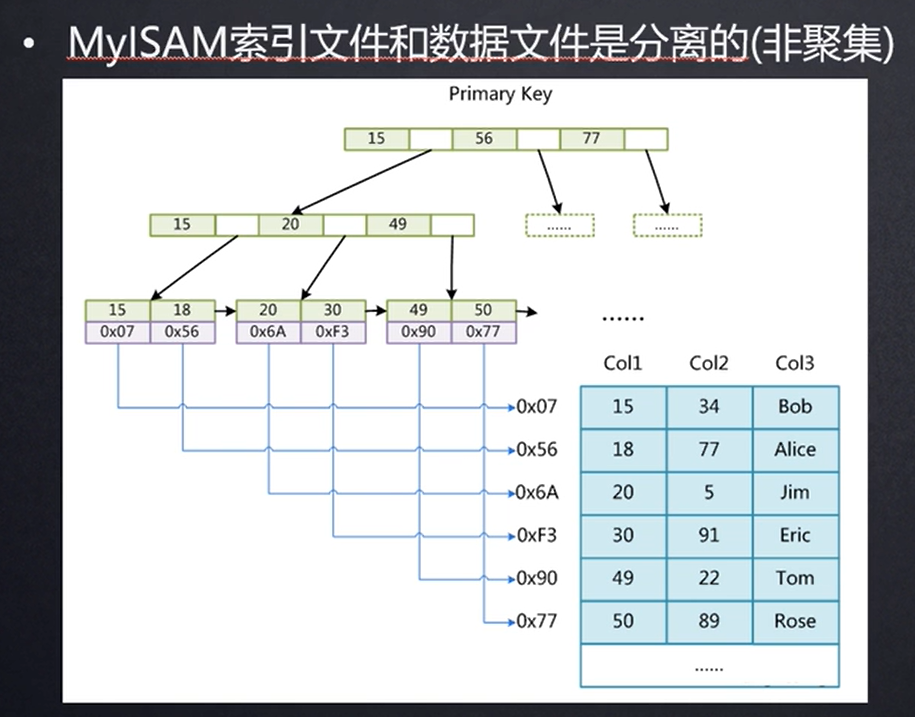
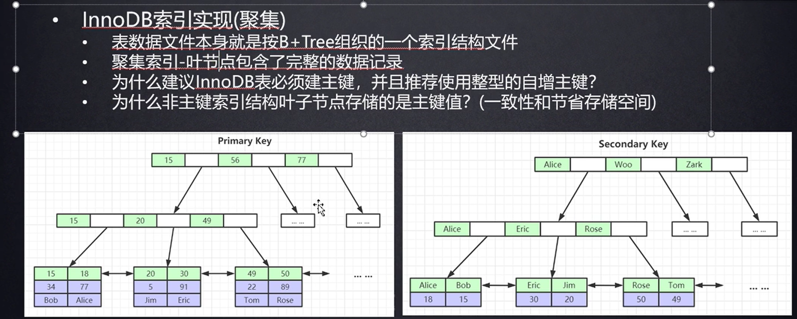
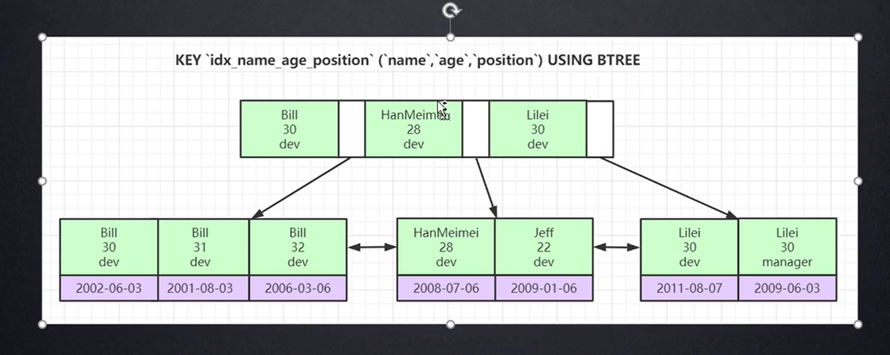
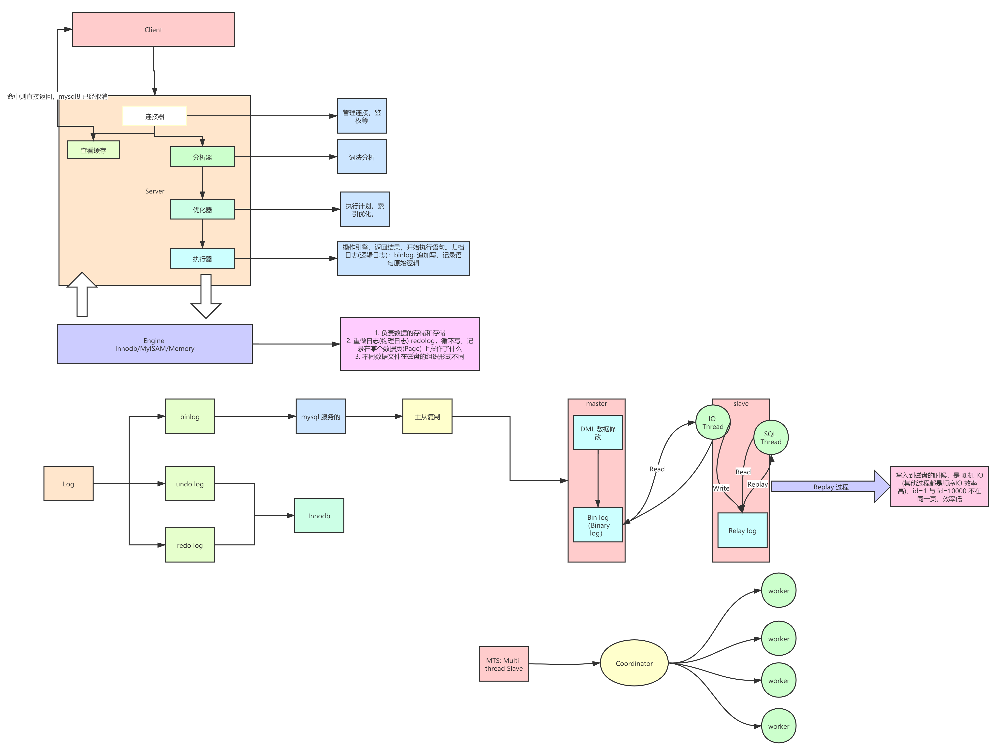

###  一张表最多能存多少数据

```text
An InnoDB tablespace also has a limit on table size of 64 terabytes. How many rows fits into this depends on the size of each row.

The 64TB limit assumes the default page size of 16KB. You can increase the page size, and therefore increase the tablespace up to 256TB. But I think you'd find other performance factors make this inadvisable long before you grow a table to that size.
```

根据 page 页大小而定，默认 16KB 则 64T, 如果调整页大小最大能到 256T

### 索引

#### 索引的本质

```text
索引本质是帮助高效获取数据的排好序的数据结构
```
B+Tree 存储结构


##### MyISAM 索引
```text
MyISAM 索引文件和数据文件是分离的(非聚集的)
```



##### Innodb 索引


聚集索引： 叶节点包含了完整的数据记录 (innodb 的主键PrimaryKey, 其余为辅助索引，需要根据辅助索引查到主键，再找到记录)

覆盖索引
如果一个索引包含（或者说覆盖）所有需要查询的字段的值，我们就称之为“覆盖索引”。我们知道InnoDB存储引擎中，如果不是主键索引，叶子节点存储的是主键+列值。最终还是要“回表”，也就是要通过主键再查找一次。这样就会比较慢覆盖索引就是把要查询出的列和索引是对应的，不做回表操作！

覆盖索引使用实例
```text
现在我创建了索引(username,age)，我们执行下面的 sql 语句

select username , age from user where username = 'Java' and age = 22

在查询数据的时候：要查询出的列在叶子节点都存在！所以，就不用回表。
```

#### B+Tree & B Tree
1. 页大小一致的情况下(16KB), B+ 树每层可以提供更多的索引，树的层级会更低，减少IO, B 树层级会多很多
2. B+ 树叶子节点直接有双向指针，区间范围查找的性能更好
3. B+ 树叶子节点包含所有索引字段。 B树叶节点具有相同深度，叶节点的指针为空，所有索引元素不重复，节点中的数据从左到右递增排列

#### 联合索引底层
1. 最左前缀原则



#### DML 流程


##### XA 两阶段提交
```text
在分布式事务处理中，全局事务（global transaction）会访问和更新多个局部数据库中的数据，如果要保证全局事务的原子性，执行全局事务 T 的所有节点必须在执行的最终结果上取得一致。X/Open 组织针对分布式事务处理而提出了 XA 规范，使用两阶段提交协议（two-phase commit protocol，2PC）来保证一个全局事务 T 要么在所有节点都提交（commit），要么在所有节点都中止。
```

##### 提交协议
```text
考虑一个全局事务 T 的事务协调器（transaction coordinator）是 C，当执行 T 的所有事务管理器（transaction manager）都通知 C 已经完成了执行，C 开始启动两阶段提交协议，分为 prepare 和 commit 两个阶段：
```

##### prepare 阶段
```text

事务协调器 C 将一条 prepare 消息发送到执行 T 的所有节点上。当各个节点的事务管理器收到 prepare 消息时，确定是否愿意提交事务 T 中自己的部分：如果可以提交，就将所有与 T 相关的日志记录强制刷盘，并记录事务 T 的状态为 prepared，然后事务管理器返回 ready 作为应答；如果无法提交，就发送 abort 消息。
```
##### commit 阶段
```text
当事务协调器 C 收到所有节点对 prepare 消息的回应后进入 commit 阶段，C 可以决定是将事务 T 进行提交还是中止，如果所有参与的节点都返回了 ready 应答，则事务 T 可以提交，否则，事务 T 需要中止。之后，协调器向所有节点发送 commit 或 abort 消息，各节点收到这个消息后，将事务最终的状态更改为 commit 或 abort，并写入日志。
```


##### 两阶段提交过程

MySQL 采用了如下的过程实现内部 XA 的两阶段提交：
```text

1. Prepare 阶段：InnoDB 将回滚段设置为 prepare 状态；将 redolog 写文件并刷盘；

2. Commit 阶段：Binlog 写入文件；binlog 刷盘；InnoDB commit；

两阶段提交保证了事务在多个引擎和 binlog 之间的原子性，以 binlog 写入成功作为事务提交的标志，而 InnoDB 的 commit 标志并不是事务成功与否的标志。

在崩溃恢复中，是以 binlog 中的 xid 和 redolog 中的 xid 进行比较，xid 在 binlog 里存在则提交，不存在则回滚。我们来看崩溃恢复时具体的情况：
1. 在 prepare 阶段崩溃，即已经写入 redolog，在写入 binlog 之前崩溃，则会回滚；

2. 在 commit 阶段，当没有成功写入 binlog 时崩溃，也会回滚；

3. 如果已经写入 binlog，在写入 InnoDB commit 标志时崩溃，则重新写入 commit 标志，完成提交。
```


#### 组提交
为了提高并发性能，肯定要细化锁粒度。MySQL 5.6 引入了 binlog 的组提交（group commit）功能，prepare 阶段不变，只针对 commit 阶段，将 commit 阶段拆分为三个过程：
```text

1. flush stage：多个线程按进入的顺序将 binlog 从 cache 写入文件（不刷盘）；

2. sync stage：对 binlog 文件做 fsync 操作（多个线程的 binlog 合并一次刷盘）；

3. commit stage：各个线程按顺序做 InnoDB commit 操作。

```

##### 组提交5.7 优化

**延迟写 redo 到 group commit 阶段**

基于
```text
1. 同时处于 Prepare 状态的事务，在从库执行是可以并行执行的
2. 处于 Prepare 与 Commit 状态之间的事务，在从库执行也是可以并行执行的。
```

MySQL 5.6 的组提交逻辑中，每个事务各自做 prepare 并写 redo log，只有到了 commit 阶段才进入组提交，因此每个事务的 redolog sync 操作成为性能瓶颈。

在 5.7 版本中，修改了组提交的 flush 阶段，在 prepare 阶段不再让线程各自执行 flush redolog 操作，而是推迟到组提交的 flush 阶段，flush stage 修改成如下逻辑：

```text
1. 收集组提交队列，得到 leader 线程，其余 follower 线程进入阻塞；
2. leader 调用 ha_flush_logs 做一次 redo write/sync，即，一次将所有线程的 redolog 刷盘；
3. 将队列中 thd 的所有 binlog cache 写到 binlog 文件中。
```

这个优化是将 redolog 的刷盘延迟到了 binlog group commit 的 flush stage 之中，sync binlog 之前。通过延迟写 redolog 的方式，为 redolog 做了一次组写入，这样 binlog 和 redolog 都进行了优化。


### 主从同步

#### 主从同步的延迟等问题、原因及解决方案：

(1)、mysql数据库从库同步的延迟问题
1. 参数
```text

show slave satus;可以看到很多同步的参数：　

Master_Log_File：                      SLAVE中的I/O线程当前正在读取的主服务器二进制日志文件的名称
Read_Master_Log_Pos：        在当前的主服务器二进制日志中，SLAVE中的I/O线程已经读取的位置
Relay_Log_File：                        SQL线程当前正在读取和执行的中继日志文件的名称
Relay_Log_Pos：                        在当前的中继日志中，SQL线程已读取和执行的位置
Relay_Master_Log_File：      由SQL线程执行的包含多数近期事件的主服务器二进制日志文件的名称
Slave_IO_Running：                 I/O线程是否被启动并成功地连接到主服务器上
Slave_SQL_Running：              SQL线程是否被启动
Seconds_Behind_Master：     从属服务器SQL线程和从属服务器I/O线程之间的时间差距，单位以秒计。
从库同步延迟情况出现的
● show slave status显示参数Seconds_Behind_Master不为0，这个数值可能会很大
● show slave status显示参数Relay_Master_Log_File和Master_Log_File显示bin-log的编号相差很大，说明bin-log在从库上没有及时同步，所以近期执行的bin-log和当前IO线程所读的bin-log相差很大
● mysql的从库数据目录下存在大量mysql-relay-log日志，该日志同步完成之后就会被系统自动删除，存在大量日志，说明主从同步延迟很厉害
```

2. MySql数据库从库同步的延迟问题
```text

1. `MySQL数据库主从同步延迟原理mysql主从同步原理：主库针对写操作，顺序写binlog，从库单线程去主库顺序读”写操作的binlog”，从库取到binlog在本地原样执行（随机写），来保证主从数据逻辑上一致。mysql的主从复制都是单线程的操作，主库对所有DDL和DML产生binlog，binlog是顺序写，所以效率很高，slave的Slave_IO_Running线程到主库取日志，效率比较高，下一步，问题来了，slave的Slave_SQL_Running线程将主库的DDL和DML操作在slave实施。DML和DDL的IO操作是随即的，不是顺序的，成本高很多，还可能可slave上的其他查询产生lock争用，由于Slave_SQL_Running也是单线程的，所以一个DDL卡主了，需要执行10分钟，那么所有之后的DDL会等待这个DDL执行完才会继续执行，这就导致了延时。有朋友会问：“主库上那个相同的DDL也需要执行10分，为什么slave会延时？”，答案是master可以并发，Slave_SQL_Running线程却不可以。

2. MySQL数据库主从同步延迟是怎么产生的？当主库的TPS并发较高时，产生的DDL数量超过slave一个sql线程所能承受的范围，那么延时就产生了，当然还有就是可能与slave的大型query语句产生了锁等待。首要原因：数据库在业务上读写压力太大，CPU计算负荷大，网卡负荷大，硬盘随机IO太高次要原因：读写binlog带来的性能影响，网络传输延迟。

```

3. 解决方案

3.1 架构方面
```text

1. 分库，不同业务请求到不同机器上，缓解单机压力
2. 加入缓存层，减少 mysql 读压力，代码逻辑会复杂及数据一致性问题
3. 使用更好的硬件设备 CPU SSD 

```

3.2 从库配置方面

```text
1. sync_bin log 配置等等
```

3.3 从根本上解决问题


```text
0. MTS: Multi-Thread Slave. 
1. 更新同一行的多个事务，需要分发到同个 Worker
2. 同一个事务不能拆开，需要分发到同个 Worker
```

##### 5.7 并行复制策略

