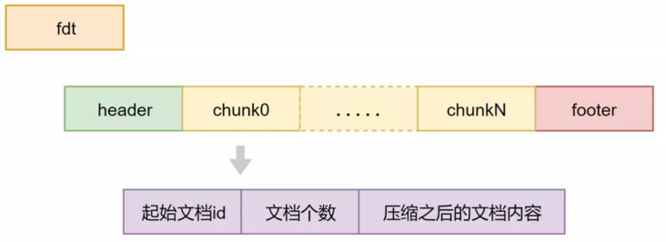
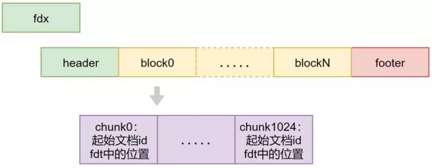
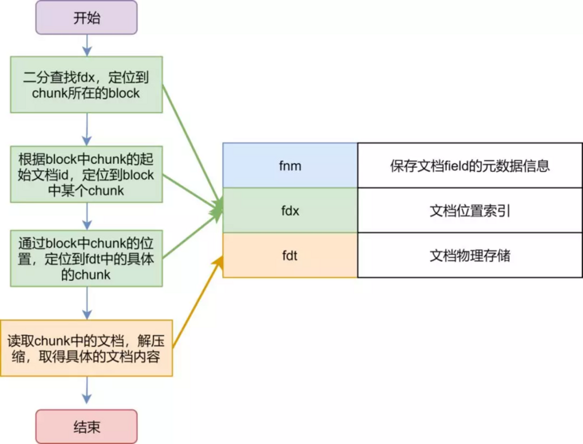
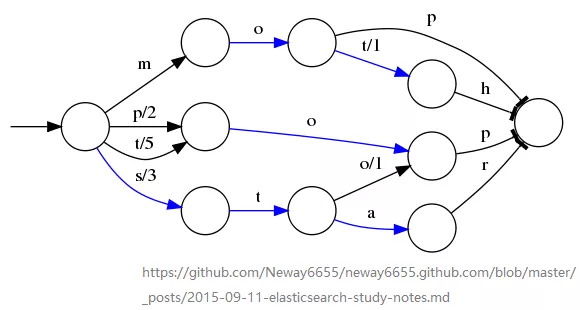
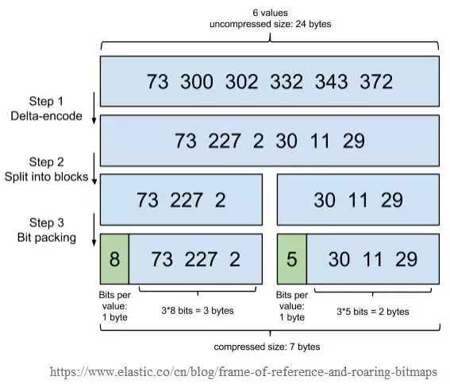
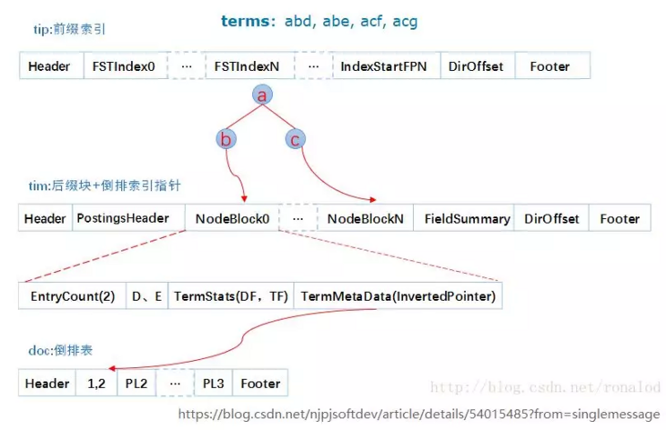

## translog

写入ES的数据首先会被写入translog文件，该文件持久化到磁盘，保证服务器宕机的时候数据不会丢失，由于顺序写磁盘，速度也会很快。

同步写入：每次写入请求执行的时候，translog在fsync到磁盘之后，才会给客户端返回成功
异步写入：写入请求缓存在内存中，每经过固定时间之后才会fsync到磁盘，写入量很大，对于数据的完整性要求又不是非常严格的情况下，可以开启异步写入


## refresh

经过固定的时间，或者手动触发之后，将内存中的数据构建索引生成segment，写入文件系统缓冲区

## commit/flush

超过固定的时间，或者translog文件过大之后，触发flush操作：

```text
1. 内存的buffer被清空，相当于进行一次refresh

2. 文件系统缓冲区中所有segment刷写到磁盘

3. 将一个包含所有段列表的新的提交点写入磁盘

4. 启动或重新打开一个索引的过程中使用这个提交点来判断哪些segment隶属于当前分片

5. 删除旧的translog，开启新的translog
```

## merge

上面提到，每次refresh的时候，都会在文件系统缓冲区中生成一个segment，后续flush触发的时候持久化到磁盘。

所以，随着数据的写入，尤其是refresh的时间设置的很短的时候，磁盘中会生成越来越多的

## segment

1. segment数目太多会带来较大的麻烦。 每一个segment都会消耗文件句柄、内存和cpu运行周期。
2. 更重要的是，每个搜索请求都必须轮流检查每个segment，所以segment越多，搜索也就越慢。

## merge的过程大致描述如下：

```text
1. 磁盘上两个小segment：A和B，内存中又生成了一个小segment：C

2. A,B被读取到内存中，与内存中的C进行merge，生成了新的更大的segment：D

3. 触发commit操作，D被fsync到磁盘

4. 创建新的提交点，删除A和B，新增D

5. 删除磁盘中的A和B

```

### Segment的不可变性的好处

1. segment的读写不需要加锁

2. 常驻文件系统缓存（堆外内存）

3. 查询的filter缓存可以常驻内存（堆内存）


#### 删除

磁盘上的每个segment都有一个.del文件与它相关联。当发送删除请求时，该文档未被真正删除，而是在.del文件中标记为已删除。此文档可能仍然能被搜索到，但会从结果中过滤掉。

当segment合并时，在.del文件中标记为已删除的文档不会被包括在新的segment中，

也就是说merge的时候会真正删除被删除的文档。

#### 更新

创建新文档时，Elasticsearch将为该文档分配一个版本号。

对文档的每次更改都会产生一个新的版本号。

当执行更新时，旧版本在.del文件中被标记为已删除，并且新版本在新的segment中写入索引。

旧版本可能仍然与搜索查询匹配，但是从结果中将其过滤掉

#### 版本控制

通过添加版本号的乐观锁机制保证高并发的时候，数据更新不会出现线程安全的问题，避免数据更新被覆盖之类的异常出现。

使用内部版本号：删除或者更新数据的时候，携带_version参数，如果文档的最新版本不是这个版本号，那么操作会失败，这个版本号是ES内部自动生成的，每次操作之后都会递增一。


## 原始文档存储（行式存储）


### fdt文件
    
文档内容的物理存储文件，由多个chunk组成，Lucene索引文档时，先缓存文档，缓存大于16KB时，就会把文档压缩存储




### fdx 文档内容的位置索引，由多个block组成：

1. 1024个chunk归为一个block

2. block记录chunk的起始文档ID，以及chunk在fdt中的位置



### fnm文件 文档元数据信息，包括文档字段的名称、类型、数量等。


lucene对原始文件的存放是行式存储，并且为了提高空间利用率，

是多文档一起压缩，因此取文档时需要读入和解压额外文档，因此取文档过程非常依赖CPU以及随机IO

#### 压缩方式的设置

原始文档的存储对应_source字段，是默认开启的，会占用大量的磁盘空间，上面提到的chunk中的文档压缩，ES默认采用的是LZ4，

如果想要提高压缩率，可以将设置改成best_compression。


#### 特定字段的内容存储

查询的时候，如果想要获取原始字段，需要在_source中获取，因为所有的字段存储在一起，所以获取完整的文档内容与获取其中某个字段，在资源消耗上几乎相同，只是返回给客户端的时候，减少了一定量的网络IO。

ES提供了特定字段内容存储的设置，在设置mappings的时候可以开启，默认是false。如果你的文档内容很大，而其中某个字段的内容有需要经常获取，可以设置开启，将该字段的内容单独存储。

PUT my_index
```json
{
  "mappings": {
    "_doc": {
      "properties": {
        "title": {
          "type": "text",
          "store": true 
        }
      }
    }
  }
}
```

## 倒排索引


倒排索引中记录的信息主要有：

```text
1. 文档编号：segment内部文档编号从0开始，最大值为int最大值，文档写入之后会分配这样一个顺序号

2. 字典：字段内容经过分词、归一化、还原词根等操作之后，得到的所有单词

3. 单词出现位置：分词字段默认开启，提供对于短语查询的支持；对于非常常见的词，例如the，位置信息可能占用很大空间，短语查询需要读取的数据量很大，查询速度慢

4. 单词出现次数：单词在文档中出现的次数，作为评分的依据

5. 单词结束字符到开始字符的偏移量：记录在文档中开始与结束字符的偏移量，提供高亮使用，默认是禁用的

6. 规范因子：对字段长度进行规范化的因子，给予较短字段更多权重
```

```text
倒排索引的查找过程本质上是通过单词找对应的文档列表的过程，

因此倒排索引中字典的设计决定了倒排索引的查询速度，

字典主要包括前缀索引（.tip文件）和后缀索引（.tim）文件。

```

### 字典前缀索引（.tip文件）

FST(Finite State Transducer) 有限状态传感器


Lucene采用的前缀索引数据结构为FST，它的优点有：
词查找复杂度为O(len(str))

1. 共享前缀、节省空间、内存占用率低，压缩率高，模糊查询支持好
2. 内存存放前缀索引，磁盘存放后缀词块
3. 缺点：结构复杂、输入要求有序、更新不易


### 字典后缀（.tim文件）

后缀词块主要保存了单词后缀，以及对应的文档列表的位置。

### 文档列表（.doc文件）



lucene对文档列表存储进行了很好的压缩，来保证缓存友好：

```text

1. 差分压缩：每个ID只记录跟前面的ID的差值

2. 每256个ID放入一个block中

3. block的头信息存放block中每个ID占用的bit位数，因为经过上面的差分压缩之后，文档列表中的文档ID都变得不大，占用的bit位数变少

```

### ES的一个重要的查询场景是bool查询

类似于mysql中的and操作，需要将两个条件对应的文档列表进行合并。

为了加快文档列表的合并，lucene底层采用了跳表的数据结构，

合并过程中，优先遍历较短的链表，去较长的列表中进行查询

### 倒排索引的查询过程
    


```text

1. tip字典前缀: 内存加载tip文件，通过FST匹配前缀找到后缀词块位置

2. tim字典后缀: 根据词块位置，读取磁盘中tim文件中后缀块并找到后缀和相应的倒排表位置信息

3. doc文件: 根据倒排表位置去doc文件中加载倒排表

4. skiplist 合并: 借助跳表结构，对多个文档列表进行合并

```

## DocValues（正排索引&列式存储）

倒排索引保存的是词项到文档的映射

DocValues保存的是文档到词项的映射，也就是文档中有哪些词项


DocValues采用的数据结构是bitset，bitset对于稀疏数据的支持不好：

1. 对于稀疏的字段来说，绝大部分的空间都被0填充，浪费空间
2. 由于字段的值之间插入了0，可能本来连续的值被0间隔开来了，不利于数据的压缩
3. 空间被一堆0占用了，缓存中缓存的有效数据减少，查询效率也会降低


## 查询过程（query then fetch）

```text
1. 协调节点将请求发送给对应分片

2. 分片查询，返回from+size数量的文档对应的id以及每个id的得分

3. 汇总所有节点的结果，按照得分获取指定区间的文档id

4. 根据查询需求，像对应分片发送多个get请求，获取文档的信息

5. 返回给客户端
```

### get查询更快

默认根据id对文档进行路由，所以指定id的查询可以定位到文档所在的分片，只对某个分片进行查询即可。当然非get查询，只要写入和查询的时候指定routing，同样可以达到该效果。

主分片与副本分片

ES的分片有主备之分，但是对于查询来说，主备分片的地位完全相同，平等的接收查询请求。这里涉及到一个请求的负载均衡策略，6.0之前采用的是轮询的策略，但是这种策略存在不足，轮询方案只能保证查询数据量在主备分片是均衡的，但是不能保证查询压力在主备分片上是均衡的，可能出现慢查询都路由到了主分片上，导致主分片所在的机器压力过大，影响了整个集群对外提供服务的能力。

新版本中优化了该策略，采用了基于负载的请求路由，基于队列的耗费时间自动调节队列长度，负载高的节点的队列长度将减少，让其他节点分摊更多的压力，搜索和索引都将基于这种机制。

### get查询的实时性

ES数据写入之后，要经过一个refresh操作之后，才能够创建索引，进行查询。但是get查询很特殊，数据实时可查。

ES5.0之前translog可以提供实时的CRUD，get查询会首先检查translog中有没有最新的修改，然后再尝试去segment中对id进行查找。5.0之后，为了减少translog设计的负责性以便于再其他更重要的方面对translog进行优化，所以取消了translog的实时查询功能。

get查询的实时性，通过每次get查询的时候，如果发现该id还在内存中没有创建索引，那么首先会触发refresh操作，来让id可查。


Max number of nodes = Number of shards * (number of replicas +1)

换句话说，如果你计划用10个分片和2个分片副本，那么最大的节点数是30。


### 分析器(analyzer)

当索引一个文档时，它的全文域被分析成词条以用来创建倒排索引。

当进行分词字段的搜索的时候，同样需要将查询字符串通过相同的分析过程，以保证搜索的词条格式与索引中的词条格式一致。当查询一个不分词字段时，不会分析查询字符串，而是搜索指定的精确值。


### ES 调优

#### 一、配置文件调优
elasticsearch.yml
 
1、内存锁定
bootstrap.memory_lock：true允许JVM锁住内存，禁止操作系统交换出去。
 
2、zen.discovery
Elasticsearch默认被配置为使用单播发现，以防止节点无意中加入集群。组播发现应该永远不被使用在生产环境了，否则你得到的结果就是一个节点意外的加入到了你的生产环境，仅仅是因为他们收到了一个错误的组播信号。
ES是一个P2P类型的分布式系统，使用gossip协议，集群的任意请求都可以发送到集群的任一节点，然后ES内部会找到需要转发的节点，并且与之进行通信。
在ES1.x的版本，ES默认是开启组播，启动ES之后，可以快速将局域网内集群名称，默认端口的相同实例加入到一个大的集群，后续再ES2.x之后，都调整成了单播，避免安全问题和网络风暴。
单播 discovery.zen.ping.unicast.hosts，建议写入集群内所有的节点及端口，如果新实例加入集群，新实例只需要写入当前集群的实例，即可自动加入到当前集群，之后再处理原实例的配置即可，新实例加入集群，不需要重启原有实例；
节点zen相关配置：discovery.zen.ping_timeout：判断master选举过程中，发现其他node存活的超时设置，主要影响选举的耗时，参数仅在加入或者选举 master 主节点的时候才起作用discovery.zen.join_timeout：节点确定加入到集群中，向主节点发送加入请求的超时时间，默认为3sdiscovery.zen.minimum_master_nodes：参与master选举的最小节点数，当集群能够被选为master的节点数量小于最小数量时，集群将无法正常选举。
 
3、故障检测（fault detection）
两种情况下会进行故障检测：
第一种是由master向集群的所有其他节点发起ping，验证节点是否处于活动状态；
第二种是：集群每个节点向master发起ping，判断master是否存活，是否需要发起选举。故障检测需要配置以下设置使用 形如：discovery.zen.fd.ping_interval节点被ping的频率，默认为1s。discovery.zen.fd.ping_timeout 等待ping响应的时间，默认为 30s，运行的集群中，master 检测所有节点，以及节点检测 master 是否正常。discovery.zen.fd.ping_retries ping失败/超时多少导致节点被视为失败，默认为3。
https://www.elastic.co/guide/en/elasticsearch/reference/6.x/modules-discovery-zen.html
 
4、队列数量
不建议盲目加大ES的队列数量，如果是偶发的因为数据突增，导致队列阻塞，加大队列size可以使用内存来缓存数据；如果是持续性的数据阻塞在队列，加大队列size除了加大内存占用，并不能有效提高数据写入速率，反而可能加大ES宕机时候，在内存中可能丢失的上数据量。
哪些情况下，加大队列size呢？GET /_cat/thread_pool，观察api中返回的queue和rejected，如果确实存在队列拒绝或者是持续的queue，可以酌情调整队列size。
https://www.elastic.co/guide/en/elasticsearch/reference/6.x/modules-threadpool.html
 
5、内存使用
设置indices的内存熔断相关参数，根据实际情况进行调整，防止写入或查询压力过高导致OOM：
indices.breaker.total.limit：50%，集群级别的断路器，默认为jvm堆的70%；
indices.breaker.request.limit：10%，单个request的断路器限制，默认为jvm堆的60%；
indices.breaker.fielddata.limit：10%，fielddata breaker限制，默认为jvm堆的60%。
https://www.elastic.co/guide/en/elasticsearch/reference/6.x/circuit-breaker.html
根据实际情况调整查询占用cache，避免查询cache占用过多的jvm内存，参数为静态的，需要在每个数据节点配置。indices.queries.cache.size: 5%，控制过滤器缓存的内存大小，默认为10%。接受百分比值，5%或者精确值，例如512mb。
https://www.elastic.co/guide/en/elasticsearch/reference/6.x/query-cache.html
 
6、创建shard
如果集群规模较大，可以阻止新建shard时扫描集群内全部shard的元数据，提升shard分配速度。
cluster.routing.allocation.disk.include_relocations: false，默认为true。
https://www.elastic.co/guide/en/elasticsearch/reference/6.x/disk-allocator.html
 
#### 二、系统层面调优
 
1、jdk版本
当前根据官方建议，选择匹配的jdk版本。
 
2、jdk内存配置
首先，-Xms和-Xmx设置为相同的值，避免在运行过程中再进行内存分配，同时，如果系统内存小于64G，建议设置略小于机器内存的一半，剩余留给系统使用。
同时，jvm heap建议不要超过32G（不同jdk版本具体的值会略有不同），否则jvm会因为内存指针压缩导致内存浪费，详见：
https://www.elastic.co/guide/cn/elasticsearch/guide/current/heap-sizing.html
 
3、交换分区
关闭交换分区，防止内存发生交换导致性能下降（部分情况下，宁死勿慢） swapoff -a
 
4、文件句柄
Lucene 使用了 大量的 文件。同时，Elasticsearch 在节点和 HTTP 客户端之间进行通信也使用了大量的套接字，所有这一切都需要足够的文件描述符，默认情况下，linux默认运行单个进程打开1024个文件句柄，这显然是不够的，故需要加大文件句柄数 ulimit -n 65536。
https://www.elastic.co/guide/en/elasticsearch/reference/6.5/setting-system-settings.html
 
5、mmap
Elasticsearch 对各种文件混合使用了 NioFs（ 注：非阻塞文件系统）和 MMapFs （ 注：内存映射文件系统）。请确保你配置的最大映射数量，以便有足够的虚拟内存可用于 mmapped 文件。
这可以暂时设置：sysctl -w vm.max_map_count=262144 或者你可以在 /etc/sysctl.conf 通过修改 vm.max_map_count 永久设置它。
https://www.elastic.co/guide/cn/elasticsearch/guide/current/_file_descriptors_and_mmap.html
 
6、磁盘
如果你正在使用 SSDs，确保你的系统 I/O 调度程序是配置正确的。当你向硬盘写数据，I/O 调度程序决定何时把数据实际发送到硬盘。大多数默认 nix 发行版下的调度程序都叫做 cfq（完全公平队列）。但它是为旋转介质优化的：机械硬盘的固有特性意味着它写入数据到基于物理布局的硬盘会更高效。这对 SSD 来说是低效的，尽管这里没有涉及到机械硬盘。
但是，deadline 或者 noop 应该被使用。deadline 调度程序基于写入等待时间进行优化， noop 只是一个简单的 FIFO 队列。echo noop > /sys/block/sd/queue/scheduler。
 
7、磁盘挂载
mount -o noatime,data=writeback,barrier=0,nobh /dev/sd* /esdata* 其中，noatime，禁止记录访问时间戳；data=writeback，不记录journal；barrier=0，因为关闭了journal，所以同步关闭barrier；nobh，关闭buffer_head，防止内核影响数据IO。
 
8、磁盘其他注意事项
使用 RAID 0。条带化 RAID 会提高磁盘I/O，代价显然就是当一块硬盘故障时整个就故障了，不要使用镜像或者奇偶校验 RAID 因为副本已经提供了这个功能。
另外，使用多块硬盘，并允许 Elasticsearch 通过多个 path.data 目录配置把数据条带化分配到它们上面。不要使用远程挂载的存储，比如 NFS 或者 SMB/CIFS。这个引入的延迟对性能来说完全是背道而驰的。
 
#### 三、Elasticsearch使用方式调优
当Elasticsearch本身的配置没有明显的问题之后，发现ES使用还是非常慢，这个时候，就需要我们去定位ES本身的问题了，首先祭出定位问题的第一个命令：
 
1、hot_threads
GET /_nodes/hot_threads&interval=30s
抓取30s的节点上占用资源的热线程，并通过排查占用资源最多的TOP线程来判断对应的资源消耗是否正常。一般情况下，bulk，search类的线程占用资源都可能是业务造成的，但是如果是merge线程占用了大量的资源，就应该考虑是不是创建index或者刷磁盘间隔太小，批量写入size太小造成的。
https://www.elastic.co/guide/en/elasticsearch/reference/6.x/cluster-nodes-hot-threads.html
 
2、pending_tasks
GET /_cluster/pending_tasks
有一些任务只能由主节点去处理，比如创建一个新的索引或者在集群中移动分片，由于一个集群中只能有一个主节点，所以只有这一master节点可以处理集群级别的元数据变动。
在99.9999%的时间里，这不会有什么问题，元数据变动的队列基本上保持为零。在一些罕见的集群里，元数据变动的次数比主节点能处理的还快，这会导致等待中的操作会累积成队列。
这个时候可以通过pending_tasks api分析当前什么操作阻塞了ES的队列，比如，集群异常时，会有大量的shard在recovery，如果集群在大量创建新字段，会出现大量的put_mappings的操作，所以正常情况下，需要禁用动态mapping。
https://www.elastic.co/guide/en/elasticsearch/reference/current/cluster-pending.html
 
3、字段存储
当前es主要有doc_values，fielddata，storefield三种类型，大部分情况下，并不需要三种类型都存储，可根据实际场景进行调整：
当前用得最多的就是 doc_values ，列存储，对于不需要进行分词的字段，都可以开启doc_values来进行存储（且只保留keyword字段），节约内存，当然，开启doc_values会对查询性能有一定的影响，但是，这个性能损耗是比较小的，而且是值得的；
fielddata 构建和管理 100% 在内存中，常驻于 JVM 内存堆，所以可用于快速查询，但是这也意味着它本质上是不可扩展的，有很多边缘情况下要提防，如果对于字段没有分析需求，可以关闭fielddata；
storefield 主要用于_source字段，默认情况下，数据在写入es的时候，es会将doc数据存储为_source字段，查询时可以通过_source字段快速获取doc的原始结构，如果没有update，reindex等需求，可以将_source字段disable；
_all ，ES在6.x以前的版本，默认将写入的字段拼接成一个大的字符串，并对该字段进行分词，用于支持整个doc的全文检索，在知道doc字段名称的情况下，建议关闭掉该字段，节约存储空间，也避免不带字段key的全文检索；
norms ：搜索时进行评分，日志场景一般不需要评分，建议关闭。
 
4、tranlog
Elasticsearch 2.0之后为了保证不丢数据，每次 index、bulk、delete、update 完成的时候，一定触发刷新 translog 到磁盘上，才给请求返回 200 OK。这个改变在提高数据安全性的同时当然也降低了一点性能。如果你不在意这点可能性，还是希望性能优先，可以在 index template 里设置如下参数：
 
{     "index.translog.durability" : "async" }
index.translog.sync_interval：
对于一些大容量的偶尔丢失几秒数据问题也并不严重的集群，使用异步的 fsync 还是比较有益的。
比如，写入的数据被缓存到内存中，再每5秒执行一次 fsync ，默认为5s。小于的值100ms是不允许的。
index.translog.flush_threshold_size：
translog存储尚未安全保存在Lucene中的所有操作。虽然这些操作可用于读取，但如果要关闭并且必须恢复，则需要重新编制索引。
此设置控制这些操作的最大总大小，以防止恢复时间过长。达到设置的最大size后，将发生刷新，生成新的Lucene提交点，默认为512mb。
 
5、refresh_interval
执行刷新操作的频率，这会使索引的最近更改对搜索可见，默认为1s，可以设置-1为禁用刷新，对于写入速率要求较高的场景，可以适当的加大对应的时长，减小磁盘io和segment的生成。
 
6、禁止动态mapping
动态mapping的坏处：
造成集群元数据一直变更，导致集群不稳定；
可能造成数据类型与实际类型不一致；
对于一些异常字段或者是扫描类的字段，也会频繁的修改mapping，导致业务不可控。
动态mapping配置的可选值及含义如下：
true ：支持动态扩展，新增数据有新的字段属性时，自动添加对于的mapping，数据写入成功；
false ：不支持动态扩展，新增数据有新的字段属性时，直接忽略，数据写入成功 ；
strict ：不支持动态扩展，新增数据有新的字段时，报错，数据写入失败。
 
7、批量写入
批量请求显然会大大提升写入速率，且这个速率是可以量化的，官方建议每次批量的数据物理字节数5-15MB是一个比较不错的起点，注意这里说的是物理字节数大小。
文档计数对批量大小来说不是一个好指标。
比如说，如果你每次批量索引 1000 个文档，记住下面的事实：1000 个 1 KB 大小的文档加起来是 1 MB 大。1000 个 100 KB 大小的文档加起来是 100 MB 大。这可是完完全全不一样的批量大小了。
批量请求需要在协调节点上加载进内存，所以批量请求的物理大小比文档计数重要得多。从 5–15 MB 开始测试批量请求大小，缓慢增加这个数字，直到你看不到性能提升为止。
然后开始增加你的批量写入的并发度（多线程等等办法）。用iostat 、 top 和 ps 等工具监控你的节点，观察资源什么时候达到瓶颈。
如果你开始收到 EsRejectedExecutionException ，你的集群没办法再继续了：至少有一种资源到瓶颈了。或者减少并发数，或者提供更多的受限资源（比如从机械磁盘换成 SSD），或者添加更多节点。
 
8、索引和shard
ES的索引，shard都会有对应的元数据，且因为ES的元数据都是保存在master节点，且元数据的更新是要hang住集群向所有节点同步的。
当ES的新建字段或者新建索引的时候，都会要获取集群元数据，并对元数据进行变更及同步，此时会影响集群的响应，所以需要关注集群的index和shard数量。
建议如下：
使用shrink和rollover api，相对生成合适的数据shard数；
根据数据量级及对应的性能需求，选择创建index的名称，形如：按月生成索引：test-YYYYMM，按天生成索引：test-YYYYMMDD；
控制单个shard的size，正常情况下，日志场景，建议单个shard不大于50GB，线上业务场景，建议单个shard不超过20GB。
 
9、segment merge
段合并的计算量庞大， 而且还要吃掉大量磁盘 I/O。合并在后台定期操作，因为他们可能要很长时间才能完成，尤其是比较大的段。
这个通常来说都没问题，因为大规模段合并的概率是很小的。如果发现merge占用了大量的资源，可以设置：index.merge.scheduler.max_thread_count：1
特别是机械磁盘在并发 I/O 支持方面比较差，所以我们需要降低每个索引并发访问磁盘的线程数。这个设置允许 max_thread_count + 2 个线程同时进行磁盘操作，也就是设置为 1 允许三个线程。
对于 SSD，你可以忽略这个设置，默认是 Math.min(3, Runtime.getRuntime().availableProcessors() / 2) ，对 SSD 来说运行的很好。
业务低峰期通过force_merge强制合并segment，降低segment的数量，减小内存消耗；关闭冷索引，业务需要的时候再进行开启，如果一直不使用的索引，可以定期删除，或者备份到hadoop集群。
 
10、二级自动生成_id
当写入端使用特定的id将数据写入ES时，ES会去检查对应的index下是否存在相同的id，这个操作会随着文档数量的增加而消耗越来越大，所以如果业务上没有强需求，建议使用ES自动生成的id，加快写入速率。
 
11、routing
对于数据量较大的业务查询场景，ES侧一般会创建多个shard，并将shard分配到集群中的多个实例来分摊压力，正常情况下，一个查询会遍历查询所有的shard，然后将查询到的结果进行merge之后，再返回给查询端。
此时，写入的时候设置routing，可以避免每次查询都遍历全量shard，而是查询的时候也指定对应的routingkey，这种情况下，ES会只去查询对应的shard，可以大幅度降低合并数据和调度全量shard的开销。
 
12、使用alias
生产提供服务的索引，切记使用别名提供服务，而不是直接暴露索引名称，避免后续因为业务变更或者索引数据需要reindex等情况造成业务中断。
 
13、避免宽表
在索引中定义太多字段是一种可能导致映射爆炸的情况，这可能导致内存不足错误和难以恢复的情况，这个问题可能比预期更常见，index.mapping.total_fields.limit ，默认值是1000。
 
14、避免稀疏索引
因为索引稀疏之后，对应的相邻文档id的delta值会很大，lucene基于文档id做delta编码压缩导致压缩率降低，从而导致索引文件增大。
同时，ES的keyword，数组类型采用doc_values结构，每个文档都会占用一定的空间，即使字段是空值，所以稀疏索引会造成磁盘size增大，导致查询和写入效率降低。


https://segmentfault.com/a/1190000020022504


## 系统层面的调优
系统层面的调优主要是内存的设定与避免交换内存。
ES 安装后默认设置的堆内存是 1GB，这很明显是不够的，那么接下来就会有一个问题出现：我们要设置多少内存给 ES 呢？
其实这是要看我们集群节点的内存大小，还取决于我们是否在服务器节点上还是否要部署其他服务。
如果内存相对很大，如 64G 及以上，并且我们不在 ES 集群上部署其他服务，那么我建议 ES 内存可以设置为 31G-32G，因为这里有一个 32G 性能瓶颈问题，直白的说就是即使你给了 ES 集群大于 32G 的内存，其性能也不一定会更加优良，甚至会不如设置为 31G-32G 时候的性能。
以我调优的集群为例，我所调优的服务器节点内存为 64G，服务器节点上也基本不跑其他服务，所以我把 ES 集群内存大小设置为了 31G，以充分发挥集群性能。
设置 ES 集群内存的时候，还有一点就是确保堆内存最小值（Xms）与最大值（Xmx）的大小是相同的，防止程序在运行时改变堆内存大小，这是一个很耗系统资源的过程。
还有一点就是避免交换内存，可以在配置文件中对内存进行锁定，以避免交换内存（也可以在操作系统层面进行关闭内存交换）。对应的参数：
bootstrap.mlockall: true
## 分片与副本

分片 (shard)：ES 是一个分布式的搜索引擎, 索引通常都会分解成不同部分, 分布在不同节点的部分数据就是分片。ES 自动管理和组织分片, 并在必要的时候对分片数据进行再平衡分配, 所以用户基本上不用担心分片的处理细节。创建索引时默认的分片数为 5 个，并且一旦创建不能更改。
副本 (replica)：ES 默认创建一份副本，就是说在 5 个主分片的基础上，每个主分片都相应的有一个副本分片。额外的副本有利有弊，有副本可以有更强的故障恢复能力，但也占了相应副本倍数的磁盘空间。
那我们在创建索引的时候，应该创建多少个分片与副本数呢？
对于副本数，比较好确定，可以根据我们集群节点的多少与我们的存储空间决定，我们的集群服务器多，并且有足够大多存储空间，可以多设置副本数，一般是 1-3 个副本数，如果集群服务器相对较少并且存储空间没有那么宽松，则可以只设定一份副本以保证容灾（副本数可以动态调整）。
对于分片数，是比较难确定的。因为一个索引分片数一旦确定，就不能更改，所以我们在创建索引前，要充分的考虑到，以后我们创建的索引所存储的数据量，否则创建了不合适的分片数，会对我们的性能造成很大的影响。
对于分片数的大小，业界一致认为分片数的多少与内存挂钩，认为 1GB 堆内存对应 20-25 个分片，而一个分片的大小不要超过 50G，这样的配置有助于集群的健康。但是我个人认为这样的配置方法过于死板，我个人在调优 ES 集群的过程中，根据总数据量的大小，设定了相应的分片，保证每一个分片的大小没有超过 50G（大概在 40G 左右），但是相比之前的分片数查询起来，效果并不明显。之后又尝试了增加分片数，发现分片数增多之后，查询速度有了明显的提升，每一个分片的数据量控制在 10G 左右。
查询大量小分片使得每个分片处理数据速度更快了，那是不是分片数越多，我们的查询就越快，ES 性能就越好呢？其实也不是，因为在查询过程中，有一个分片合并的过程，如果分片数不断的增加，合并的时间则会增加，而且随着更多的任务需要按顺序排队和处理，更多的小分片不一定要比查询较小数量的更大的分片更快。如果有多个并发查询，则有很多小碎片也会降低查询吞吐量。
如果现在你的场景是分片数不合适了，但是又不知道如何调整，那么有一个好的解决方法就是按照时间创建索引，然后进行通配查询。如果每天的数据量很大，则可以按天创建索引，如果是一个月积累起来导致数据量很大，则可以一个月创建一个索引。如果要对现有索引进行重新分片，则需要重建索引，我会在文章的最后总结重建索引的过程。
参数调优

## ES 关键参数的调优。
有很多场景是，我们的 ES 集群占用了多大的 cpu 使用率，该如何调节呢。cpu 使用率高，有可能是写入导致的，也有可能是查询导致的，那要怎么查看呢？
可以先通过 GET _nodes/{node}/hot_threads 查看线程栈，查看是哪个线程占用 cpu 高，如果是 elasticsearch[{node}][search][T#10] 则是查询导致的，如果是 elasticsearch[{node}][bulk][T#1] 则是数据写入导致的。
我在实际调优中，cpu 使用率很高，如果不是 SSD，建议把 index.merge.scheduler.max_thread_count: 1 索引 merge 最大线程数设置为 1 个，该参数可以有效调节写入的性能。因为在存储介质上并发写，由于寻址的原因，写入性能不会提升，只会降低。
还有几个重要参数可以进行设置，各位同学可以视自己的集群情况与数据情况而定。
index.refresh_interval：这个参数的意思是数据写入后几秒可以被搜索到，默认是 1s。每次索引的 refresh 会产生一个新的 lucene 段, 这会导致频繁的合并行为，如果业务需求对实时性要求没那么高，可以将此参数调大，实际调优告诉我，该参数确实很给力，cpu 使用率直线下降。
indices.memory.index_buffer_size：如果我们要进行非常重的高并发写入操作，那么最好将 indices.memory.index_buffer_size 调大一些，index buffer 的大小是所有的 shard 公用的，一般建议（看的大牛博客），对于每个 shard 来说，最多给 512mb，因为再大性能就没什么提升了。ES 会将这个设置作为每个 shard 共享的 index buffer，那些特别活跃的 shard 会更多的使用这个 buffer。默认这个参数的值是 10%，也就是 jvm heap 的 10%。
translog：ES 为了保证数据不丢失，每次 index、bulk、delete、update 完成的时候，一定会触发刷新 translog 到磁盘上。在提高数据安全性的同时当然也降低了一点性能。如果你不在意这点可能性，还是希望性能优先，可以设置如下参数：
"index.translog": {
            "sync_interval": "120s",     --sync间隔调高
            "durability": "async",       -– 异步更新
            "flush_threshold_size":"1g"  --log文件大小
        }
复制代码这样设定的意思是开启异步写入磁盘，并设定写入的时间间隔与大小，有助于写入性能的提升。
还有一些超时参数的设置：

discovery.zen.ping_timeout 判断 master 选举过程中，发现其他 node 存活的超时设置
discovery.zen.fd.ping_interval 节点被 ping 的频率，检测节点是否存活
discovery.zen.fd.ping_timeout 节点存活响应的时间，默认为 30s，如果网络可能存在隐患，可以适当调大
discovery.zen.fd.ping_retries ping 失败/超时多少导致节点被视为失败，默认为 3

##其他建议

插入索引自动生成 id：当写入端使用特定的 id 将数据写入 ES 时，ES 会检查对应的索引下是否存在相同的 id，这个操作会随着文档数量的增加使消耗越来越大，所以如果业务上没有硬性需求建议使用 ES 自动生成的 id，加快写入速率。
避免稀疏索引：索引稀疏之后，会导致索引文件增大。ES 的 keyword，数组类型采用 doc_values 结构，即使字段是空值，每个文档也会占用一定的空间，所以稀疏索引会造成磁盘增大，导致查询和写入效率降低。

调优主要是重建索引，更改了现有索引的分片数量，经过不断的测试，找到了一个最佳的分片数量，重建索引的时间是漫长的，在此期间，又对 ES 的写入进行了相应的调优，使 cpu 使用率降低下来。附上我的调优参数。
index.merge.scheduler.max_thread_count:1 # 索引 merge 最大线程数
indices.memory.index_buffer_size:30%	 # 内存
index.translog.durability:async # 这个可以异步写硬盘，增大写的速度
index.translog.sync_interval:120s #translog 间隔时间
discovery.zen.ping_timeout:120s # 心跳超时时间
discovery.zen.fd.ping_interval:120s	 # 节点检测时间
discovery.zen.fd.ping_timeout:120s	 #ping 超时时间
discovery.zen.fd.ping_retries:6	 # 心跳重试次数
thread_pool.bulk.size:20 # 写入线程个数 由于我们查询线程都是在代码里设定好的，我这里只调节了写入的线程数
thread_pool.bulk.queue_size:1000 # 写入线程队列大小
index.refresh_interval:300s #index 刷新间隔

## 关于重建索引
在重建索引之前，首先要考虑一下重建索引的必要性，因为重建索引是非常耗时的。
ES 的 reindex api 不会去尝试设置目标索引，不会复制源索引的设置，所以我们应该在运行_reindex 操作之前设置目标索引，包括设置映射（mapping），分片，副本等。
第一步，和创建普通索引一样创建新索引。当数据量很大的时候，需要设置刷新时间间隔，把 refresh_intervals 设置为-1，即不刷新,number_of_replicas 副本数设置为 0（因为副本数可以动态调整，这样有助于提升速度）。
{
	"settings": {

		"number_of_shards": "50",
		"number_of_replicas": "0",
		"index": {
			"refresh_interval": "-1"
		}
	}
	"mappings": {
    }
}
复制代码第二步，调用 reindex 接口，建议加上 wait_for_completion=false 的参数条件，这样 reindex 将直接返回 taskId。
POST _reindex?wait_for_completion=false

{
  "source": {
    "index": "old_index",   //原有索引
    "size": 5000            //一个批次处理的数据量
  },
  "dest": {
    "index": "new_index",   //目标索引
  }
}
复制代码第三步，等待。可以通过 GET _tasks?detailed=true&actions=*reindex 来查询重建的进度。如果要取消 task 则调用_tasks/node_id:task_id/_cancel。
第四步，删除旧索引，释放磁盘空间。更多细节可以查看 ES 官网的 reindex api。
那么有的同学可能会问，如果我此刻 ES 是实时写入的，那咋办呀？
这个时候，我们就要重建索引的时候，在参数里加上上一次重建索引的时间戳，直白的说就是，比如我们的数据是 100G，这时候我们重建索引了，但是这个 100G 在增加，那么我们重建索引的时候，需要记录好重建索引的时间戳，记录时间戳的目的是下一次重建索引跑任务的时候不用全部重建，只需要在此时间戳之后的重建就可以，如此迭代，直到新老索引数据量基本一致，把数据流向切换到新索引的名字。
POST /_reindex
{
    "conflicts": "proceed",          //意思是冲突以旧索引为准，直接跳过冲突，否则会抛出异常，停止task
    "source": {
        "index": "old_index"         //旧索引
        "query": {
            "constant_score" : {
                "filter" : {
                    "range" : {
                        "data_update_time" : {
                            "gte" : 123456789   //reindex开始时刻前的毫秒时间戳
                            }
                        }
                    }
                }
            }
        },
    "dest": {
        "index": "new_index",       //新索引
        "version_type": "external"  //以旧索引的数据为准
        }
}


## Query 和 Filter区别：

如何选择查询与过滤
通常的规则是，使用查询（query）语句来进行 全文 搜索或者其它任何需要影响 相关性得分 的搜索。除此以外的情况都使用过滤（filters)。

### query context

1. query context关注的是，文档到底有多匹配查询的条件，这个匹配的程度是由相关性分数决定的，分数越高自然就越匹配。所以这种查询除了关注文档是否满足查询条件，还需要额外的计算相关性分数.

### filter context

1. filter context关注的是，文档是否匹配查询条件，结果只有两个，是和否。没有其它额外的计算。它常用的一个场景就是过滤时间范围。

2. 并且filter context会自动被ES缓存结果，效率进一步提高。

3. 对于bool查询，must使用的就是query context，而filter使用的就是filter context。


## mapping 中的 index 和 store

### index

index 属性控制怎样索引字符串。它可以是下面三个值：

analyzed
首先分析字符串，然后索引它。换句话说，以全文索引这个域。
not_analyzed
  索引这个域，所以它能够被搜索，但索引的是精确值。不会对它进行分析。
no
不索引这个域。这个域不会被搜索到。


### store

默认情况下，对字段值进行索引以使其可搜索，但不存储它们 (store)。 这意味着可以查询该字段，但是无法检索原始字段值。在这里我们必须理解的一点是: 如果一个字段的mapping中含有store属性为true，那么有一个单独的存储空间为这个字段做存储，而且这个存储是独立于_source的存储的。它具有更快的查询。存储该字段会占用磁盘空间。如果需要从文档中提取（即在脚本中和聚合），它会帮助减少计算。在聚合时，具有store属性的字段会比不具有这个属性的字段快。 此选项的可能值为false和true。