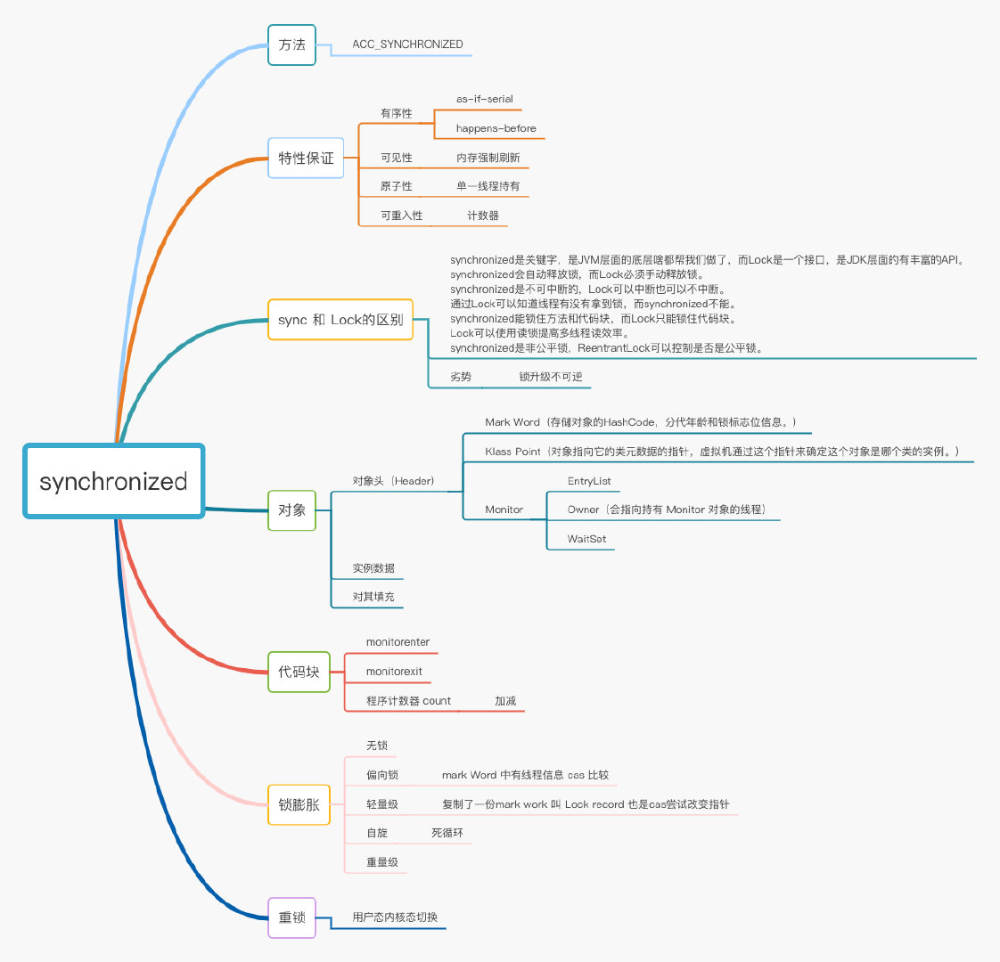
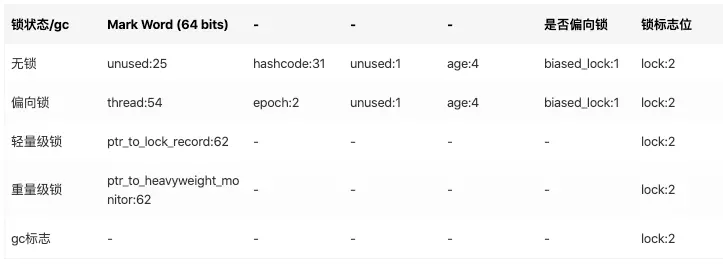
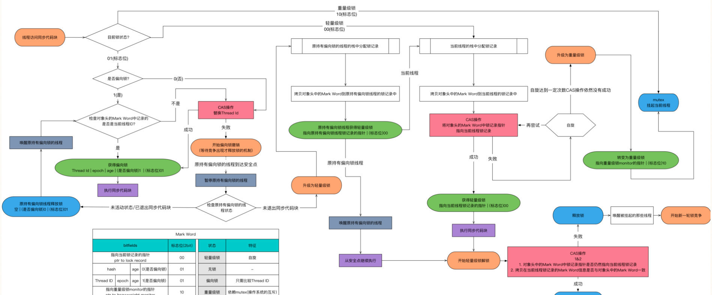
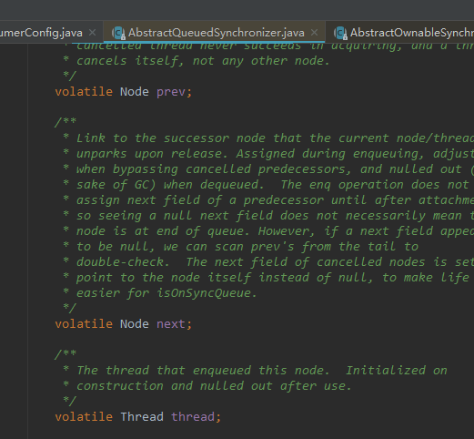

## HashMap

### default value

#### 默认初始化容量 一定是2次幂
```java
    /**
     * The default initial capacity - MUST be a power of two.
     */
    static final int DEFAULT_INITIAL_CAPACITY = 1 << 4; // aka 16
```

#### 最大容量 1 << 30 (1073741824)
```java
    /**
     * The maximum capacity, used if a higher value is implicitly specified
     * by either of the constructors with arguments.
     * MUST be a power of two <= 1<<30.
     */
    static final int MAXIMUM_CAPACITY = 1 << 30;
```

### 默认加载因子 用于扩容
```java


    /**
     * The load factor used when none specified in constructor.
     */
    static final float DEFAULT_LOAD_FACTOR = 0.75f;
```


#### 大于 8 时转换成树

根据泊松分布确定，7 或者 8 

```java

    Because TreeNodes are about twice the size of regular nodes, we
     * use them only when bins contain enough nodes to warrant use
     * (see TREEIFY_THRESHOLD). And when they become too small (due to
     * removal or resizing) they are converted back to plain bins.  In
     * usages with well-distributed user hashCodes, tree bins are
     * rarely used.  Ideally, under random hashCodes, the frequency of
     * nodes in bins follows a Poisson distribution
     * (http://en.wikipedia.org/wiki/Poisson_distribution) with a
     * parameter of about 0.5 on average for the default resizing
     * threshold of 0.75, although with a large variance because of
     * resizing granularity. Ignoring variance, the expected
     * occurrences of list size k are (exp(-0.5) * pow(0.5, k) /
     * factorial(k)). The first values are:
     *
     * 0:    0.60653066
     * 1:    0.30326533
     * 2:    0.07581633
     * 3:    0.01263606
     * 4:    0.00157952
     * 5:    0.00015795
     * 6:    0.00001316
     * 7:    0.00000094
     * 8:    0.00000006
     * more: less than 1 in ten million

    /**
     * The bin count threshold for using a tree rather than list for a
     * bin.  Bins are converted to trees when adding an element to a
     * bin with at least this many nodes. The value must be greater
     * than 2 and should be at least 8 to mesh with assumptions in
     * tree removal about conversion back to plain bins upon
     * shrinkage.
     */

    static final int TREEIFY_THRESHOLD = 8;
```

#### 红黑树转链表
```java
    /**
     * The bin count threshold for untreeifying a (split) bin during a
     * resize operation. Should be less than TREEIFY_THRESHOLD, and at
     * most 6 to mesh with shrinkage detection under removal.
     */
    static final int UNTREEIFY_THRESHOLD = 6;
```

#### 当前bucket 节点数大于 8 及 整体节点数量大于 64 才会转换成红黑树
```java
    /**
     * The smallest table capacity for which bins may be treeified.
     * (Otherwise the table is resized if too many nodes in a bin.)
     * Should be at least 4 * TREEIFY_THRESHOLD to avoid conflicts
     * between resizing and treeification thresholds.
     */
    static final int MIN_TREEIFY_CAPACITY = 64;

```

### table size

计算 table 的 size

```java
    /**
     * Returns a power of two size for the given target capacity.
     */
    static final int tableSizeFor(int cap) {
        int n = cap - 1;
        n |= n >>> 1;
        n |= n >>> 2;
        n |= n >>> 4;
        n |= n >>> 8;
        n |= n >>> 16;
        return (n < 0) ? 1 : (n >= MAXIMUM_CAPACITY) ? MAXIMUM_CAPACITY : n + 1;
    }

```


### hash 

为什么异或 h >>> 16 ?
```
高位向低位转换，让 h 的高低位都参与运算，尽可能地散列，扰动。

```


```java
    /**
     * Computes key.hashCode() and spreads (XORs) higher bits of hash
     * to lower.  Because the table uses power-of-two masking, sets of
     * hashes that vary only in bits above the current mask will
     * always collide. (Among known examples are sets of Float keys
     * holding consecutive whole numbers in small tables.)  So we
     * apply a transform that spreads the impact of higher bits
     * downward. There is a tradeoff between speed, utility, and
     * quality of bit-spreading. Because many common sets of hashes
     * are already reasonably distributed (so don't benefit from
     * spreading), and because we use trees to handle large sets of
     * collisions in bins, we just XOR some shifted bits in the
     * cheapest possible way to reduce systematic lossage, as well as
     * to incorporate impact of the highest bits that would otherwise
     * never be used in index calculations because of table bounds.
     */
    static final int hash(Object key) {
        int h;
        return (key == null) ? 0 : (h = key.hashCode()) ^ (h >>> 16);
    }
```


### index = (n - 1) & hash

1. n 为 2 次幂, n-1  = 低位全是 1，即 16  - 1 = 15. 
2. 高位全是 0 ，& 之后 抹 0, 只有与 低位 1计算，即范围只能是 0 - (n-1) 

### putVal 
1. // 计算 tab 下标
   if ((p = tab[i = (n - 1) & hash]) == null)
   
2. // 当前 bucket 空的，直接新增节点
tab[i] = newNode(hash, key, value, null);

3. // 1. 对比 hash, 2. 对比 key 3. 或者对比 key 值. 4. 相同则覆盖 
      if (p.hash == hash &&
      ((k = p.key) == key || (key != null && key.equals(k))))
      e = p;

4. 相同 hash 不同 key, 未树化情况
JDK8 使用 尾插法插入链表 

```java
        if (binCount >= TREEIFY_THRESHOLD - 1) // -1 for 1st
                            treeifyBin(tab, hash);
```

    4.1 如果 binCount 大于等于 7 = 8 - 1， 进入 ** treeifyBin(tab, hash)** 此时并未树化
    4.2 如果 **table 数组长度小于**  64 = MIN_TREEIFY_CAPACITY, 则 resize , 否则才真正树化


```java
    if (tab == null || (n = tab.length) < MIN_TREEIFY_CAPACITY)
                resize();
```

```java
            for (int binCount = 0; ; ++binCount) {
                    if ((e = p.next) == null) {
                        p.next = newNode(hash, key, value, null);
                        if (binCount >= TREEIFY_THRESHOLD - 1) // -1 for 1st
                            treeifyBin(tab, hash);
                        break;
                    }
                    if (e.hash == hash &&
                        ((k = e.key) == key || (key != null && key.equals(k))))
                        break;
                    p = e;
                }
```


```java

    /**
     * Implements Map.put and related methods.
     *
     * @param hash hash for key
     * @param key the key
     * @param value the value to put
     * @param onlyIfAbsent if true, don't change existing value
     * @param evict if false, the table is in creation mode.
     * @return previous value, or null if none
     */
    final V putVal(int hash, K key, V value, boolean onlyIfAbsent,
                   boolean evict) {
        Node<K,V>[] tab; Node<K,V> p; int n, i;
        if ((tab = table) == null || (n = tab.length) == 0)
            n = (tab = resize()).length;
        // 计算 tab 下标
        if ((p = tab[i = (n - 1) & hash]) == null)
         // 当前 bucket 空的，直接新增节点
            tab[i] = newNode(hash, key, value, null);
        else {
            Node<K,V> e; K k;
            // 1. 对比 hash, 2. 对比 key 3. 或者对比 key 值. 4. 相同则覆盖 
            if (p.hash == hash &&
                ((k = p.key) == key || (key != null && key.equals(k))))
                e = p;
            else if (p instanceof TreeNode)
                e = ((TreeNode<K,V>)p).putTreeVal(this, tab, hash, key, value);
            else {
                for (int binCount = 0; ; ++binCount) {
                    if ((e = p.next) == null) {
                        p.next = newNode(hash, key, value, null);
                        if (binCount >= TREEIFY_THRESHOLD - 1) // -1 for 1st
                            treeifyBin(tab, hash);
                        break;
                    }
                    if (e.hash == hash &&
                        ((k = e.key) == key || (key != null && key.equals(k))))
                        break;
                    p = e;
                }
            }
            if (e != null) { // existing mapping for key
                V oldValue = e.value;
                if (!onlyIfAbsent || oldValue == null)
                    e.value = value;
                afterNodeAccess(e);
                return oldValue;
            }
        }
        ++modCount;
        if (++size > threshold)
            resize();
        afterNodeInsertion(evict);
        return null;
    }

```

### resize

1. 初始化 或者 doubles 数组
2. list 移动及拼接  ， 判断去扩容后的高位 还是 低位 if ((e.hash & oldCap) == 0) 
3. tree split

```java

   /**
     * Initializes or doubles table size.  If null, allocates in
     * accord with initial capacity target held in field threshold.
     * Otherwise, because we are using power-of-two expansion, the
     * elements from each bin must either stay at same index, or move
     * with a power of two offset in the new table.
     *
     * @return the table
     */
    final Node<K,V>[] resize() {
        Node<K,V>[] oldTab = table;
        int oldCap = (oldTab == null) ? 0 : oldTab.length;
        int oldThr = threshold;
        int newCap, newThr = 0;
        if (oldCap > 0) {
            if (oldCap >= MAXIMUM_CAPACITY) {
                threshold = Integer.MAX_VALUE;
                return oldTab;
            }
            // newCap 为 oldCap double ，newThr 为 oldThr double
            else if ((newCap = oldCap << 1) < MAXIMUM_CAPACITY &&
                     oldCap >= DEFAULT_INITIAL_CAPACITY)
                newThr = oldThr << 1; // double threshold
        }
        else if (oldThr > 0) // initial capacity was placed in threshold
            newCap = oldThr;
        else {               // zero initial threshold signifies using defaults
            // 初始化
            newCap = DEFAULT_INITIAL_CAPACITY;
            newThr = (int)(DEFAULT_LOAD_FACTOR * DEFAULT_INITIAL_CAPACITY);
        }
        if (newThr == 0) {
            float ft = (float)newCap * loadFactor;
            newThr = (newCap < MAXIMUM_CAPACITY && ft < (float)MAXIMUM_CAPACITY ?
                      (int)ft : Integer.MAX_VALUE);
        }
        threshold = newThr;
        @SuppressWarnings({"rawtypes","unchecked"})
        // 创建新的 table
        Node<K,V>[] newTab = (Node<K,V>[])new Node[newCap];
        table = newTab;
        if (oldTab != null) {
            // 将 老数组 oldTab 中的值 移动到 新数组 newTab
            for (int j = 0; j < oldCap; ++j) {
                Node<K,V> e;
                if ((e = oldTab[j]) != null) {
                    // 置空旧table
                    oldTab[j] = null;
                    if (e.next == null)
                        // 如果当前 bin 只有一个元素，直接进入新 table
                        newTab[e.hash & (newCap - 1)] = e;
                    else if (e instanceof TreeNode)
                        // 如果是树，则进行拆解
                        ((TreeNode<K,V>)e).split(this, newTab, j, oldCap);
                    else { // preserve order
                        // 如果是链表
                        Node<K,V> loHead = null, loTail = null;
                        Node<K,V> hiHead = null, hiTail = null;
                        Node<K,V> next;
                        do {
                            next = e.next;
                            // hash & (n) // 非 n - 1, 即 最高位是 1，其余都是 0. 则旧数组中的值, 在新数组中为同样的位置
                            // 判断是否去 低位 还是 高位
                            if ((e.hash & oldCap) == 0) {
                            // 去到 低位链表中，低位链表对应位置为空，则设置 loHead loTail ，后续来的节点拼接到后面
                                if (loTail == null)
                                    loHead = e;
                                else
                                    loTail.next = e;
                                loTail = e;
                            }
                            else {
                             // 否则去到 hi 链表中
                                if (hiTail == null)
                             // 如果 hi 链表对应的位置是空的，则直接设置为表头 hiHead hiTail,，后续来的节点拼接到后面
                                    hiHead = e;
                                else
                                    hiTail.next = e;
                                hiTail = e;
                            }
                        } while ((e = next) != null);
                        if (loTail != null) {
                            loTail.next = null;
                            // loHead 新数组的低位
                            newTab[j] = loHead;
                        }
                        if (hiTail != null) {
                            hiTail.next = null;
                            // hiHead 新数组的高位
                            newTab[j + oldCap] = hiHead;
                        }
                    }
                }
            }
        }
        return newTab;
    }

```


### treeify 桶的树化

```text

1. treeifyBin是将链接的链表线索化，即为每个二叉树的节点添加前驱和后继节点，形成线索。

2. 在完成线索化后，算法会调用treeify函数将已经线索化的链表转化为红黑树，即将桶中的节点进行redBlackTree.put算法。

```

```java

/**
     * Replaces all linked nodes in bin at index for given hash unless
     * table is too small, in which case resizes instead.
     */
    final void treeifyBin(Node<K,V>[] tab, int hash) {
        int n, index; Node<K,V> e;
        if (tab == null || (n = tab.length) < MIN_TREEIFY_CAPACITY)
            resize();
        else if ((e = tab[index = (n - 1) & hash]) != null) {
            TreeNode<K,V> hd = null, tl = null;
            do {
                TreeNode<K,V> p = replacementTreeNode(e, null);
                if (tl == null)
                    hd = p;
                else {
                    p.prev = tl;
                    tl.next = p;
                }
                tl = p;
            } while ((e = e.next) != null);
            if ((tab[index] = hd) != null)
                hd.treeify(tab);
        }
    }

```


### split tree

```java

        /**
         * Splits nodes in a tree bin into lower and upper tree bins,
         * or untreeifies if now too small. Called only from resize;
         * see above discussion about split bits and indices.
         *
         * @param map the map
         * @param tab the table for recording bin heads
         * @param index the index of the table being split
         * @param bit the bit of hash to split on
         */
        final void split(HashMap<K,V> map, Node<K,V>[] tab, int index, int bit) {
            TreeNode<K,V> b = this;
            // Relink into lo and hi lists, preserving order
            TreeNode<K,V> loHead = null, loTail = null;
            TreeNode<K,V> hiHead = null, hiTail = null;
            int lc = 0, hc = 0;
            for (TreeNode<K,V> e = b, next; e != null; e = next) {
                next = (TreeNode<K,V>)e.next;
                e.next = null;
                if ((e.hash & bit) == 0) {
                    if ((e.prev = loTail) == null)
                        loHead = e;
                    else
                        loTail.next = e;
                    loTail = e;
                    ++lc;
                }
                else {
                    if ((e.prev = hiTail) == null)
                        hiHead = e;
                    else
                        hiTail.next = e;
                    hiTail = e;
                    ++hc;
                }
            }

            if (loHead != null) {
                if (lc <= UNTREEIFY_THRESHOLD)
                    tab[index] = loHead.untreeify(map);
                else {
                    tab[index] = loHead;
                    if (hiHead != null) // (else is already treeified)
                        loHead.treeify(tab);
                }
            }
            if (hiHead != null) {
                if (hc <= UNTREEIFY_THRESHOLD)
                    tab[index + bit] = hiHead.untreeify(map);
                else {
                    tab[index + bit] = hiHead;
                    if (loHead != null)
                        hiHead.treeify(tab);
                }
            }
        }

```


# ConcurrentHashMap

### 与HashMap 一致的静态变量
### 静态变量
-8 预留一下元数据信息的空间
    /**
     * The largest possible (non-power of two) array size.
     * Needed by toArray and related methods.
     */
    static final int MAX_ARRAY_SIZE = Integer.MAX_VALUE - 8;
    
    /**
     * The next table index (plus one) to split while resizing.
     */
    private transient volatile int transferIndex;
    
        /**
         * Spinlock (locked via CAS) used when resizing and/or creating CounterCells.
         */
        private transient volatile int cellsBusy;
    
        /**
         * Table of counter cells. When non-null, size is a power of 2.
         */
        private transient volatile CounterCell[] counterCells;

### spread

```java

 /**
     * Spreads (XORs) higher bits of hash to lower and also forces top
     * bit to 0. Because the table uses power-of-two masking, sets of
     * hashes that vary only in bits above the current mask will
     * always collide. (Among known examples are sets of Float keys
     * holding consecutive whole numbers in small tables.)  So we
     * apply a transform that spreads the impact of higher bits
     * downward. There is a tradeoff between speed, utility, and
     * quality of bit-spreading. Because many common sets of hashes
     * are already reasonably distributed (so don't benefit from
     * spreading), and because we use trees to handle large sets of
     * collisions in bins, we just XOR some shifted bits in the
     * cheapest possible way to reduce systematic lossage, as well as
     * to incorporate impact of the highest bits that would otherwise
     * never be used in index calculations because of table bounds.
     */
    static final int spread(int h) {
        return (h ^ (h >>> 16)) & HASH_BITS;
    }

```

### initTable

**sizeCtl** : 
-1 : 初始化 (sizeCtl = -1; // force exclusion for table construction)

-(1 + the number of active resizing threads)

table is null 则用于创建初始化table 大小

0: 默认 this.sizeCtl = DEFAULT_CAPACITY;

正数： 扩容阈值


#### 会有几个线程进行初始化操作
1 个。

else if (U.compareAndSwapInt(this, SIZECTL, sc, -1)) { // 有一个线程进来， CAS 操作，sizeCtl = -1， 此时其他线程进来，则会进入上一个判断 Thread.yield(); 让出时间片，只会有一个线程在执行初始化操作

```java
/**
     * Table initialization and resizing control.  When negative, the
     * table is being initialized or resized: -1 for initialization,
     * else -(1 + the number of active resizing threads).  Otherwise,
     * when table is null, holds the initial table size to use upon
     * creation, or 0 for default. After initialization, holds the
     * next element count value upon which to resize the table.
     */
    private transient volatile int sizeCtl;


1）一旦变量被transient修饰，变量将不再是对象持久化的一部分，该变量内容在序列化后无法获得访问。

2）transient关键字只能修饰变量，而不能修饰方法和类。注意，本地变量是不能被transient关键字修饰的。变量如果是用户自定义类变量，则该类需要实现Serializable接口。

3）被transient关键字修饰的变量不再能被序列化，一个静态变量不管是否被transient修饰，均不能被序列化。

```


```java
    /**
     * Initializes table, using the size recorded in sizeCtl.
     */
    private final Node<K,V>[] initTable() {
        Node<K,V>[] tab; int sc;
        while ((tab = table) == null || tab.length == 0) {
            if ((sc = sizeCtl) < 0)
                Thread.yield(); // lost initialization race; just spin
            else if (U.compareAndSwapInt(this, SIZECTL, sc, -1)) { // 有一个线程进来， CAS 操作，sizeCtl = -1， 此时其他线程进来，则会进入上一个判断 Thread.yield(); 让出时间片，只会有一个线程在执行初始化操作
                try {
                    if ((tab = table) == null || tab.length == 0) {
                        int n = (sc > 0) ? sc : DEFAULT_CAPACITY;
                        @SuppressWarnings("unchecked")
                        Node<K,V>[] nt = (Node<K,V>[])new Node<?,?>[n];
                        table = tab = nt;
                        sc = n - (n >>> 2);
                    }
                } finally {
                    // 正数: 扩容阈值
                    sizeCtl = sc;
                }
                break;
            }
        }
        return tab;
    }
```

### tabAt

```java

ASHIFT:

ABASE: 

    static final <K,V> Node<K,V> tabAt(Node<K,V>[] tab, int i) {
        return (Node<K,V>)U.getObjectVolatile(tab, ((long)i << ASHIFT) + ABASE);
    }

    static final <K,V> boolean casTabAt(Node<K,V>[] tab, int i,
                                        Node<K,V> c, Node<K,V> v) {
        return U.compareAndSwapObject(tab, ((long)i << ASHIFT) + ABASE, c, v);
    }
```

### addCount 判断是否需要扩容

```java

 /**
     * Adds to count, and if table is too small and not already
     * resizing, initiates transfer. If already resizing, helps
     * perform transfer if work is available.  Rechecks occupancy
     * after a transfer to see if another resize is already needed
     * because resizings are lagging additions.
     *
     * @param x the count to add
     * @param check if <0, don't check resize, if <= 1 only check if uncontended
     */
    private final void addCount(long x, int check) {
        CounterCell[] as; long b, s;
        if ((as = counterCells) != null ||
            !U.compareAndSwapLong(this, BASECOUNT, b = baseCount, s = b + x)) {
            CounterCell a; long v; int m;
            boolean uncontended = true;
            if (as == null || (m = as.length - 1) < 0 ||
                (a = as[ThreadLocalRandom.getProbe() & m]) == null ||
                !(uncontended =
                  U.compareAndSwapLong(a, CELLVALUE, v = a.value, v + x))) {
                fullAddCount(x, uncontended);
                return;
            }
            if (check <= 1)
                return;
            s = sumCount();
        }
        if (check >= 0) {
            Node<K,V>[] tab, nt; int n, sc;
            // 判断是否需要扩容
            while (s >= (long)(sc = sizeCtl) && (tab = table) != null &&
                   (n = tab.length) < MAXIMUM_CAPACITY) {
                // 相当于一个当前数组标识
                int rs = resizeStamp(n);
                if (sc < 0) {
                    if ((sc >>> RESIZE_STAMP_SHIFT) != rs || sc == rs + 1 ||
                        sc == rs + MAX_RESIZERS || (nt = nextTable) == null ||
                        transferIndex <= 0)
                        break;
                    if (U.compareAndSwapInt(this, SIZECTL, sc, sc + 1))
                        transfer(tab, nt);
                }
                else if (U.compareAndSwapInt(this, SIZECTL, sc,
                                             (rs << RESIZE_STAMP_SHIFT) + 2))
                    // 扩容转移数据
                    transfer(tab, null);
                s = sumCount();
            }
        }
    }

```

### transfer 扩容转移数据

```java

    /** 转移操作过程中位于 bin 头部的节点
     * A node inserted at head of bins during transfer operations.
     */
    static final class ForwardingNode<K,V> extends Node<K,V> {
        final Node<K,V>[] nextTable;
        ForwardingNode(Node<K,V>[] tab) {
            super(MOVED, null, null, null);
            this.nextTable = tab;
        }

        Node<K,V> find(int h, Object k) {
            // loop to avoid arbitrarily deep recursion on forwarding nodes
            outer: for (Node<K,V>[] tab = nextTable;;) {
                Node<K,V> e; int n;
                if (k == null || tab == null || (n = tab.length) == 0 ||
                    (e = tabAt(tab, (n - 1) & h)) == null)
                    return null;
                for (;;) {
                    int eh; K ek;
                    if ((eh = e.hash) == h &&
                        ((ek = e.key) == k || (ek != null && k.equals(ek))))
                        return e;
                    if (eh < 0) {
                        if (e instanceof ForwardingNode) {
                            tab = ((ForwardingNode<K,V>)e).nextTable;
                            continue outer;
                        }
                        else
                            return e.find(h, k);
                    }
                    if ((e = e.next) == null)
                        return null;
                }
            }
        }
    }


    /**
     * Moves and/or copies the nodes in each bin to new table. See
     * above for explanation.
     */
    private final void transfer(Node<K,V>[] tab, Node<K,V>[] nextTab) {
        int n = tab.length, stride;
        if ((stride = (NCPU > 1) ? (n >>> 3) / NCPU : n) < MIN_TRANSFER_STRIDE)
            // 切分多个范围，进行迁移数据
            stride = MIN_TRANSFER_STRIDE; // subdivide range 默认16
        if (nextTab == null) {            // initiating
            try {
                @SuppressWarnings("unchecked")
                Node<K,V>[] nt = (Node<K,V>[])new Node<?,?>[n << 1];
                nextTab = nt;
            } catch (Throwable ex) {      // try to cope with OOME
                sizeCtl = Integer.MAX_VALUE;
                return;
            }
            nextTable = nextTab;
            // The next table index (plus one) to split while resizing. 从后向前遍历，tab.length 赋值
            transferIndex = n;
        }
        int nextn = nextTab.length;
        // 设定新数组的节点，往前指
        ForwardingNode<K,V> fwd = new ForwardingNode<K,V>(nextTab);
        // 两个标志位
        boolean advance = true;
        boolean finishing = false; // to ensure sweep before committing nextTab
        // loop 死循环
        for (int i = 0, bound = 0;;) {
            Node<K,V> f; int fh;
            while (advance) {
                int nextIndex, nextBound;
                if (--i >= bound || finishing) // 本质是从后往前遍历
                    advance = false;
                else if ((nextIndex = transferIndex) <= 0) {
                    i = -1;
                    advance = false;
                }
                else if (U.compareAndSwapInt
                         (this, TRANSFERINDEX, nextIndex,
                          nextBound = (nextIndex > stride ?
                                       nextIndex - stride : 0))) {
                    // 1. 第一次一定进来这里，本质是从后往前遍历
                    bound = nextBound;
                    i = nextIndex - 1;
                    advance = false;
                }
            }
            if (i < 0 || i >= n || i + n >= nextn) {
                int sc;
                if (finishing) {
                    nextTable = null;
                    table = nextTab;
                    sizeCtl = (n << 1) - (n >>> 1);
                    return;
                }
                if (U.compareAndSwapInt(this, SIZECTL, sc = sizeCtl, sc - 1)) {
                    if ((sc - 2) != resizeStamp(n) << RESIZE_STAMP_SHIFT)
                        return;
                    finishing = advance = true;
                    i = n; // recheck before commit
                }
            }
            else if ((f = tabAt(tab, i)) == null)
                    // 当前位置为空，直接设置， advance=true
                advance = casTabAt(tab, i, null, fwd);
            else if ((fh = f.hash) == MOVED)
                advance = true; // already processed
            else {
                // 实际数据转移过程
                synchronized (f) {
                    if (tabAt(tab, i) == f) {
                        Node<K,V> ln, hn;
                        if (fh >= 0) {
                            int runBit = fh & n;
                            Node<K,V> lastRun = f;
                            for (Node<K,V> p = f.next; p != null; p = p.next) {
                                int b = p.hash & n;
                                if (b != runBit) {
                                    runBit = b;
                                    lastRun = p;
                                }
                            }       
                            // runBit 区分两个链表 l & h
                            if (runBit == 0) {
                                ln = lastRun;
                                hn = null;
                            }
                            else {
                                hn = lastRun;
                                ln = null;
                            }
                            // 不等于 lastRun 才需要去判断拼接到高低位链表，如果都一样的位置，lastRun 一样不用在高低位链表中来回切换
                            for (Node<K,V> p = f; p != lastRun; p = p.next) {
                                int ph = p.hash; K pk = p.key; V pv = p.val;
                                if ((ph & n) == 0)
                                    ln = new Node<K,V>(ph, pk, pv, ln);
                                else
                                    hn = new Node<K,V>(ph, pk, pv, hn);
                            }
                            // 原位置
                            setTabAt(nextTab, i, ln);
                            // 新位置(高位) 与 hashMap 一致
                            setTabAt(nextTab, i + n, hn);
                            // 旧数组的值给到新数组的 fwd 中，不用到原来的数组中取值
                            setTabAt(tab, i, fwd);
                            advance = true;
                        }
                        else if (f instanceof TreeBin) {
                            TreeBin<K,V> t = (TreeBin<K,V>)f;
                            TreeNode<K,V> lo = null, loTail = null;
                            TreeNode<K,V> hi = null, hiTail = null;
                            int lc = 0, hc = 0;
                            for (Node<K,V> e = t.first; e != null; e = e.next) {
                                int h = e.hash;
                                TreeNode<K,V> p = new TreeNode<K,V>
                                    (h, e.key, e.val, null, null);
                                if ((h & n) == 0) {
                                    if ((p.prev = loTail) == null)
                                        lo = p;
                                    else
                                        loTail.next = p;
                                    loTail = p;
                                    ++lc;
                                }
                                else {
                                    if ((p.prev = hiTail) == null)
                                        hi = p;
                                    else
                                        hiTail.next = p;
                                    hiTail = p;
                                    ++hc;
                                }
                            }
                            ln = (lc <= UNTREEIFY_THRESHOLD) ? untreeify(lo) :
                                (hc != 0) ? new TreeBin<K,V>(lo) : t;
                            hn = (hc <= UNTREEIFY_THRESHOLD) ? untreeify(hi) :
                                (lc != 0) ? new TreeBin<K,V>(hi) : t;
                            setTabAt(nextTab, i, ln);
                            setTabAt(nextTab, i + n, hn);
                            setTabAt(tab, i, fwd);
                            advance = true;
                        }
                    }
                }
            }
        }
    }

```

### putVal

```java

    /** Implementation for put and putIfAbsent */
    final V putVal(K key, V value, boolean onlyIfAbsent) {
        if (key == null || value == null) throw new NullPointerException();
        int hash = spread(key.hashCode());
        int binCount = 0;
        for (Node<K,V>[] tab = table;;) {
            Node<K,V> f; int n, i, fh;
            if (tab == null || (n = tab.length) == 0)
                tab = initTable(); // 初始化 table
            else if ((f = tabAt(tab, i = (n - 1) & hash)) == null) { // 判断 bin 是否已经有值了
                if (casTabAt(tab, i, null,
                             new Node<K,V>(hash, key, value, null)))
                    break;                   // **no lock** when adding to empty bin
            }
            else if ((fh = f.hash) == MOVED)
                tab = helpTransfer(tab, f);
            else {
                V oldVal = null;
                // 当前节点加锁
                synchronized (f) {
                    if (tabAt(tab, i) == f) {
                        if (fh >= 0) {
                            binCount = 1;
                            for (Node<K,V> e = f;; ++binCount) {
                                K ek;
                                if (e.hash == hash &&
                                    ((ek = e.key) == key ||
                                     (ek != null && key.equals(ek)))) {
                                    oldVal = e.val;
                                    if (!onlyIfAbsent)
                                        e.val = value;
                                    break;
                                }
                                Node<K,V> pred = e;
                                if ((e = e.next) == null) {
                                    pred.next = new Node<K,V>(hash, key,
                                                              value, null);
                                    break;
                                }
                            }
                        }
                        else if (f instanceof TreeBin) {
                            Node<K,V> p;
                            binCount = 2;
                            if ((p = ((TreeBin<K,V>)f).putTreeVal(hash, key,
                                                           value)) != null) {
                                oldVal = p.val;
                                if (!onlyIfAbsent)
                                    p.val = value;
                            }
                        }
                    }
                }
                if (binCount != 0) {
                    if (binCount >= TREEIFY_THRESHOLD)
                        treeifyBin(tab, i);
                    if (oldVal != null)
                        return oldVal;
                    break;
                }
            }
        }
        addCount(1L, binCount);
        return null;
    }

```


# AVL RBTree


# synchronized




1. 同步方法 使用的是特殊标志位 ACC_SYNCHRONIZED
步方法的时候，一旦执行到这个方法，就会先判断是否有标志位，然后，ACC_SYNCHRONIZED会去隐式调用刚才的两个指令：monitorenter和monitorexit。

所以归根究底，还是monitor对象的争夺

2. 同步代码块 monitor 对象控制
进入一个人方法的时候，执行monitorenter，就会获取当前对象的一个所有权，这个时候monitor进入数为1，当前的这个线程就是这个monitor的owner

执行完monitorexit，对应的进入数就-1，直到为0，才可以被其他线程持有


## 偏向锁


对象头是由Mark Word和Klass pointer 组成，锁争夺也就是对象头指向的Monitor对象的争夺，一旦有线程持有了这个对象，标志位修改为1，就进入偏向模式，同时会把这个线程的ID记录在对象的Mark Word中。
这个过程是采用了CAS乐观锁操作的，每次同一线程进入，虚拟机就不进行任何同步的操作了，对标志位+1就好了，不同线程过来，CAS会失败，也就意味着获取锁失败

## 轻量级锁

跟Mark Work 相关，如果这个对象是无锁的，jvm就会在当前线程的栈帧中建立一个叫锁记录（Lock Record）的空间，用来存储锁对象的Mark Word 拷贝，然后把Lock Record中的owner指向当前对象。

JVM接下来会利用CAS尝试把对象原本的Mark Word 更新会Lock Record的指针，成功就说明加锁成功，改变锁标志位，执行相关同步操作

如果失败了，就会判断当前对象的Mark Word是否指向了当前线程的栈帧，是则表示当前的线程已经持有了这个对象的锁，否则说明被其他线程持有了，继续锁升级，修改锁的状态，之后等待的线程也阻塞。

## 自旋锁

自旋，过来的现在就不断自旋，防止线程被挂起，一旦可以获取资源，就直接尝试成功，直到超出阈值，自旋锁的默认大小是10次，-XX：PreBlockSpin可以修改。

## 重量级锁

重量级锁是由轻量级锁升级而来，当同一时间有多个线程竞争锁时，锁就会被升级成重量级锁，此时其申请锁带来的开销也就变大。

重量级锁一般使用场景会在追求吞吐量，同步块或者同步方法执行时间较长的场景


# volatile

## ACC_VOLATILE
ACC_VOLATILE 来表示，供后续操作此变量时判断访问标志是否为ACC_VOLATILE，来决定是否遵循volatile的语义处理。

## volatile有序性的实现原理
volatile有序性的保证就是通过禁止指令重排序来实现的。指令重排序包括编译器和处理器重排序，JMM会分别限制这两种指令重排序。
那么禁止指令重排序又是如何实现的呢？答案是加内存屏障。JMM为volatile加内存屏障有以下4种情况：

```text

在每个volatile写操作的前面插入一个StoreStore屏障，防止写volatile与后面的写操作重排序。
在每个volatile写操作的后面插入一个StoreLoad屏障，防止写volatile与后面的读操作重排序。
在每个volatile读操作的后面插入一个LoadLoad屏障，防止读volatile与后面的读操作重排序。
在每个volatile读操作的后面插入一个LoadStore屏障，防止读volatile与后面的写操作重排序。


LoadLoadBarrier
volatile 读操作
LoadStoreBarrier

StoreStoreBarrier
volatile 写操作
StoreLoadBarrier


```

## Happens-Before的规则包括：

1. 程序顺序规则
   
```text

一个线程中，按照程序顺序，前面的操作 Happens-Before 于后续的任意操作。这个还是非常好理解的，比如上面那三行代码，第一行的 "double pi = 3.14; " happens-before 于 “double r = 1.0;”

double pi = 3.14; // A
double r = 1.0; // B
double area = pi * r * r; // C

```


2. 锁定规则

```text

对一个锁的解锁，happens-before于随后对这个锁的加锁

```

3. volatile变量规则

```text

对一个volatile域的写，happens-before于任意后续对这个volatile域的读

```

4. 线程启动规则(start()规则)

```text

这条是关于线程启动的。它是指主线程 A 启动子线程 B 后，子线程 B 能够看到主线程在启动子线程 B 前的操作。

```

5. 线程结束规则(join())

```text
如果线程A执行操作ThreadB.join()并成功返回，那么线程B中的任意操作happens-before于线程A从ThreadB.join()操作成功返回。
```

6. 中断规则

```text
一个线程在另一个线程上调用interrupt,Happens-Before被中断线程检测到interrupt被调用。
```

7. 终结器规则
```text

一个对象的构造函数执行结束Happens-Before它的finalize()方法的开始。

```
8. 传递性规则
   
```text

如果A happens-before B，且B happens-before C，那么A happens-before C。

```


# 对象头 ObjectHeader

```text
对象在内存中的存储布局分为 3 块区域：对象头（Header）、实例数据（Instance Data）和对齐填充（Padding）
```

## Mark Word
主要用来存储对象自身的运行时数据，如hashcode、gc分代年龄等。mark word的位长度为JVM的一个Word大小，也就是说32位JVM的Mark word为32位，64位JVM为64位

### lock state





```c++

enum {  locked_value                 = 0, // 0 00 轻量级锁
         unlocked_value           = 1,// 0 01 无锁
         monitor_value            = 2,// 0 10 重量级锁
         marked_value             = 3,// 0 11 gc标志
         biased_lock_pattern      = 5 // 1 01 偏向锁
  }

```

## Klass Pointer


   即对象指向它的元数据的指针，虚拟机通过这个指针来确定是哪个类的实例。并不是所有的虚拟机实现都必须在对象数据上保留类型指针(通过句柄池访问)。

   简单引申一下对象的访问方式，我们创建对象的目的就是为了使用它。所以我们的Java程序在运行时会通过虚拟机栈中本地变量表的reference数据来操作堆上对象。但是reference只是JVM中规范的一个指向对象的引用，那这个引用如何去定位到具体的对象呢？因此，不同的虚拟机可以实现不同的定位方式。主要有两种：句柄池和直接指针。


Object对象，总共占16字节
对象头占 12 个字节，其中：mark-word 占 8 字节、Klass Point 占 4 字节
最后 4 字节，用于数据填充找齐


关闭指针压缩后，mark-word 还是占 8 字节不变。
重点在类型指针 Klass Point 的变化，由原来的 4 字节，现在扩增到 8 字节。


##### 那么为什么添加 synchronized 也能保证变量的可见性呢？

```text

因为：

线程解锁前，必须把共享变量的最新值刷新到主内存中。
线程加锁前，将清空工作内存中共享变量的值，从而使用共享变量时需要从主内存中重新读取最新的值。
volatile 的可见性都是通过内存屏障（Memnory Barrier）来实现的。
synchronized 靠操作系统内核互斥锁实现，相当于 JMM 中的 lock、unlock。退出代码块时刷新变量到主内存。
```


#### AQS

底层实际就是 CAS

AQS核心思想是，如果被请求的共享资源空闲，那么就将当前请求资源的线程设置为有效的工作线程，将共享资源设置为锁定状态；如果共享资源被占用，就需要一定的阻塞等待唤醒机制来保证锁分配。这个机制主要用的是CLH队列的变体实现的，将暂时获取不到锁的线程加入到队列中。

CLH：Craig、Landin and Hagersten队列，是单向链表，AQS中的队列是CLH变体的虚拟双向队列（FIFO），AQS是通过将每条请求共享资源的线程封装成一个节点来实现锁的分配。




