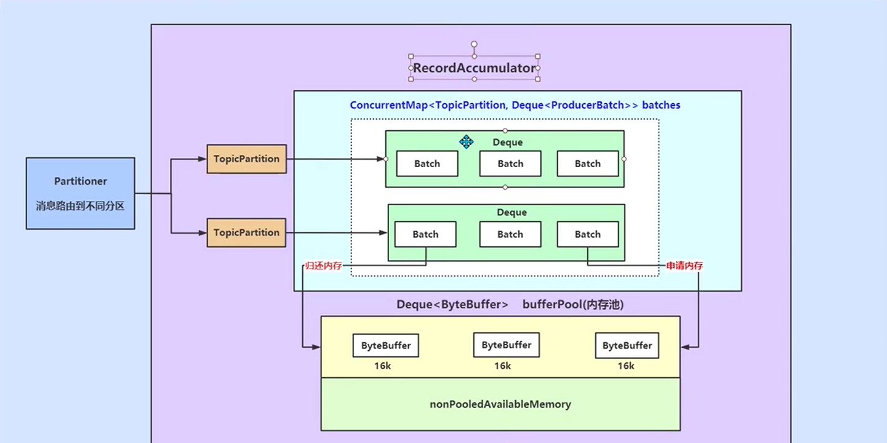

## KafkaProducer Demo

```java

    public void run() {
        int messageKey = 0;
        int recordsSent = 0;
        while (recordsSent < numRecords) {
            String messageStr = "Message_" + messageKey;
            long startTime = System.currentTimeMillis();
            if (isAsync) { // Send asynchronously
                producer.send(new ProducerRecord<>(topic,
                    messageKey,
                    messageStr), new DemoCallBack(startTime, messageKey, messageStr));
            } else { // Send synchronously
                try {
                    producer.send(new ProducerRecord<>(topic,
                        messageKey,
                        messageStr)).get();
                    System.out.println("Sent message: (" + messageKey + ", " + messageStr + ")");
                } catch (InterruptedException | ExecutionException e) {
                    e.printStackTrace();
                }
            }
            messageKey += 2;
            recordsSent += 1;
        }
        System.out.println("Producer sent " + numRecords + " records successfully");
        latch.countDown();
    }

```

## Kafka 发送流程


## Kafka RecordAccumulator




## KafkaProducer 初始化
```java

    // visible for testing
    @SuppressWarnings("unchecked")
    KafkaProducer(ProducerConfig config,
                  Serializer<K> keySerializer,
                  Serializer<V> valueSerializer,
                  ProducerMetadata metadata,
                  KafkaClient kafkaClient,
                  ProducerInterceptors<K, V> interceptors,
                  Time time) {
        try {
            this.producerConfig = config;
            this.time = time;
    
            // 事务id
            String transactionalId = config.getString(ProducerConfig.TRANSACTIONAL_ID_CONFIG);
            // 配置 Client Id 一般不配置
            this.clientId = config.getString(ProducerConfig.CLIENT_ID_CONFIG);

            LogContext logContext;
            if (transactionalId == null)
                logContext = new LogContext(String.format("[Producer clientId=%s] ", clientId));
            else
                logContext = new LogContext(String.format("[Producer clientId=%s, transactionalId=%s] ", clientId, transactionalId));
            log = logContext.logger(KafkaProducer.class);
            log.trace("Starting the Kafka producer");
            
            // Metrics 监控信息
            Map<String, String> metricTags = Collections.singletonMap("client-id", clientId);
            MetricConfig metricConfig = new MetricConfig().samples(config.getInt(ProducerConfig.METRICS_NUM_SAMPLES_CONFIG))
                    .timeWindow(config.getLong(ProducerConfig.METRICS_SAMPLE_WINDOW_MS_CONFIG), TimeUnit.MILLISECONDS)
                    .recordLevel(Sensor.RecordingLevel.forName(config.getString(ProducerConfig.METRICS_RECORDING_LEVEL_CONFIG)))
                    .tags(metricTags);
            List<MetricsReporter> reporters = config.getConfiguredInstances(ProducerConfig.METRIC_REPORTER_CLASSES_CONFIG,
                    MetricsReporter.class,
                    Collections.singletonMap(ProducerConfig.CLIENT_ID_CONFIG, clientId));
            JmxReporter jmxReporter = new JmxReporter();
            jmxReporter.configure(config.originals(Collections.singletonMap(ProducerConfig.CLIENT_ID_CONFIG, clientId)));
            reporters.add(jmxReporter);
            MetricsContext metricsContext = new KafkaMetricsContext(JMX_PREFIX,
                    config.originalsWithPrefix(CommonClientConfigs.METRICS_CONTEXT_PREFIX));
            this.metrics = new Metrics(metricConfig, reporters, time, metricsContext);
            // 设置分区器，默认使用 DefaultPatitionner
            this.partitioner = config.getConfiguredInstance(
                    ProducerConfig.PARTITIONER_CLASS_CONFIG,
                    Partitioner.class,
                    Collections.singletonMap(ProducerConfig.CLIENT_ID_CONFIG, clientId));

            // 重试间隔时间
            long retryBackoffMs = config.getLong(ProducerConfig.RETRY_BACKOFF_MS_CONFIG);
            
            // 设置序列化器，支持自定义
            if (keySerializer == null) {
                this.keySerializer = config.getConfiguredInstance(ProducerConfig.KEY_SERIALIZER_CLASS_CONFIG,
                                                                                         Serializer.class);
                this.keySerializer.configure(config.originals(Collections.singletonMap(ProducerConfig.CLIENT_ID_CONFIG, clientId)), true);
            } else {
                config.ignore(ProducerConfig.KEY_SERIALIZER_CLASS_CONFIG);
                this.keySerializer = keySerializer;
            }
            if (valueSerializer == null) {
                this.valueSerializer = config.getConfiguredInstance(ProducerConfig.VALUE_SERIALIZER_CLASS_CONFIG,
                                                                                           Serializer.class);
                this.valueSerializer.configure(config.originals(Collections.singletonMap(ProducerConfig.CLIENT_ID_CONFIG, clientId)), false);
            } else {
                config.ignore(ProducerConfig.VALUE_SERIALIZER_CLASS_CONFIG);
                this.valueSerializer = valueSerializer;
            }
            
            // 拦截器链
            List<ProducerInterceptor<K, V>> interceptorList = (List) config.getConfiguredInstances(
                    ProducerConfig.INTERCEPTOR_CLASSES_CONFIG,
                    ProducerInterceptor.class,
                    Collections.singletonMap(ProducerConfig.CLIENT_ID_CONFIG, clientId));
            if (interceptors != null)
                this.interceptors = interceptors;
            else
                this.interceptors = new ProducerInterceptors<>(interceptorList);
            ClusterResourceListeners clusterResourceListeners = configureClusterResourceListeners(keySerializer,
                    valueSerializer, interceptorList, reporters);

            // 最大请求的消息大小默认 1M 
            this.maxRequestSize = config.getInt(ProducerConfig.MAX_REQUEST_SIZE_CONFIG);

            // 缓存大小默认32M 其实就是 RecordAccumulator 的缓冲区大小
            this.totalMemorySize = config.getLong(ProducerConfig.BUFFER_MEMORY_CONFIG);

            // 设置压缩格式
            this.compressionType = CompressionType.forName(config.getString(ProducerConfig.COMPRESSION_TYPE_CONFIG));

            // 当 Buffer 满了，或者metadata 获取不到，或者序列化没有完成，或者分区函数没有计算完成等等 最大的阻塞时间 60s
            this.maxBlockTimeMs = config.getLong(ProducerConfig.MAX_BLOCK_MS_CONFIG);
            // 发送消息上报成功或者失败的的最大时间
            int deliveryTimeoutMs = configureDeliveryTimeout(config, log);

            this.apiVersions = new ApiVersions();
            // 配置事务管理器
            this.transactionManager = configureTransactionState(config, logContext);
            
            // 创建核心组件，RecordAccumulator，缓存消息
            this.accumulator = new RecordAccumulator(logContext,
                    config.getInt(ProducerConfig.BATCH_SIZE_CONFIG), // ProducerBatch 默认 16384bytes= 16KB
                    this.compressionType,
                    lingerMs(config),
                    retryBackoffMs,
                    deliveryTimeoutMs,
                    metrics,
                    PRODUCER_METRIC_GROUP_NAME,
                    time,
                    apiVersions,
                    transactionManager,
                    new BufferPool(this.totalMemorySize, config.getInt(ProducerConfig.BATCH_SIZE_CONFIG), metrics, time, PRODUCER_METRIC_GROUP_NAME));

            List<InetSocketAddress> addresses = ClientUtils.parseAndValidateAddresses(
                    config.getList(ProducerConfig.BOOTSTRAP_SERVERS_CONFIG),
                    config.getString(ProducerConfig.CLIENT_DNS_LOOKUP_CONFIG));
            
            // 判断kafka 元数据信息是否存在
            if (metadata != null) {
                // Kafka 集群节点、topic、topic 分区、ISR 列表
                this.metadata = metadata;
            } else {
                this.metadata = new ProducerMetadata(retryBackoffMs,
                        config.getLong(ProducerConfig.METADATA_MAX_AGE_CONFIG),
                        config.getLong(ProducerConfig.METADATA_MAX_IDLE_CONFIG),
                        logContext,
                        clusterResourceListeners,
                        Time.SYSTEM);
                this.metadata.bootstrap(addresses);
            }

            this.errors = this.metrics.sensor("errors");
            // 初始化 Sender 线程
            this.sender = newSender(logContext, kafkaClient, this.metadata);
            String ioThreadName = NETWORK_THREAD_PREFIX + " | " + clientId;
            this.ioThread = new KafkaThread(ioThreadName, this.sender, true);
            this.ioThread.start();

            config.logUnused();
            AppInfoParser.registerAppInfo(JMX_PREFIX, clientId, metrics, time.milliseconds());
            log.debug("Kafka producer started");
        } catch (Throwable t) {
            // call close methods if internal objects are already constructed this is to prevent resource leak. see KAFKA-2121
            close(Duration.ofMillis(0), true);
            // now propagate the exception
            throw new KafkaException("Failed to construct kafka producer", t);
        }
    }

```

### NetWorkClient

NetWorkClient 可能导致的乱序的情况，max.in.flight.request.per.connection: 5 默认配置。即可能同时发送5个消息，但是其中之一如果失败重试，则顺序就会乱。
设置为 1 可以避免一个分区内的乱序。


没有建立连接，会移除可用主机，也就获取不到 Batches，即不会发送消息到对应主机上。


### Sender retry & ack


## Producer doSend

```java

    /**
     * Implementation of asynchronously send a record to a topic.
     */
    private Future<RecordMetadata> doSend(ProducerRecord<K, V> record, Callback callback) {
        TopicPartition tp = null;
        try {
            throwIfProducerClosed();
            // first make sure the metadata for the topic is available
            long nowMs = time.milliseconds();
            ClusterAndWaitTime clusterAndWaitTime;
            try {
                // 等待拉去元数据
                clusterAndWaitTime = waitOnMetadata(record.topic(), record.partition(), nowMs, maxBlockTimeMs);
            } catch (KafkaException e) {
                if (metadata.isClosed())
                    throw new KafkaException("Producer closed while send in progress", e);
                throw e;
            }
            nowMs += clusterAndWaitTime.waitedOnMetadataMs;
            long remainingWaitMs = Math.max(0, maxBlockTimeMs - clusterAndWaitTime.waitedOnMetadataMs);
            Cluster cluster = clusterAndWaitTime.cluster;
        
            // key value 序列化
            byte[] serializedKey;
            try {
                serializedKey = keySerializer.serialize(record.topic(), record.headers(), record.key());
            } catch (ClassCastException cce) {
                throw new SerializationException("Can't convert key of class " + record.key().getClass().getName() +
                        " to class " + producerConfig.getClass(ProducerConfig.KEY_SERIALIZER_CLASS_CONFIG).getName() +
                        " specified in key.serializer", cce);
            }
            byte[] serializedValue;
            try {
                serializedValue = valueSerializer.serialize(record.topic(), record.headers(), record.value());
            } catch (ClassCastException cce) {
                throw new SerializationException("Can't convert value of class " + record.value().getClass().getName() +
                        " to class " + producerConfig.getClass(ProducerConfig.VALUE_SERIALIZER_CLASS_CONFIG).getName() +
                        " specified in value.serializer", cce);
            }
            
            // 根据元数据信息，计算出消息应该发送到哪个分区
            int partition = partition(record, serializedKey, serializedValue, cluster);
            tp = new TopicPartition(record.topic(), partition);

            setReadOnly(record.headers());
            Header[] headers = record.headers().toArray();

            int serializedSize = AbstractRecords.estimateSizeInBytesUpperBound(apiVersions.maxUsableProduceMagic(),
                    compressionType, serializedKey, serializedValue, headers);
            //  判断消息是否超过 消息大小的最大值 默认 1M
            ensureValidRecordSize(serializedSize);
            long timestamp = record.timestamp() == null ? nowMs : record.timestamp();
            if (log.isTraceEnabled()) {
                log.trace("Attempting to append record {} with callback {} to topic {} partition {}", record, callback, record.topic(), partition);
            }
            // producer callback will make sure to call both 'callback' and interceptor callback
            // 绑定 callback 回调函数
            Callback interceptCallback = new InterceptorCallback<>(callback, this.interceptors, tp);

            if (transactionManager != null && transactionManager.isTransactional()) {
                transactionManager.failIfNotReadyForSend();
            }
            RecordAccumulator.RecordAppendResult result = accumulator.append(tp, timestamp, serializedKey,
                    serializedValue, headers, interceptCallback, remainingWaitMs, true, nowMs);

            if (result.abortForNewBatch) {
                int prevPartition = partition;
                partitioner.onNewBatch(record.topic(), cluster, prevPartition);
                partition = partition(record, serializedKey, serializedValue, cluster);
                tp = new TopicPartition(record.topic(), partition);
                if (log.isTraceEnabled()) {
                    log.trace("Retrying append due to new batch creation for topic {} partition {}. The old partition was {}", record.topic(), partition, prevPartition);
                }
                // producer callback will make sure to call both 'callback' and interceptor callback
                interceptCallback = new InterceptorCallback<>(callback, this.interceptors, tp);

                result = accumulator.append(tp, timestamp, serializedKey,
                    serializedValue, headers, interceptCallback, remainingWaitMs, false, nowMs);
            }
        
            // 判断事务
            if (transactionManager != null && transactionManager.isTransactional())
                transactionManager.maybeAddPartitionToTransaction(tp);
            // 如果批次满了，或者是创建了新的批次
            if (result.batchIsFull || result.newBatchCreated) {
                log.trace("Waking up the sender since topic {} partition {} is either full or getting a new batch", record.topic(), partition);
                // 唤醒 sender, 它是真正发送数据的线程
                this.sender.wakeup();
            }
            return result.future;
            // handling exceptions and record the errors;
            // for API exceptions return them in the future,
            // for other exceptions throw directly
        } catch (ApiException e) {
            log.debug("Exception occurred during message send:", e);
            if (callback != null)
                callback.onCompletion(null, e);
            this.errors.record();
            this.interceptors.onSendError(record, tp, e);
            return new FutureFailure(e);
        } catch (InterruptedException e) {
            this.errors.record();
            this.interceptors.onSendError(record, tp, e);
            throw new InterruptException(e);
        } catch (KafkaException e) {
            this.errors.record();
            this.interceptors.onSendError(record, tp, e);
            throw e;
        } catch (Exception e) {
            // we notify interceptor about all exceptions, since onSend is called before anything else in this method
            this.interceptors.onSendError(record, tp, e);
            throw e;
        }
    }

```

## Nagle 算法

默认开启。适用于需要发送大量消息的场景，这种算法可以减少传输次数，增加性能。
它会把一些包收集起来，组成一个大包发送出去。所以一定不能设置为 false, 否则，消息包小，不组成大包发出去是不合理的。


## Kafka 处理粘包拆包问题


```text
Kafka 底层就是通过**长度编码方式**解决TCP 粘包 拆包问题的。
```

## Kafka 服务端模型


Kafka Processor 如何处理 stagedReceives 中的请求？


KafkaServer 处理 RequestQueue


## kafka 整体架构


## kafka broker


## 内存映射与稀疏索引
MappedByteBuffer, 当已写入的字节数超过了 4KB (4096bytes), 会调用索引对象的 append 方法增加索引。即稀疏索引。


写消息到磁盘文件中，底层采用了 FileChannel , 出于性能考虑，操作系统会将数据缓存到内存中(OS Cache)
所以无法保证写入到 FileChannel 里的数据一定会即时写到磁盘中，要保证这一点，需要调用 force 方法。

## Leader Partition & Follower 同步

### kafka不是完全同步，也不是完全异步，是一种ISR机制：

```text
1. leader会维护一个与其基本保持同步的Replica列表，该列表称为ISR(in-sync Replica)，每个Partition都会有一个ISR，而且是由leader动态维护

2. 如果一个follower比一个leader落后太多，或者超过一定时间未发起数据复制请求，则leader将其重ISR中移除

3. 当ISR中所有Replica都向Leader发送ACK时，leader才commit，这时候producer才能认为一个请求中的消息都commit了。
```

LEO: Log end offset

HW: High Watermark, 

Learder HW = MIN(ISR_ALL(Replica(1)LEO,Replica(2)LEO, .... Replica(N)LEO))


## Kafka Consumer init


## Kafka 流程


### Kafka 保证消息不丢

```text

1. KafkaProducer send 使用回调，失败重试
2. Consumer 手动提交(两次消费问题，业务自己处理)
3. 假如 leader 副本所在的 broker 突然挂掉，那么就要从 follower 副本重新选出一个 leader ，但是 leader 的数据还有一些没有被 follower 副本的同步的话，就会造成消息丢失。
   设置 acks = all 所有副本都要接收到该消息之后该消息才算真正成功被发送

4. 设置 replication.factor >= 3
   为了保证 leader 副本能有 follower 副本能同步消息，我们一般会为 topic 设置 replication.factor >= 3。这样就可以保证每个 分区(partition) 至少有 3 个副本。虽然造成了数据冗余，但是带来了数据的安全性。
   
5. min.insync.replicas > 1
   一般情况下我们还需要设置 min.insync.replicas> 1 ，这样配置代表消息至少要被写入到 2 个副本才算是被成功发送。min.insync.replicas 的默认值为 1 ，在实际生产中应尽量避免默认值 1。
6. 确保 replication.factor > min.insync.replicas

7. unclean.leader.election.enable = false 当 leader 副本发生故障时就不会从 follower 副本中和 leader 同步程度达不到要求的副本中选择出 leader ，这样降低了消息丢失的可能性

```

### Coordinator

```text
Coordinator一般指的是运行在broker上的group Coordinator，用于管理Consumer Group中各个成员，每个KafkaServer都有一个GroupCoordinator实例，管理多个消费者组,

主要用于offset位移管理和Consumer Rebalance

```

#### Coordinator存储的信息

对于每个Consumer Group，Coordinator会存储以下信息：

1. 对每个存在的topic，可以有多个消费组group订阅同一个topic(对应消息系统中的广播)

2. 对每个Consumer Group，元数据如下：
```text

订阅的topics列表
Consumer Group配置信息，包括session timeout等
组中每个Consumer的元数据。包括主机名，consumer id
每个正在消费的topic partition的当前offsets
Partition的ownership元数据，包括consumer消费的partitions映射关系
```

#### 如何确定consumer group的coordinator

1. 确定consumer group位移信息写入__consumers_offsets这个topic的哪个分区。具体计算公式：

__consumers_offsets partition# = Math.abs(groupId.hashCode() % groupMetadataTopicPartitionCount) 

注意：groupMetadataTopicPartitionCount由offsets.topic.num.partitions指定，默认是50个分区。


2. 该分区leader所在的broker就是被选定的coordinator


#### Coordinator工作过程

offset位移管理
消费者在消费的过程中需要记录自己消费了多少数据，即消费位置信息。在Kafka中这个位置信息有个专门的术语：位移(offset)。
(1)、很多消息引擎都把这部分信息保存在服务器端(broker端)。这样做的好处当然是实现简单，但会有三个主要的问题：
1. broker从此变成有状态的，会影响伸缩性；
2. 需要引入应答机制(acknowledgement)来确认消费成功。
3. 由于要保存很多consumer的offset信息，必然引入复杂的数据结构，造成资源浪费。
而Kafka选择了不同的方式：每个consumer group管理自己的位移信息，那么只需要简单的一个整数表示位置就够了；同时可以引入checkpoint机制定期持久化，简化了应答机制的实现。
(2)、Kafka默认是定期帮你自动提交位移的(enable.auto.commit = true)，你当然可以选择手动提交位移实现自己控制。
(3)、另外kafka会定期把group消费情况保存起来


增加__consumeroffsets topic，将offset信息写入这个topic，摆脱对zookeeper的依赖(指保存offset这件事情)。__consumer_offsets中的消息保存了每个consumer group某一时刻提交的offset信息。

__consumers_offsets topic配置了compact策略，使得它总是能够保存最新的位移信息，既控制了该topic总体的日志容量，也能实现保存最新offset的目的


### Rebalance

```text

rebalance本质上是一组协议。group与coordinator共同使用它来完成group的rebalance。目前kafka提供了5个协议来处理与consumer group coordination相关的问题：

Heartbeat请求：consumer需要定期给coordinator发送心跳来表明自己还活着

LeaveGroup请求：主动告诉coordinator我要离开consumer group

SyncGroup请求：group leader把分配方案告诉组内所有成员

JoinGroup请求：成员请求加入组

DescribeGroup请求：显示组的所有信息，包括成员信息，协议名称，分配方案，订阅信息等。通常该请求是给管理员使用

Coordinator在rebalance的时候主要用到了前面4种请求。

```

rebalance的前提是coordinator已经确定了。

总体而言，rebalance分为2步：Join和Sync


 Join， 顾名思义就是加入组。
 
 这一步中，所有成员都向coordinator发送JoinGroup请求，请求入组。
 
 一旦所有成员都发送了JoinGroup请求，coordinator会从中选择一个consumer担任leader的角色，并把组成员信息以及订阅信息发给leader——注意leader和coordinator不是一个概念。
 
 leader负责消费分配方案的制定。


Sync，这一步leader开始分配消费方案，即哪个consumer负责消费哪些topic的哪些partition。

一旦完成分配，leader会将这个方案封装进SyncGroup请求中发给coordinator，非leader也会发SyncGroup请求，只是内容为空。

coordinator接收到分配方案之后会把方案塞进SyncGroup的response中发给各个consumer。这样组内的所有成员就都知道自己应该消费哪些分区了。


### Rebalance 场景分析

#### 新成员加入组


#### 组成员“崩溃”

成员崩溃和组成员主动离开是两个不同的场景。因为在崩溃时成员并不会主动地告知coordinator此事，coordinator有可能需要一个完整的session.timeout周期(心跳周期)才能检测到这种崩溃，这必然会造成consumer的滞后。可以说离开组是主动地发起rebalance；而崩溃则是被动地发起rebalance。

#### 提交位移 (需要在超时前完成)

### 如何避免不必要的rebalance

要避免 Rebalance，还是要从 Rebalance 发生的时机入手。我们在前面说过，Rebalance 发生的时机有三个：

```text

1. 组成员数量发生变化

2. 订阅主题数量发生变化

3. 订阅主题的分区数发生变化

```

后两个我们大可以人为的避免，发生rebalance最常见的原因是消费组成员的变化。


消费者成员正常的添加和停掉导致rebalance，这种情况无法避免，但是时在某些情况下，Consumer 实例会被 Coordinator 错误地认为 “已停止” 从而被“踢出”Group。从而导致rebalance。

除了这个参数，Consumer 还提供了一个控制发送心跳请求频率的参数，就是 heartbeat.interval.ms。这个值设置得越小，Consumer 实例发送心跳请求的频率就越高。频繁地发送心跳请求会额外消耗带宽资源，但好处是能够更加快速地知晓当前是否开启 Rebalance，因为，目前 Coordinator 通知各个 Consumer 实例开启 Rebalance 的方法，就是将 REBALANCE_NEEDED 标志封装进心跳请求的响应体中。

除了以上两个参数，Consumer 端还有一个参数，用于控制 Consumer 实际消费能力对 Rebalance 的影响，即 max.poll.interval.ms 参数。它限定了 Consumer 端应用程序两次调用 poll 方法的最大时间间隔。它的默认值是 5 分钟，表示你的 Consumer 程序如果在 5 分钟之内无法消费完 poll 方法返回的消息，那么 Consumer 会主动发起 “离开组” 的请求，Coordinator 也会开启新一轮 Rebalance。

通过上面的分析，我们可以看一下那些rebalance是可以避免的：

第一类非必要 Rebalance 是因为未能及时发送心跳，导致 Consumer 被 “踢出”Group 而引发的。这种情况下我们可以设置 session.timeout.ms 和 heartbeat.interval.ms 的值，来尽量避免rebalance的出现。（以下的配置是在网上找到的最佳实践，暂时还没测试过）

设置 session.timeout.ms = 6s。
设置 heartbeat.interval.ms = 2s。
要保证 Consumer 实例在被判定为 “dead” 之前，能够发送至少 3 轮的心跳请求，即 session.timeout.ms >= 3 * heartbeat.interval.ms。
将 session.timeout.ms 设置成 6s 主要是为了让 Coordinator 能够更快地定位已经挂掉的 Consumer，早日把它们踢出 Group。

第二类非必要 Rebalance 是 Consumer 消费时间过长导致的。此时，max.poll.interval.ms 参数值的设置显得尤为关键。如果要避免非预期的 Rebalance，你最好将该参数值设置得大一点，比你的下游最大处理时间稍长一点。

总之，要为业务处理逻辑留下充足的时间。这样，Consumer 就不会因为处理这些消息的时间太长而引发 Rebalance 。

相关概念
coordinator
Group Coordinator是一个服务，每个Broker在启动的时候都会启动一个该服务。Group Coordinator的作用是用来存储Group的相关Meta信息，并将对应Partition的Offset信息记录到Kafka内置Topic(__consumer_offsets)中。Kafka在0.9之前是基于Zookeeper来存储Partition的Offset信息(consumers/{group}/offsets/{topic}/{partition})，因为ZK并不适用于频繁的写操作，所以在0.9之后通过内置Topic的方式来记录对应Partition的Offset。

每个Group都会选择一个Coordinator来完成自己组内各Partition的Offset信息，选择的规则如下：

1，计算Group对应在__consumer_offsets上的Partition
2，根据对应的Partition寻找该Partition的leader所对应的Broker，该Broker上的Group Coordinator即就是该Group的Coordinator
Partition计算规则：

partition-Id(__consumer_offsets) = Math.abs(groupId.hashCode() % groupMetadataTopicPartitionCount)
其中groupMetadataTopicPartitionCount对应offsets.topic.num.partitions参数值，默认值是50个分区


### Rebalance Listener
因为触发Rebalance的可能性太多，并且在实际的工作中并不是所有的Rebalance都是有益的，所以可以在代码层面实现对Rebalance的监控，从而根据真实的业务场景做出相应的对策。这里贴出监控Demo：通过在客户端维护Offset信息可以自定义控制消息的commit，尽可能保证Exactly Once语义，避免重复消费。
```java

/**
 * ConsumerRebalanceListener: 监听客户端Rebalance 包含两个方法onPartitionsRevoked和onPartitionsAssigned
 * 
 * onPartitionsRevoked： 在客户端停止消费消息后、在Rebalance开始前调用可以在此时提交offset信息、保证在Rebalance后的consumer可以准确知晓Partition的消费起点
 * onPartitionsAssigned：在Rebalance完成后调用
 *
 * @author yhyr
 */
public class ConsumerRebalanceListenerDemo {
    private static Map<TopicPartition, OffsetAndMetadata> currentOffsets = new HashMap<>();
    private static List<String> topics = Collections.singletonList("demoTopic");
    private static KafkaConsumer<String, String> consumer;
    static {
        Properties props = new Properties();
        props.put("bootstrap.servers", "localhost:9092");
        props.put("group.id", "group_test");
        props.put("enable.auto.commit", "true");
        props.put("auto.commit.interval.ms", "1000");
        props.put("key.deserializer", "org.apache.kafka.common.serialization.StringDeserializer");
        props.put("value.deserializer", "org.apache.kafka.common.serialization.StringDeserializer");
        consumer = new KafkaConsumer<>(props);
    }

    private class CustomHandleRebalance implements ConsumerRebalanceListener {
        @Override
        public void onPartitionsRevoked(Collection<TopicPartition> collection) {
            System.out.println("Before Rebalance, Assignment partitions is : " + collection.toString());
            System.out.println("Before Rebalance, Each partition's lastest consumer offset : "
                + currentOffsets.toString());
        }

        @Override
        public void onPartitionsAssigned(Collection<TopicPartition> collection) {
            System.out.println("After Rebalance, Assignment partitions is : " + collection.toString());
            System.out.println("After Rebalance, Each partition's lastest consumer offset : "
                + currentOffsets.toString());
        }
    }

    private void consumer() {
        // 通过自定义Rebalance监听方式来订阅Topic
        consumer.subscribe(topics, new CustomHandleRebalance());
        while (true) {
            ConsumerRecords<String, String> records = consumer.poll(100);
            for (ConsumerRecord<String, String> record : records) {
                // deal with msg
                System.out.println("Current Processing msg info : " + record.toString());
                // increase offset
                currentOffsets.put(new TopicPartition(record.topic(), record.partition()),
                    new OffsetAndMetadata(record.offset() + 1));
            }
            // submit offset by consumer.commitSync() or consumer.commitAsync() if you need; Default kafka auto commit
        }
    }

    public static void main(String[] args) {
        ConsumerRebalanceListenerDemo action = new ConsumerRebalanceListenerDemo();
        action.consumer();
    }
}

```