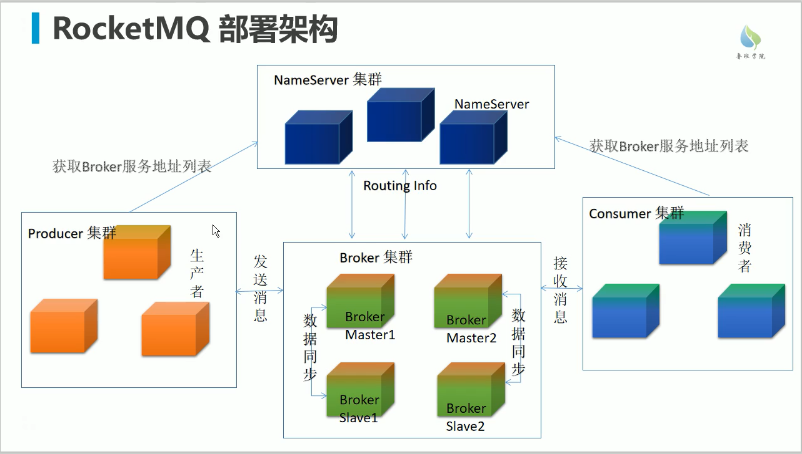
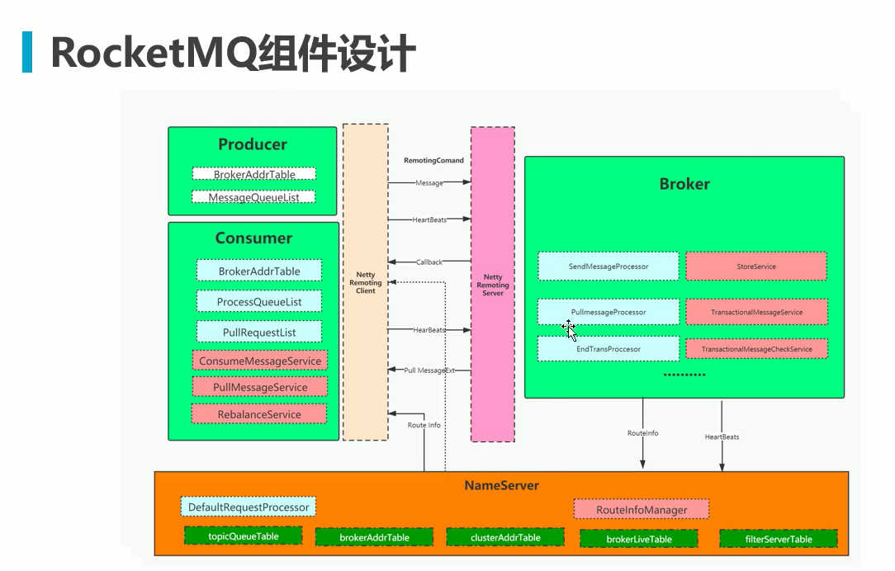
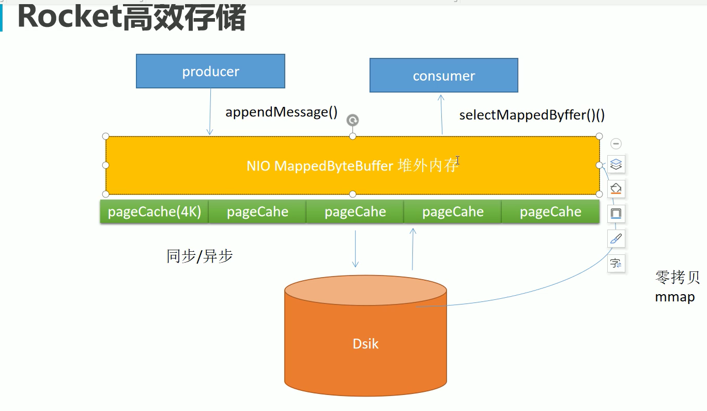
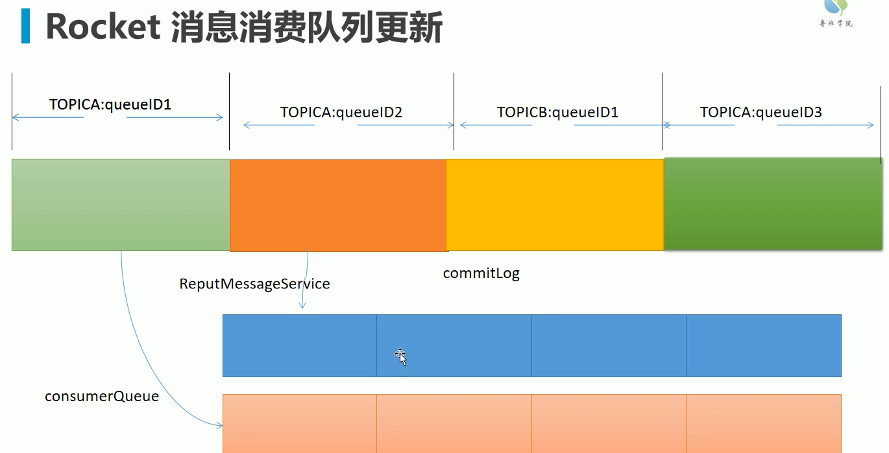
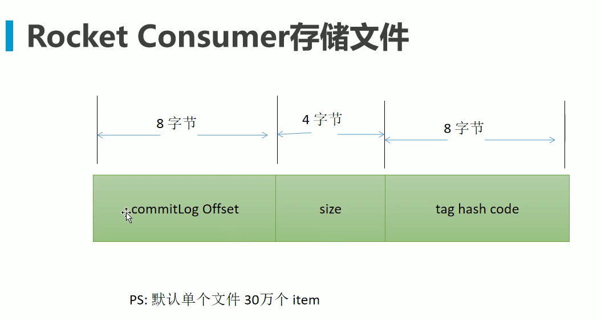
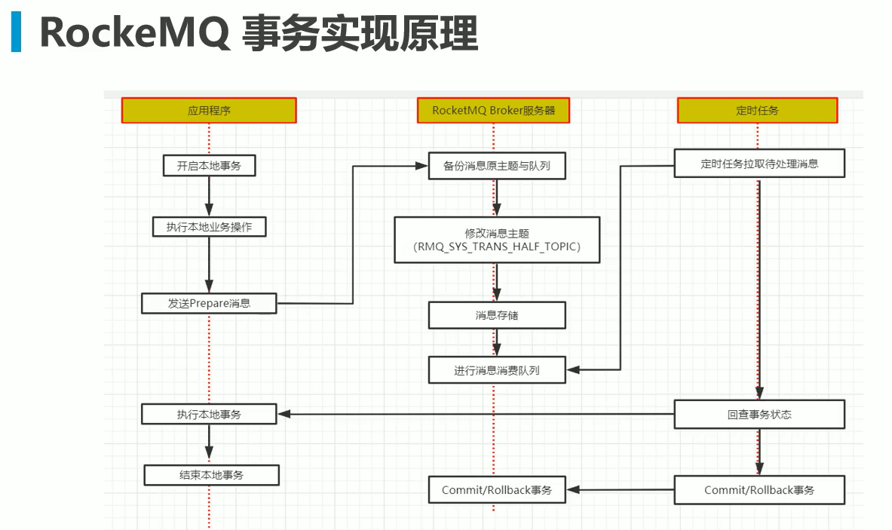
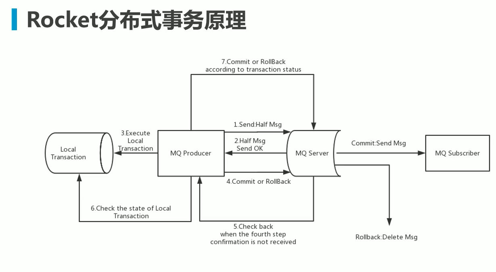

注释格式：`注释2.3.3`

1. broker：broker 模块
2. client：消息客户端，包含消息生产者、消息消费者相关类
3. common：公共包
4. dev：开发者信息（非源代码 ）
5. distribution：部署实例文件夹
6. example：示例代码
7. filter：消息过滤相关基础类
8. filtersrv：消息过滤服务器实现相关类
11. openmessaging：消息开放标准
12. remoting：远程通信模块，基于 Netty
13. srvutil：服务器工具类
14. store：消息存储实现相关类
15. style：checkstyle 相关实现
16. test：测试相关类
17. tools：工具类，监控命令相关实现类

### 1.3.1 设计理念

基于主题的发布与订阅模式：消息发送、消息存储、消息消费  
NameServer 实现元数据的管理（Topic路由信息等），但集群之间互不通信  

# 2 路由中心 NameServer

## 2.1 架构设计

NameServer 互相之间不通信，Broker 消息服务器在启动时向所有的 NameServer 注册，Producer
在发送消息之前从 NameServer 获取 Broker 服务器地址列表，然后根据负载算法选择一台进行发送，
NameServer 与每台 Broker 保持长连接，30s 检测 Broker 是否存活，如果检测到 Broker 宕机，
从路由注册表中移除，但不会马上通知 Producer，为了降低 NameServer 的复杂度，让 Producer 
的容错机制保证消息发送的高可用性

## 2.3 路由注册、故障剔除

### 2.3.1 路由元信息

QueueData：在 2M-2S 中，每个 M-S 的每个 Topic 有 4个读队列和4个写队列  
BrokerData  
BrokerLiveInfo

### 2.3.2 路由注册

Broker 基于定时线程池组装请求信息，遍历 NameServer 发送，多个 Broker 心跳包
NameServer 基于读写锁串行更新 Broker 信息，但是读取 Broker 表信息是并发读，标准
的 ReadWriteLock

### 2.3.3 路由删除

被动：NameServer 的定时任务线程会 10s 扫描一次 Broker 元信息表，查看 BrokerLive 的
lastUpdateTimestamp 并与当前时间戳对比，超过 120s 进行移除操作，并更新对应的其它
元信息表  
主动：Broker 正常关闭，发送 unregisterBroker 指令删除

### 2.3.4 路由发现

非实时，即 NameServer 不主动推送最新的路由，而是由客户端主动定时通过特殊的某个主题去拉
取最新的路由

# 3 消息发送

可靠消息发送、可靠异步发送、单向（oneway）发送

## 3.1 简略消息发送

同步(sync)：发送消息的API是阻塞的，直到消息服务器返回  
异步(async)：发送消息的API是异步主线程不阻塞，通过回调来获取发送结果   
单向(oneway)：发送消息的API直接返回，也没回调函数，只管发

## 3.2 Message 类

扩展都存放到 map，包括 tag keys 等

## 3.3 生产者启动流程

### 3.3.1 DefaultMQProducer

### 3.3.2 生产者启动流程

## 3.4 消息发送基本流程

验证消息、查找路由、消息发送 

### 3.4.1 消息长度验证

### 3.4.2 查找主题路由信息

### 3.4.3 选择消息队列

根据 ThreadLocal + random + volatile：对消息队列轮询查找，并对超过阈值 broker 没有
交互的直接剔除，避免轮询已经宕机的 broker 消息队列

### 3.4.4 消息发送

## 3.5 批量消息发送

使用 MessageBatch 类，在发送时使用 instanceof 判断是否是批量，从而进行操作  
压缩不支持批量

# 4 消息存储

## 4.1 存储概要

Commitlog、ConsumeQueue、IndexFile   
Commitlog：将所有主题的消息存储在同一个文件中，确保消息发送时顺序写文件，但是对消息主题检索消息
不友好  
因此额外增加了 ConsumeQueue 消息队列文件，每个消息主题包含多个消息消费队列，
每个消息队列有一个消息文件  
IndexFile 索引文件，加速消息检索，根据消息的属性快速从 Commitlog 检索消息  
![][0]

## 4.2 初识消息存储

## 4.3 消息发送存储流程

## 4.4 存储文件组织与内存映射

CommitLog、ConsumeQueue、IndexFile：单个文件固定长度，文件名为该文件第一条消息对应的全局物理偏移量

### 4.4.1 MappedFileQueue 映射文件队列

MappedFileQueue 是对存储目录的封装，即作为一个文件夹，下面包含多个文件

### 4.4.2 MappedFile 内存映射文件

勘误：第96页，不是 MappedFile 的 shutdown 而应该是 ReferenceResource 的 shutdown，
其中使用了引用计数关闭

### 4.4.3 TransientStorePool

短暂的存储池，用来临时存储数据，数据先写入该内存映射中，然后由 commit 线程定时将数据从该
内存复制到与目的物理文件对应的内存映射中  
引入该机制主要原因是提供一种内存锁定，将当前堆外内存一直锁定在内存中，避免被进程将内存交换到磁盘。

## 4.5 RocketMQ存储文件

commitlog：消息存储目录  
config：运行时配置  
consumerFilter.json：主题消息过滤信息  
consumerOffset.json：集群消费模式消息消费进度  
delayOffset.json：延时消息队列拉取进度  
subscriptionGroup.json：消息消费组配置信息  
topics.json:topic配置属性  
consumequeue：消息消费队列存储目录  
index：消息索引文件存储目录  
abort：如果存在，则说明 Broker 非正常关闭，启动时创建，正常退出前删除  
checkpoint：存储 commitlog 文件最后一次刷盘时间戳 、consumequeue 最后一次刷盘时间、index 索引文件最后一次刷盘时间戳

### 4.5.1 Commitlog文件

![][1]

### 4.5.2 ConsumeQueue文件

同一主题的消息不连续地存储在 commitlog 文件中，如果需要查找某个主题下的消息，只能通过遍历，
效率极低，因此设计了消息消费队列文件（ConsumeQueue），即作为 Commitlog 文件消息消费的"索引"
文件，consumequeue 的第一级目录为消息主题，第二级目录为主题的消息队列   

- Topic1   
-------- 0  
-------- 1  
-------- 2  
-------- 3  
- Topic2   
-------- 0  
-------- 1  
-------- 2  
-------- 3  

### 4.5.3 Index索引文件

![][2]

## 4.6 实时更新消息消费队列与索引文件

消息消费队列文件、消息属性属性文件都是基于 CommitLog 文件构建，当消息生产者提交的消息存储在 CommitLog 文件中，
ConsumeQueue、IndexFile 需要及时更新，否则消息无法及时被消费，而且查找消息也出现延迟   
RocketMQ 通过开启一个线程 ReputMessageService 来准实时转发 CommitLog 文件更新事件（事件通知）

### 4.6.1 根据消息更新 ConsumeQueue

写入到 mappedFile，默认异步落盘

### 4.6.2 根据消息更新 Index 索引文件

## 4.7 消息队列与索引文件恢复

问题：消息成功存储到 Commitlog，但是转发任务未执行，Broker 宕机，此时三个文件不一致   
启动时通过判断 abort 文件的存在从而判断是否是异常宕机，初始化文件的偏移量，进行文件恢复

### 4.7.1 Broker 正常停止文件恢复

### 4.7.2 Broker 异常停止文件恢复

## 4.8 文件刷盘机制

基于 JDK NIO 的 MappedByteBuffer，内存映射机制，先将消息追加到内存，然后根据刷盘策略
在不同的时间写入磁盘，如果是同步刷盘，消息追加到内存后，将同步调用 MappedByteBuffer.force(),
如果是异步刷盘，则追加到内存后立刻返回给消息发送端  
基于 Commitlog 文件刷盘机制分析，其它两个文件类似

### 4.8.1 Broker 同步刷盘

消息生产者在消息服务端将消息内容追加到内存映射文件后（内存），需要同步将内存的内容立刻
刷写到磁盘，其中是堆外内存保证零拷贝效率，MappedByteBuffer.force 保证写入

### 4.8.2 Broker 异步刷盘

1. 将消息直接追加到 ByteBuffer(Direct)，wrotePostion 随着消息追加而移动  
2. CommitRealTimeService 线程每200ms将Buffer新追加的内容的数据提交到MappedByteBuffer
3. FlushRealTimeService 线程每500ms将MappedByteBuffer中新追加的内存通过调用
MappedByteBuffer.force 写入到磁盘  

## 4.9 过期文件删除机制

超过72小时的两个文件，无论消息是否被消费，都被删除

## 4.10 总结

消息到达 commitlog 通过定时线程转发到 consumequeue/indexFile  
使用 abort 文件做异常宕机的记录

# 5 消息消费 

## 5.1 消息消费概述

集群模式、广播模式  
推模式、拉模式

## 5.2 消息消费者初探

## 5.3 消费者启动流程

## 5.4 消息拉取

### 5.4.1 PullMessageService 实现机制

如何实现：一个消息队列在同一时间只允许被一个消息消费者消息，一个消息小飞飞着可以同时消费多个消息队列

### 5.4.2 ProcessQueue 实现机制

ProcessQueue 是 MessageQueue 在消费端的重现、快照？  
PullMessageService 从消息服务器默认每次拉取32条消息，按消息的队列偏移量顺序存放在 ProcessQueue 中  
PullMessageService 然后将消息提交到消费者消费线程池，消息成功消费后从 ProcessQueue 中移除

### 5.4.3 消息拉取基本流程

1. 消息拉取看客户端消息拉取请求封装
2. 消息服务器查找并返回消息
3. 消息拉取客户端处理返回的消息

![][4]
  
通过长轮询向消息服务端发送拉取请求，如果消息消费者向 RocketMQ 发送消息拉取时，消息并未到达
消费队列，如果不启用长轮询机制，则会在服务端等待 shortPollingTimeMills 时间后（挂起）
再去判断消息是否已达到消息队列，如果消息未到达则提示消息拉取客户端不存在。  
如果开启了长轮询模式，RocketMQ 以方便会每 5s 轮询检查一次消息是否可达，同时一有新消息达到
后立马通知挂起线程再次验证新消息是否是自己感兴趣的消息，如果是则从 commitlog 文件提取消息
返回给消息拉取客户端，否则直到挂起超时，push超时时间默认 15s。pull模式通过 

## 5.5 消息队列负载与重新分布机制

消息队列重新分布通过 RebalanceService 线程实现

![][5]

## 5.6 消息消费过程

消息拉取：PullMessageService 负责怼消息队列进行消息拉取，从远端服务器拉取消息后将
消息存入 ProcessQueue 消息队列处理队列中，然后调用 ConsumeMessageService.submitConsumeRequest()
进行方法消费，消息拉取与消息消费解耦

### 5.6.1 消息消费

### 5.6.2 消息确认（ACK）

消息监听器返回的消息结果为 RECONSUME_LATER，则需要将这些消息发送给 Broker 延迟消息。
如果发送 ACK 消息失败，将延迟 5s 后提交线程池进行消费

### 5.6.3 消费进度管理

消息消费者在消费一批消息后，需要记录该批消息已经消费完毕，即消息进度文件  
广播模式：同一个消费组的所有消息都需要消费主体下的所有消息，即消息进度需要独立存储，最
理想的存储地方应该是与消费者绑定  
集群模式：同一个消费组内的所有消息消费者共享消息主题下的所有消息，所以消费进度需要保存
在一个每个消费者都能访问到的地方

![][6]

## 5.7 定时消息机制

消息发送到 Broker 后，等到特定的时间后才能被消费，RocketMQ 并不支持任意的时间精度，
如果要支持任意时间精度的定时调度，不可避免地需要在 Broker 层做消息排序（ScheduledExecutorService），
再加上持久化方面的考量，将不可避免地带来巨大的性能消耗，所以 RocketMQ 只支持特定级别的延迟消息，
在 Broker 端通过 messageDelayLevel 配置：默认为 1s 5s 10s 30s 1m 2m 3m 4m 5m 6m 7m 
8m 9m 10m 20m 30m 1h 2h，delayLevel=1 表示延迟1s。  
定时任务，前面的消息重试也是借助的定时任务实现，在将消息存入 commitlog 文件之前需要判断
消息的重试次数，如果大于0，则会将消息的主题设置为 SCHEDULE_TOPIC_XXXX

### 5.7.1 load 方法

### 5.7.2 start 方法

### 5.7.3 定时调度逻辑

为每个延迟级别创建一个调度任务，每一个延迟级别对应 SCHEDULE_TOPIC_XXXX 主题下的一个
消息消费队列

整体流程：  
1. 消息消费者发送消息，如果发送消息的 delayLevel 大于0，则改变消息主题为 SCHEDULE_TOPIC_XXXX，
消息队列为 delayLevel-1  
2. 消息经由 commitlog 转发消息消费队列  
3. 定时任务每隔1s 根据上次拉取偏移量从消费队列中取出所有消息  
4. 根据消息的物理偏移量与消息大小从 commitlog 中拉取消息
5. 根据消息属性重新创建消息，存入 commitlog 文件
6. 转发到原 Topic 的消息消费队列，供消息消费者消费

![][7]

## 5.8 消息过滤机制

提交一个过滤雷到 FilterServer，消息消费者从 FilterServer 拉取消息。表达式纷纷为 TAG
与 SQL92 表达式  
commitlog 存储的是消息的 tag 的hashcode，直接对比 hashcode

## 5.9 顺序消费

支持局部消息顺序消费，即确保同一个消息消费队列中的消息被顺序消费，如果需要做到全局顺序
消费则考科一将主题匹配成一个队列，例如数据库 BinLog 等要求严格顺序的场景

### 5.9.1 消息队列负载

需要先通过 RebalanceService 线程实现消息队列的负载，集群模式下同一个消费组内的消费者
共同承担其订阅主题下消息队列的消费，同一个消息消费队列在同一时刻只会被消费组内一个消费者消费，
一个消费者同一时刻可以分配多个消费队列  
拉取任务时需要在 Broker 服务器锁定该消息队列

### 5.9.2 消息拉取

### 5.9.3 消息消费

当一个新的消费队列分配给消费者时，在添加其拉取任务之前必须向 Broker 发送对该消息队列加锁请求

### 5.9.4 消息队列锁实现

## 5.10 总结

消息队列负载20s一次  
消息拉取线程默认一次批量拉取32条消息，会有消息拉取流控可控制  
不支持任意精度的定时调度，延迟级别是有固定的消息消费队列主题来支持  
顺序消费一般使用集群模式时，必须锁定消息消费队列，在 Broker 端会存储消息消费队列的锁占用情况

![][8]

# 6 消息过滤 FilterServer

## 6.1 ClassFilter 运行机制

1. Broker 进程所在的服务器会启动多个 FilterServer 进程
2. 消费者在订阅消息主题时会上传一个自定义的消息过滤实现类，FilterServer加载并实例化
3. 消息消费者向FilterServer发送消息拉取请求，FilterServer接收到消息消费者消息拉取请求后，
FilterServer将消息拉取请求转发给 Broker，Broker返回消息后在 FilterServer端执行消息过滤
逻辑，然后返回消息

![][9]

## 6.2 FilterServer 注册剖析

## 6.3 类过滤模式订阅机制

## 6.4 消息拉取

消息拉取时，判断消息过滤模式是否为 classFilter，将拉取消息服务器地址由原来的 Broker
地址转换成该 Broker 服务器所对应的 FilterServer

# 7 RocketMQ 主从同步(HA)机制

HAService：主从同步核心实现类
HAService$AcceptSocketService：HA Master 端监听客户端连接实现类
HAService$GroupTransferService：主从同步通知实现类
HAService$HAClient：HA Client端实现类
HAConnection：HA Master 服务端HA 连接对象的封装，与 Broker 从服务器的网络读写实现类
HAConnection$ReadSocketService：HA Master 网络读实现类
HAConnection$WriteSockketService：HA Master 网络写实现类

##  7.1 主从复制原理

### 7.1.1 HAService 整体工作机制

1. 从服务器主动连接主服务器，主服务器接收客户端的连接
2. 从服务器主动向主服务器发送待拉取消息偏移量，主服务器解析请求并返回消息给从服务器
3. 从服务器保存消息并继续发发送新的消息同步请求

### 7.1.2 AcceptSocketService 实现原理

标准NIO的服务端请求，选择器每1s处理一次连接就绪事件，HAConnection将负责M-S数据同步逻辑

### 7.1.3 GroupTransferService 实现原理

同步阻塞实现，即M-S-sync  
消息发送者将消息刷写到磁盘后，需要继续等待新数据被传输到从服务器，从服务器数据的复制
是在另一个线程 HAConnection 中拉去，消息发送者在这里需要等待数据传输的结果

### 7.1.4 HAClient 实现原理 

### 7.1.5 HAConnection 实现原理

![][10]

## 7.2 读写分离机制

同一组Broker(M-S)服务器，它们的brokerName相同但brokerId不同，主为0，从>0，

## 7.3 本章小结

HA 核心是实现是从服务器在启动的时候主动向主服务器建立 TCP长连接，获取服务器的 commitlog
最大偏移量，以此偏移量向主服务器主动拉取消息，循环进行，达到主从服务器数据同步  
读写分离：消费者先向主服务器发起拉取请求，然后主服务器返回一批消息，并根据主服务器负载压力
与主从同步情况，向`从服务器`(勘误：消费者服务器)建议下次消息拉取是从主服务器还是从从服务器拉取  
  
勘误：224页，`从服务器`应该改为`向消费者服务器`

#  8 事务消息

## 8.1 事务消息实现思想

基于两阶段提交和定时事务状态回查决定消息最终是 commit/rollback  
![][11]

## 8.2 事务消息发送流程

![][12]

## 8.3 提交或回滚你事务

第二阶段：提交或回滚事务  
提交或回滚成功后，原消息不会物理删除，而是修改 Topic 逻辑删除

## 8.4 事务消息回查事务状态

通过 TransactionalMessageCheckService 线程池定时检测 RMQ_SYS_TRANS_ HALF_TOPIC 消息，
用户回查消息的事务状态

## 8.5 本章小结

事务消息基于两阶段提交和定时任务事务状态回查机制
![][13]

### Rocketmq 保证消息不丢

#### Producer发送消息阶段
1. 提供SYNC的发送消息方式，等待broker处理结果

 同步发送：Producer 向 broker 发送消息，阻塞当前线程等待 broker 响应 发送结果。

 异步发送：Producer 首先构建一个向 broker 发送消息的任务，把该任务提交给线程池，等执行完该任务时，回调用户自定义的回调函数，执行处理结果。

 Oneway发送：Oneway 方式只负责发送请求，不等待应答，Producer只负责把请求发出去，而不处理响应结果。

2. 重试3次，重试次数可以通过producer指定

3.  roker提供多master模式，即使某台broker宕机了，保证消息可以投递到另外一台正常的broker上
如果broker只有一个节点，则broker宕机了，即使producer有重试机制，也没用，因此利用多主模式，当某台broker宕机了，换一台broker进行投递

#### Broker处理消息阶段

1. 提供同步刷盘的策略

如果刷盘策略为异步，broker并不会等待消息落盘就会返回producer成功，也就是说当broker所在的服务器突然宕机，则会丢失部分页的消息

2. 提供主从模式，同时主从支持同步双写
即使broker设置了同步刷盘，如果主broker磁盘损坏，也是会导致消息丢失。 因此可以给broker指定slave，同时设置master为SYNC_MASTER，然后将slave设置为同步刷盘策略

此模式下，producer每发送一条消息，都会等消息投递到master和slave都落盘成功了，broker才会当作消息投递成功，保证休息不丢失。

在broker端，消息丢失的可能性主要在于刷盘策略和同步机制。
RocketMQ默认broker的刷盘策略为异步刷盘，如果有主从，同步策略也默认的是异步同步，这样子可以提高broker处理消息的效率，但是会有丢失的可能性。因此可以通过同步刷盘策略+同步slave策略+主从的方式解决丢失消息的可能。

#### Consumer消费消息阶段

1. consumer默认提供的是At least Once机制
2. 消费消息重试机制

## Rocket MQ

## RocketMQ 组件

NameServer 每 10s 扫描一次 Broker
Broker 每 30s 注册一次路由信息

## RocketMQ Producer 
### Producer 寻址

### Producer 重试机制

### RocketMQ 高效存储

### RocketMQ ConsumerQueue

本质是消息CommitLog的索引文件

### RocketMQ 事务

回查机制(15次)

 

[0]: https://leran2deeplearnjavawebtech.oss-cn-beijing.aliyuncs.com/learn/RocketMQ%E6%8A%80%E6%9C%AF%E5%86%85%E5%B9%95/4_1.png
[1]: https://leran2deeplearnjavawebtech.oss-cn-beijing.aliyuncs.com/learn/RocketMQ%E6%8A%80%E6%9C%AF%E5%86%85%E5%B9%95/4_2.png
[2]: https://leran2deeplearnjavawebtech.oss-cn-beijing.aliyuncs.com/learn/RocketMQ%E6%8A%80%E6%9C%AF%E5%86%85%E5%B9%95/4_3.png
[3]: https://leran2deeplearnjavawebtech.oss-cn-beijing.aliyuncs.com/learn/RocketMQ%E6%8A%80%E6%9C%AF%E5%86%85%E5%B9%95/4_4.png
[4]: https://leran2deeplearnjavawebtech.oss-cn-beijing.aliyuncs.com/learn/RocketMQ%E6%8A%80%E6%9C%AF%E5%86%85%E5%B9%95/5_1.png
[5]: https://leran2deeplearnjavawebtech.oss-cn-beijing.aliyuncs.com/learn/RocketMQ%E6%8A%80%E6%9C%AF%E5%86%85%E5%B9%95/5_2.png
[6]: https://leran2deeplearnjavawebtech.oss-cn-beijing.aliyuncs.com/learn/RocketMQ%E6%8A%80%E6%9C%AF%E5%86%85%E5%B9%95/5_3.png
[7]: https://leran2deeplearnjavawebtech.oss-cn-beijing.aliyuncs.com/learn/RocketMQ%E6%8A%80%E6%9C%AF%E5%86%85%E5%B9%95/5_4.png
[8]: https://leran2deeplearnjavawebtech.oss-cn-beijing.aliyuncs.com/learn/RocketMQ%E6%8A%80%E6%9C%AF%E5%86%85%E5%B9%95/5_5.png
[9]: https://leran2deeplearnjavawebtech.oss-cn-beijing.aliyuncs.com/learn/RocketMQ%E6%8A%80%E6%9C%AF%E5%86%85%E5%B9%95/6_1.png
[10]: https://leran2deeplearnjavawebtech.oss-cn-beijing.aliyuncs.com/learn/RocketMQ%E6%8A%80%E6%9C%AF%E5%86%85%E5%B9%95/7_1.png
[11]: https://leran2deeplearnjavawebtech.oss-cn-beijing.aliyuncs.com/learn/RocketMQ%E6%8A%80%E6%9C%AF%E5%86%85%E5%B9%95/8_1.png
[12]: https://leran2deeplearnjavawebtech.oss-cn-beijing.aliyuncs.com/learn/RocketMQ%E6%8A%80%E6%9C%AF%E5%86%85%E5%B9%95/8_2.png
[13]: https://leran2deeplearnjavawebtech.oss-cn-beijing.aliyuncs.com/learn/RocketMQ%E6%8A%80%E6%9C%AF%E5%86%85%E5%B9%95/8_3.png
