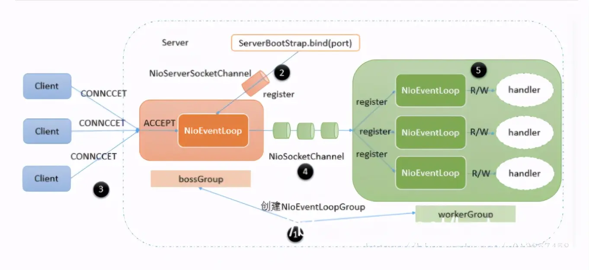
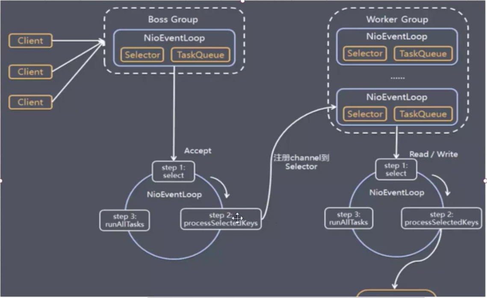
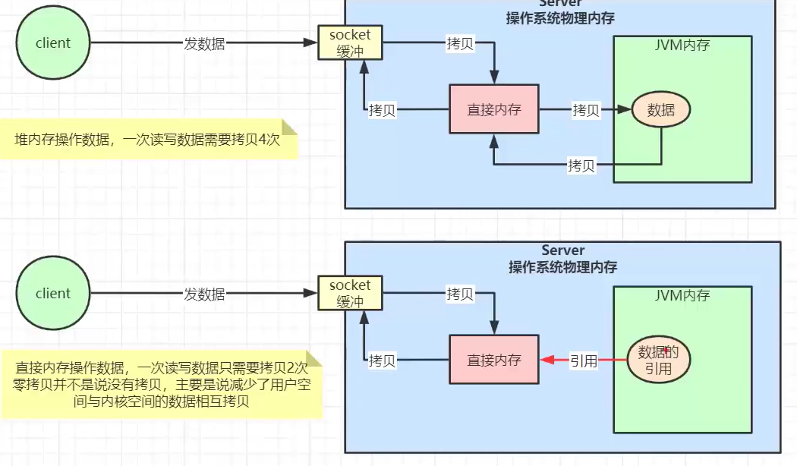

#### EventLoop（事件循环）
EventLoop 介绍

《Netty 实战》这本书是这样介绍它的：

**EventLoop 定义了 Netty 的核心抽象，用于处理连接的生命周期中所发生的事件。**

EventLoop 的主要作用实际就是责监听网络事件并调用事件处理器进行相关 I/O 操作（读写）的处理。


#### Channel 和 EventLoop 的关系

```text

Channel 为 Netty 网络操作(读写等操作)抽象类，EventLoop 负责处理注册到其上的Channel 的 I/O 操作，两者配合进行 I/O 操作。

```

#### EventLoopGroup 和 EventLoop 的关系

EventLoopGroup 包含多个 EventLoop（每一个 EventLoop 通常内部包含一个线程），它管理着所有的 EventLoop 的生命周期。

```text

EventLoop 处理的 I/O 事件都将在它专有的 Thread 上被处理，即 Thread 和 EventLoop 属于 1 : 1 的关系，从而保证线程安全。
```

#### ChannelHandler（消息处理器） 和 ChannelPipeline（ChannelHandler 对象链表）

** ChannelHandler 是消息的具体处理器，主要负责处理客户端/服务端接收和发送的数据。**

当 Channel 被创建时，它会被自动地分配到它专属的 ChannelPipeline。 一个Channel包含一个 ChannelPipeline。 ChannelPipeline 为 ChannelHandler 的链，一个 pipeline 上可以有多个 ChannelHandler。


#### Bootstrap & ServerBootStrap
Bootstrap 通常使用 connet() 方法连接到远程的主机和端口，作为一个 Netty TCP 协议通信中的客户端。另外，Bootstrap 也可以通过 bind() 方法绑定本地的一个端口，作为 UDP 协议通信中的一端。
ServerBootstrap通常使用 bind() 方法绑定本地的端口上，然后等待客户端的连接。
Bootstrap 只需要配置一个线程组— EventLoopGroup ,而 ServerBootstrap需要配置两个线程组— EventLoopGroup ，一个用于接收连接，一个用于具体的处理。

#### 流程




#### Zero-Copy
DirectByteBuf

