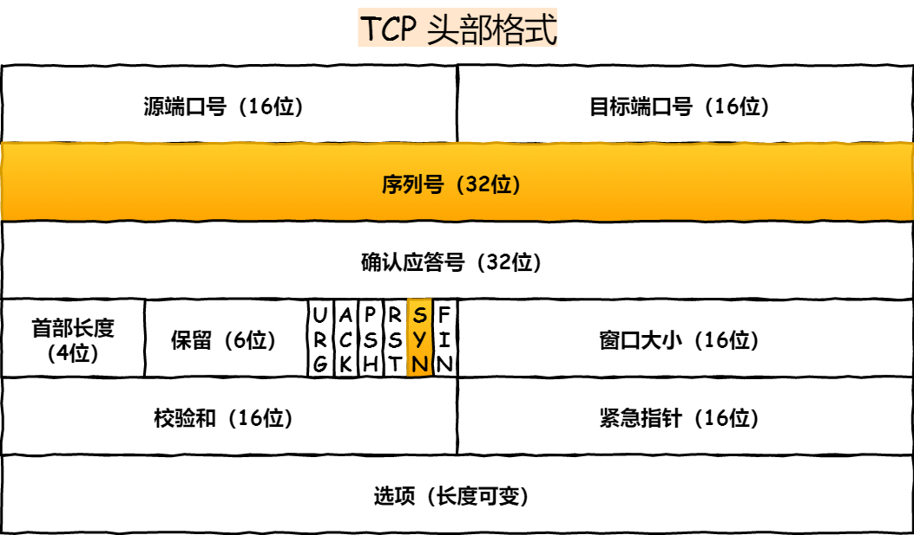

UDP 在传送数据之前不需要先建立连接，远地主机在收到 UDP 报文后，不需要给出任何确认。虽然 UDP 不提供可靠交付，但在某些情况下 UDP 确是一种最有效的工作方式（一般用于即时通信），比如： QQ 语音、 QQ 视频 、直播等等

TCP 提供面向连接的服务。在传送数据之前必须先建立连接，数据传送结束后要释放连接。 TCP 不提供广播或多播服务。由于 TCP 要提供可靠的，面向连接的传输服务（TCP的可靠体现在TCP在传递数据之前，会有三次握手来建立连接，而且在数据传递时，有确认、窗口、重传、拥塞控制机制，在数据传完后，还会断开连接用来节约系统资源），这一难以避免增加了许多开销，如确认，流量控制，计时器以及连接管理等。这不仅使协议数据单元的首部增大很多，还要占用许多处理机资源。TCP 一般用于文件传输、发送和接收邮件、远程登录等场景。

#### TCP 协议如何保证可靠传输
```text

1. 应用数据被分割成 TCP 认为最适合发送的数据块。

2. TCP 给发送的每一个包进行编号，接收方对数据包进行排序，把有序数据传送给应用层。

3. 校验和： TCP 将保持它首部和数据的检验和。这是一个端到端的检验和，目的是检测数据在传输过程中的任何变化。如果收到段的检验和有差错，TCP 将丢弃这个报文段和不确认收到此报文段。

4. TCP 的接收端会丢弃重复的数据。

5. 流量控制： TCP 连接的每一方都有固定大小的缓冲空间，TCP的接收端只允许发送端发送接收端缓冲区能接纳的数据。当接收方来不及处理发送方的数据，能提示发送方降低发送的速率，防止包丢失。TCP 使用的流量控制协议是可变大小的滑动窗口协议。 （TCP 利用滑动窗口实现流量控制）

6. 拥塞控制： 当网络拥塞时，减少数据的发送。

7. ARQ协议： 也是为了实现可靠传输的，它的基本原理就是每发完一个分组就停止发送，等待对方确认。在收到确认后再发下一个分组。

8. 超时重传： 当 TCP 发出一个段后，它启动一个定时器，等待目的端确认收到这个报文段。如果不能及时收到一个确认，将重发这个报文段。


```
#### 4.1 ARQ协议

##### 自动重传请求（Automatic Repeat-reQuest，ARQ）

是OSI模型中数据链路层和传输层的错误纠正协议之一。它通过使用确认和超时这两个机制，在不可靠服务的基础上实现可靠的信息传输。如果发送方在发送后一段时间之内没有收到确认帧，它通常会重新发送。ARQ包括停止等待ARQ协议和连续ARQ协议。


##### 停止等待ARQ协议
停止等待协议是为了实现可靠传输的，它的基本原理就是每发完一个分组就停止发送，等待对方确认（回复ACK）。如果过了一段时间（超时时间后），还是没有收到 ACK 确认，说明没有发送成功，需要重新发送，直到收到确认后再发下一个分组。
在停止等待协议中，若接收方收到重复分组，就丢弃该分组，但同时还要发送确认。


优缺点：

优点： 简单
缺点： 信道利用率低，等待时间长
#####  1) 无差错情况:

发送方发送分组,接收方在规定时间内收到,并且回复确认.发送方再次发送。

#####  2) 出现差错情况（超时重传）:

停止等待协议中超时重传是指只要超过一段时间仍然没有收到确认，就重传前面发送过的分组（认为刚才发送过的分组丢失了）。因此每发送完一个分组需要设置一个超时计时器，其重传时间应比数据在分组传输的平均往返时间更长一些。这种自动重传方式常称为 自动重传请求 ARQ 。另外在停止等待协议中若收到重复分组，就丢弃该分组，但同时还要发送确认。连续 ARQ 协议 可提高信道利用率。发送维持一个发送窗口，凡位于发送窗口内的分组可连续发送出去，而不需要等待对方确认。接收方一般采用累积确认，对按序到达的最后一个分组发送确认，表明到这个分组位置的所有分组都已经正确收到了。

#####  3) 确认丢失和确认迟到

确认丢失 ：确认消息在传输过程丢失。当A发送M1消息，B收到后，B向A发送了一个M1确认消息，但却在传输过程中丢失。而A并不知道，在超时计时过后，A重传M1消息，B再次收到该消息后采取以下两点措施：1. 丢弃这个重复的M1消息，不向上层交付。 2. 向A发送确认消息。（不会认为已经发送过了，就不再发送。A能重传，就证明B的确认消息丢失）。
确认迟到 ：确认消息在传输过程中迟到。A发送M1消息，B收到并发送确认。在超时时间内没有收到确认消息，A重传M1消息，B仍然收到并继续发送确认消息（B收到了2份M1）。此时A收到了B第二次发送的确认消息。接着发送其他数据。过了一会，A收到了B第一次发送的对M1的确认消息（A也收到了2份确认消息）。处理如下：1. A收到重复的确认后，直接丢弃。2. B收到重复的M1后，也直接丢弃重复的M1。

##### 连续ARQ协议
连续 ARQ 协议可提高信道利用率。发送方维持一个发送窗口，凡位于发送窗口内的分组可以连续发送出去，而不需要等待对方确认。接收方一般采用累计确认，对按序到达的最后一个分组发送确认，表明到这个分组为止的所有分组都已经正确收到了。

优缺点：

优点： 信道利用率高，容易实现，即使确认丢失，也不必重传。
缺点： 不能向发送方反映出接收方已经正确收到的所有分组的信息。 比如：发送方发送了 5条 消息，中间第三条丢失（3号），这时接收方只能对前两个发送确认。发送方无法知道后三个分组的下落，而只好把后三个全部重传一次。这也叫 Go-Back-N（回退 N），表示需要退回来重传已经发送过的 N 个消息。

#####  滑动窗口和流量控制
TCP 利用滑动窗口实现流量控制。流量控制是为了控制发送方发送速率，保证接收方来得及接收。 接收方发送的确认报文中的窗口字段可以用来控制发送方窗口大小，从而影响发送方的发送速率。将窗口字段设置为 0，则发送方不能发送数据。

#####  拥塞控制
在某段时间，若对网络中某一资源的需求超过了该资源所能提供的可用部分，网络的性能就要变坏。这种情况就叫拥塞。拥塞控制就是为了防止过多的数据注入到网络中，这样就可以使网络中的路由器或链路不致过载。拥塞控制所要做的都有一个前提，就是网络能够承受现有的网络负荷。拥塞控制是一个全局性的过程，涉及到所有的主机，所有的路由器，以及与降低网络传输性能有关的所有因素。相反，流量控制往往是点对点通信量的控制，是个端到端的问题。流量控制所要做到的就是抑制发送端发送数据的速率，以便使接收端来得及接收。

为了进行拥塞控制，TCP 发送方要维持一个 拥塞窗口(cwnd) 的状态变量。拥塞控制窗口的大小取决于网络的拥塞程度，并且动态变化。发送方让自己的发送窗口取为拥塞窗口和接收方的接受窗口中较小的一个。

TCP的拥塞控制采用了四种算法，即 慢开始 、 拥塞避免 、快重传 和 快恢复。在网络层也可以使路由器采用适当的分组丢弃策略（如主动队列管理 AQM），以减少网络拥塞的发生。

慢开始： 慢开始算法的思路是当主机开始发送数据时，如果立即把大量数据字节注入到网络，那么可能会引起网络阻塞，因为现在还不知道网络的符合情况。经验表明，较好的方法是先探测一下，即由小到大逐渐增大发送窗口，也就是由小到大逐渐增大拥塞窗口数值。cwnd初始值为1，每经过一个传播轮次，cwnd加倍。
拥塞避免： 拥塞避免算法的思路是让拥塞窗口cwnd缓慢增大，即每经过一个往返时间RTT就把发送放的cwnd加1.
快重传与快恢复： 在 TCP/IP 中，快速重传和恢复（fast retransmit and recovery，FRR）是一种拥塞控制算法，它能快速恢复丢失的数据包。没有 FRR，如果数据包丢失了，TCP 将会使用定时器来要求传输暂停。在暂停的这段时间内，没有新的或复制的数据包被发送。有了 FRR，如果接收机接收到一个不按顺序的数据段，它会立即给发送机发送一个重复确认。如果发送机接收到三个重复确认，它会假定确认件指出的数据段丢失了，并立即重传这些丢失的数据段。有了 FRR，就不会因为重传时要求的暂停被耽误。 　当有单独的数据包丢失时，快速重传和恢复（FRR）能最有效地工作。当有多个数据信息包在某一段很短的时间内丢失时，它则不能很有效地工作。


#### 三次握手


#### 四次挥手


2MSL: MSL(Maximum Segment Lifetime) 最长报文段寿命
(最大分段生存期)指明TCP报文在Internet上最长生存时间，每个具体的TCP​实现都必须选择一个确定的MSL值。RFC 1122建议是2分钟

1. 防止报文丢失，导致服务端(非发起关闭方)重复发送 FIN
2. 防止滞留在网络中的报文，对新的建立的连接(发起关闭方又建立了连接，且是相同端口，收到FIN 报文)，产生混乱

MSS: Max Segment Size (默认 536 bytes)


### Https


### Keepalive

在应用交互的过程中，可能存在以下几种情况：

客户端或服务端意外断电，死机，崩溃，重启。
中间网络已经中断，而客户端与服务器并不知道。

TCP连接并未来得及正常释放，连接的另一方并不知道对端的情况，它会一直维护这个连接，

长时间的积累会导致非常多的半打开连接，造成端系统资源的消耗和浪费，为了解决这个问题，在传输层可以利用TCP的保活报文来实现，

这就有了TCP的Keepalive（保活探测）机制。         
  
利用保活探测功能，可以探知这种对端的意外情况，从而保证在意外发生时，可以释放半打开的TCP、
连接。

#### 防止中间设备因超时删除连接相关的连接表

#### TCP保活报文交互过程


TCP保活可能带来的问题：

```text
1. 中间设备因大量保活连接，导致其连接表满，网关设备由于保活问题，导致其连接表满，
无法新建连接(XX局网闸故障案例)或性能下降严重

2. 正常连接被释放

```


### SSL TLS
SSL(Secure Sockets Layer 安全套接层),及其继任者传输层安全（Transport Layer Security，TLS）是为网络通信提供安全及数据完整性的一种安全协议。TLS与SSL在 **传输层** 对网络连接进行加密。

SSL协议位于TCP/IP协议与各种应用层协议之间，为数据通讯提供安全支持。SSL协议可分为两层： SSL记录协议（SSL Record Protocol）：它建立在可靠的传输协议（如TCP）之上，为高层协议提供数据封装、压缩、加密等基本功能的支持。

SSL握手协议（SSL Handshake Protocol）：它建立在SSL记录协议之上，用于在实际的数据传输开始前，通讯双方进行身份认证、协商加密算法、交换加密密钥等。


SSL：（Secure Socket Layer，安全套接字层），**位于可靠的面向连接的网络层协议和应用层协议之间的一种协议层** 。SSL通过互相认证、使用数字签名确保完整性、使用加密确保私密性，以实现客户端和服务器之间的安全通讯。该协议由两层组成：SSL记录协议和SSL握手协议。

TLS：(Transport Layer Security，传输层安全协议)，用于两个应用程序之间提供保密性和数据完整性。该协议由两层组成：TLS记录协议和TLS握手协议。


## ARP
ARP 协议的全称是 Address Resolution Protocol(地址解析协议)，它是一个通过用于实现从 IP 地址到 MAC 地址的映射，即询问目标 IP 对应的 MAC 地址 的一种协议。ARP 协议在 IPv4 中极其重要。

注意：ARP 只用于 IPv4 协议中，IPv6 协议使用的是 Neighbor Discovery Protocol，译为邻居发现协议，它被纳入 ICMPv6 中。
简而言之，ARP 就是一种解决地址问题的协议，它以 IP 地址为线索，定位下一个应该接收数据分包的主机 MAC 地址。如果目标主机不在同一个链路上，那么会查找下一跳路由器的 MAC 地址。


### TCP header



客户端优化


三次握手建立连接的首要目的是「同步序列号」。


只有同步了序列号才有可靠传输，TCP 许多特性都依赖于序列号实现，比如流量控制、丢包重传等，这也是三次握手中的报文称为 SYN 的原因，SYN 的全称就叫 Synchronize Sequence Numbers（同步序列号）。

SYN 包重发：

#### SYN_SENT 状态的优化

客户端作为主动发起连接方，首先它将发送 SYN 包，于是客户端的连接就会处于 SYN_SENT 状态。


客户端在等待服务端回复的 ACK 报文，正常情况下，服务器会在几毫秒内返回 SYN+ACK ，但如果客户端长时间没有收到 SYN+ACK 报文，则会重发 SYN 包，重发的次数由 tcp_syn_retries 参数控制，默认是 5 次：


第一次超时重传是在 1 秒后，第二次超时重传是在 2 秒，第三次超时重传是在 4 秒后，第四次超时重传是在 8 秒后，第五次是在超时重传 16 秒后。**每次超时的时间是上一次的 2 倍**


服务端优化


当服务端收到 SYN 包后，服务端会立马回复 SYN+ACK 包，表明确认收到了客户端的序列号，同时也把自己的序列号发给对方。


此时，服务端出现了新连接，状态是 SYN_RCV。在这个状态下，Linux 内核就会建立一个「半连接队列」来维护「未完成」的握手信息，当半连接队列溢出后，服务端就无法再建立新的连接。


SYN 攻击，攻击的是就是这个半连接队列。

#### 如何查看由于 SYN 半连接队列已满，而被丢弃连接的情况？


```text

我们可以通过该 netstat -s 命令给出的统计结果中，  可以得到由于半连接队列已满，引发的失败次数：

上面输出的数值是累计值，表示共有多少个 TCP 连接因为半连接队列溢出而被丢弃。隔几秒执行几次，如果有上升的趋势，说明当前存在半连接队列溢出的现象。
```

#### 如何调整 SYN 半连接队列大小？
要想增大半连接队列，

不能只单纯增大 **tcp_max_syn_backlog** 的值，还需一同增大 **somaxconn** 和 **backlog**，也就是增大 **accept** 队列。

否则，只单纯增大 tcp_max_syn_backlog 是无效的。

增大 tcpmaxsyn_backlog 和 somaxconn 的方法是修改 Linux 内核参数：


增大 backlog 的方式，每个 Web 服务都不同，比如 Nginx 增大 backlog 的方法如下：


```text

最后，改变了如上这些参数后，要重启 Nginx 服务，因为 SYN 半连接队列和 accept 队列都是在 listen() 初始化的。
```

#### 如果 SYN 半连接队列已满，只能丢弃连接吗？

```text
不是这样，开启 syncookies 功能就可以在不使用 SYN 半连接队列的情况下成功建立连接。
```

syncookies 的工作原理：服务器根据当前状态计算出一个值，放在己方发出的 SYN+ACK 报文中发出，当客户端返回 ACK 报文时，取出该值验证，如果合法，就认为连接建立成功，如下图所示。


syncookies 参数主要有以下三个值：

```text

0 值，表示关闭该功能；

1 值，表示仅当 SYN 半连接队列放不下时，再启用它；

2 值，表示无条件开启功能；

```

在应对 SYN 攻击时，只需要设置为 1

### SYN_RCV 状态的优化

// TODO

如果要想知道客户端连接不上服务端，是不是服务端 TCP 全连接队列满的原因，那么可以把 tcpaborton_overflow 设置为 1，这时如果在客户端异常中可以看到很多 connection reset by peer 的错误，那么就可以证明是由于服务端 TCP 全连接队列溢出的问题。


通常情况下，应当把 tcpaborton_overflow 设置为 0，因为这样更有利于应对突发流量。


accept 队列的长度取决于 somaxconn 和 backlog 之间的最小值，也就是 min(somaxconn, backlog)，其中：

somaxconn 是 Linux 内核的参数，默认值是 128，可以通过 net.core.somaxconn 来设置其值；

backlog 是 listen(int sockfd, int backlog) 函数中的 backlog 大小；


Tomcat、Nginx、Apache 常见的 Web 服务的 backlog 默认值都是 511。


如何查看服务端进程 accept 队列的长度？


可以通过 ss -ltn 命令查看：


**TCP**:
https://xie.infoq.cn/article/681d093ffc06d594de54992b9


