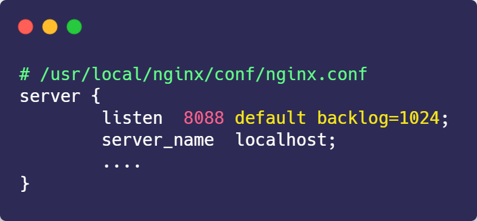

UDP 在传送数据之前不需要先建立连接，远地主机在收到 UDP 报文后，不需要给出任何确认。虽然 UDP 不提供可靠交付，但在某些情况下 UDP 确是一种最有效的工作方式（一般用于即时通信），比如： QQ 语音、 QQ 视频 、直播等等

TCP 提供面向连接的服务。在传送数据之前必须先建立连接，数据传送结束后要释放连接。 TCP 不提供广播或多播服务。由于 TCP 要提供可靠的，面向连接的传输服务（TCP的可靠体现在TCP在传递数据之前，会有三次握手来建立连接，而且在数据传递时，有确认、窗口、重传、拥塞控制机制，在数据传完后，还会断开连接用来节约系统资源），这一难以避免增加了许多开销，如确认，流量控制，计时器以及连接管理等。这不仅使协议数据单元的首部增大很多，还要占用许多处理机资源。TCP 一般用于文件传输、发送和接收邮件、远程登录等场景。

#### TCP 协议如何保证可靠传输
```text

1. 应用数据被分割成 TCP 认为最适合发送的数据块。

2. TCP 给发送的每一个包进行编号，接收方对数据包进行排序，把有序数据传送给应用层。

3. 校验和： TCP 将保持它首部和数据的检验和。这是一个端到端的检验和，目的是检测数据在传输过程中的任何变化。如果收到段的检验和有差错，TCP 将丢弃这个报文段和不确认收到此报文段。

4. TCP 的接收端会丢弃重复的数据。

5. 流量控制： TCP 连接的每一方都有固定大小的缓冲空间，TCP的接收端只允许发送端发送接收端缓冲区能接纳的数据。当接收方来不及处理发送方的数据，能提示发送方降低发送的速率，防止包丢失。TCP 使用的流量控制协议是可变大小的滑动窗口协议。 （TCP 利用滑动窗口实现流量控制）

6. 拥塞控制： 当网络拥塞时，减少数据的发送。

7. ARQ协议： 也是为了实现可靠传输的，它的基本原理就是每发完一个分组就停止发送，等待对方确认。在收到确认后再发下一个分组。

8. 超时重传： 当 TCP 发出一个段后，它启动一个定时器，等待目的端确认收到这个报文段。如果不能及时收到一个确认，将重发这个报文段。


```
#### 4.1 ARQ协议

##### 自动重传请求（Automatic Repeat-reQuest，ARQ）

是OSI模型中数据链路层和传输层的错误纠正协议之一。它通过使用确认和超时这两个机制，在不可靠服务的基础上实现可靠的信息传输。如果发送方在发送后一段时间之内没有收到确认帧，它通常会重新发送。ARQ包括停止等待ARQ协议和连续ARQ协议。


##### 停止等待ARQ协议
停止等待协议是为了实现可靠传输的，它的基本原理就是每发完一个分组就停止发送，等待对方确认（回复ACK）。如果过了一段时间（超时时间后），还是没有收到 ACK 确认，说明没有发送成功，需要重新发送，直到收到确认后再发下一个分组。
在停止等待协议中，若接收方收到重复分组，就丢弃该分组，但同时还要发送确认。


优缺点：

优点： 简单
缺点： 信道利用率低，等待时间长
#####  1) 无差错情况:

发送方发送分组,接收方在规定时间内收到,并且回复确认.发送方再次发送。

#####  2) 出现差错情况（超时重传）:

停止等待协议中超时重传是指只要超过一段时间仍然没有收到确认，就重传前面发送过的分组（认为刚才发送过的分组丢失了）。因此每发送完一个分组需要设置一个超时计时器，其重传时间应比数据在分组传输的平均往返时间更长一些。这种自动重传方式常称为 自动重传请求 ARQ 。另外在停止等待协议中若收到重复分组，就丢弃该分组，但同时还要发送确认。连续 ARQ 协议 可提高信道利用率。发送维持一个发送窗口，凡位于发送窗口内的分组可连续发送出去，而不需要等待对方确认。接收方一般采用累积确认，对按序到达的最后一个分组发送确认，表明到这个分组位置的所有分组都已经正确收到了。

#####  3) 确认丢失和确认迟到

确认丢失 ：确认消息在传输过程丢失。当A发送M1消息，B收到后，B向A发送了一个M1确认消息，但却在传输过程中丢失。而A并不知道，在超时计时过后，A重传M1消息，B再次收到该消息后采取以下两点措施：1. 丢弃这个重复的M1消息，不向上层交付。 2. 向A发送确认消息。（不会认为已经发送过了，就不再发送。A能重传，就证明B的确认消息丢失）。
确认迟到 ：确认消息在传输过程中迟到。A发送M1消息，B收到并发送确认。在超时时间内没有收到确认消息，A重传M1消息，B仍然收到并继续发送确认消息（B收到了2份M1）。此时A收到了B第二次发送的确认消息。接着发送其他数据。过了一会，A收到了B第一次发送的对M1的确认消息（A也收到了2份确认消息）。处理如下：1. A收到重复的确认后，直接丢弃。2. B收到重复的M1后，也直接丢弃重复的M1。

##### 连续ARQ协议
连续 ARQ 协议可提高信道利用率。发送方维持一个发送窗口，凡位于发送窗口内的分组可以连续发送出去，而不需要等待对方确认。接收方一般采用累计确认，对按序到达的最后一个分组发送确认，表明到这个分组为止的所有分组都已经正确收到了。

优缺点：

优点： 信道利用率高，容易实现，即使确认丢失，也不必重传。
缺点： 不能向发送方反映出接收方已经正确收到的所有分组的信息。 比如：发送方发送了 5条 消息，中间第三条丢失（3号），这时接收方只能对前两个发送确认。发送方无法知道后三个分组的下落，而只好把后三个全部重传一次。这也叫 Go-Back-N（回退 N），表示需要退回来重传已经发送过的 N 个消息。

#####  滑动窗口和流量控制
TCP 利用滑动窗口实现流量控制。流量控制是为了控制发送方发送速率，保证接收方来得及接收。 接收方发送的确认报文中的窗口字段可以用来控制发送方窗口大小，从而影响发送方的发送速率。将窗口字段设置为 0，则发送方不能发送数据。

#####  拥塞控制
在某段时间，若对网络中某一资源的需求超过了该资源所能提供的可用部分，网络的性能就要变坏。这种情况就叫拥塞。拥塞控制就是为了防止过多的数据注入到网络中，这样就可以使网络中的路由器或链路不致过载。拥塞控制所要做的都有一个前提，就是网络能够承受现有的网络负荷。拥塞控制是一个全局性的过程，涉及到所有的主机，所有的路由器，以及与降低网络传输性能有关的所有因素。相反，流量控制往往是点对点通信量的控制，是个端到端的问题。流量控制所要做到的就是抑制发送端发送数据的速率，以便使接收端来得及接收。

为了进行拥塞控制，TCP 发送方要维持一个 拥塞窗口(cwnd) 的状态变量。拥塞控制窗口的大小取决于网络的拥塞程度，并且动态变化。发送方让自己的发送窗口取为拥塞窗口和接收方的接受窗口中较小的一个。

TCP的拥塞控制采用了四种算法，即 慢开始 、 拥塞避免 、快重传 和 快恢复。在网络层也可以使路由器采用适当的分组丢弃策略（如主动队列管理 AQM），以减少网络拥塞的发生。

慢开始： 慢开始算法的思路是当主机开始发送数据时，如果立即把大量数据字节注入到网络，那么可能会引起网络阻塞，因为现在还不知道网络的符合情况。经验表明，较好的方法是先探测一下，即由小到大逐渐增大发送窗口，也就是由小到大逐渐增大拥塞窗口数值。cwnd初始值为1，每经过一个传播轮次，cwnd加倍。
拥塞避免： 拥塞避免算法的思路是让拥塞窗口cwnd缓慢增大，即每经过一个往返时间RTT就把发送放的cwnd加1.
快重传与快恢复： 在 TCP/IP 中，快速重传和恢复（fast retransmit and recovery，FRR）是一种拥塞控制算法，它能快速恢复丢失的数据包。没有 FRR，如果数据包丢失了，TCP 将会使用定时器来要求传输暂停。在暂停的这段时间内，没有新的或复制的数据包被发送。有了 FRR，如果接收机接收到一个不按顺序的数据段，它会立即给发送机发送一个重复确认。如果发送机接收到三个重复确认，它会假定确认件指出的数据段丢失了，并立即重传这些丢失的数据段。有了 FRR，就不会因为重传时要求的暂停被耽误。 　当有单独的数据包丢失时，快速重传和恢复（FRR）能最有效地工作。当有多个数据信息包在某一段很短的时间内丢失时，它则不能很有效地工作。


#### 三次握手


#### 四次挥手


2MSL: MSL(Maximum Segment Lifetime) 最长报文段寿命
(最大分段生存期)指明TCP报文在Internet上最长生存时间，每个具体的TCP​实现都必须选择一个确定的MSL值。RFC 1122建议是2分钟

1. 防止报文丢失，导致服务端(非发起关闭方)重复发送 FIN
2. 防止滞留在网络中的报文，对新的建立的连接(发起关闭方又建立了连接，且是相同端口，收到FIN 报文)，产生混乱

MSS: Max Segment Size (默认 536 bytes)


### Https


### Keepalive

在应用交互的过程中，可能存在以下几种情况：

客户端或服务端意外断电，死机，崩溃，重启。
中间网络已经中断，而客户端与服务器并不知道。

TCP连接并未来得及正常释放，连接的另一方并不知道对端的情况，它会一直维护这个连接，

长时间的积累会导致非常多的半打开连接，造成端系统资源的消耗和浪费，为了解决这个问题，在传输层可以利用TCP的保活报文来实现，

这就有了TCP的Keepalive（保活探测）机制。         
  
利用保活探测功能，可以探知这种对端的意外情况，从而保证在意外发生时，可以释放半打开的TCP、
连接。

#### 防止中间设备因超时删除连接相关的连接表

#### TCP保活报文交互过程


TCP保活可能带来的问题：

```text
1. 中间设备因大量保活连接，导致其连接表满，网关设备由于保活问题，导致其连接表满，
无法新建连接(XX局网闸故障案例)或性能下降严重

2. 正常连接被释放

```


### SSL TLS
SSL(Secure Sockets Layer 安全套接层),及其继任者传输层安全（Transport Layer Security，TLS）是为网络通信提供安全及数据完整性的一种安全协议。TLS与SSL在 **传输层** 对网络连接进行加密。

SSL协议位于TCP/IP协议与各种应用层协议之间，为数据通讯提供安全支持。SSL协议可分为两层： SSL记录协议（SSL Record Protocol）：它建立在可靠的传输协议（如TCP）之上，为高层协议提供数据封装、压缩、加密等基本功能的支持。

SSL握手协议（SSL Handshake Protocol）：它建立在SSL记录协议之上，用于在实际的数据传输开始前，通讯双方进行身份认证、协商加密算法、交换加密密钥等。


SSL：（Secure Socket Layer，安全套接字层），**位于可靠的面向连接的网络层协议和应用层协议之间的一种协议层** 。SSL通过互相认证、使用数字签名确保完整性、使用加密确保私密性，以实现客户端和服务器之间的安全通讯。该协议由两层组成：SSL记录协议和SSL握手协议。

TLS：(Transport Layer Security，传输层安全协议)，用于两个应用程序之间提供保密性和数据完整性。该协议由两层组成：TLS记录协议和TLS握手协议。


## ARP
ARP 协议的全称是 Address Resolution Protocol(地址解析协议)，它是一个通过用于实现从 IP 地址到 MAC 地址的映射，即询问目标 IP 对应的 MAC 地址 的一种协议。ARP 协议在 IPv4 中极其重要。

注意：ARP 只用于 IPv4 协议中，IPv6 协议使用的是 Neighbor Discovery Protocol，译为邻居发现协议，它被纳入 ICMPv6 中。
简而言之，ARP 就是一种解决地址问题的协议，它以 IP 地址为线索，定位下一个应该接收数据分包的主机 MAC 地址。如果目标主机不在同一个链路上，那么会查找下一跳路由器的 MAC 地址。


### TCP header


客户端优化


三次握手建立连接的首要目的是「同步序列号」。


只有同步了序列号才有可靠传输，TCP 许多特性都依赖于序列号实现，比如流量控制、丢包重传等，这也是三次握手中的报文称为 SYN 的原因，SYN 的全称就叫 Synchronize Sequence Numbers（同步序列号）。

SYN 包重发：

#### SYN_SENT 状态的优化

客户端作为主动发起连接方，首先它将发送 SYN 包，于是客户端的连接就会处于 SYN_SENT 状态。


客户端在等待服务端回复的 ACK 报文，正常情况下，服务器会在几毫秒内返回 SYN+ACK ，但如果客户端长时间没有收到 SYN+ACK 报文，则会重发 SYN 包，重发的次数由 tcp_syn_retries 参数控制，默认是 5 次：


第一次超时重传是在 1 秒后，第二次超时重传是在 2 秒，第三次超时重传是在 4 秒后，第四次超时重传是在 8 秒后，第五次是在超时重传 16 秒后。**每次超时的时间是上一次的 2 倍**


服务端优化


当服务端收到 SYN 包后，服务端会立马回复 SYN+ACK 包，表明确认收到了客户端的序列号，同时也把自己的序列号发给对方。


此时，服务端出现了新连接，状态是 SYN_RCV。在这个状态下，Linux 内核就会建立一个「半连接队列」来维护「未完成」的握手信息，当半连接队列溢出后，服务端就无法再建立新的连接。


SYN 攻击，攻击的是就是这个半连接队列。

#### 如何查看由于 SYN 半连接队列已满，而被丢弃连接的情况？


```text

我们可以通过该 netstat -s 命令给出的统计结果中，  可以得到由于半连接队列已满，引发的失败次数：

上面输出的数值是累计值，表示共有多少个 TCP 连接因为半连接队列溢出而被丢弃。隔几秒执行几次，如果有上升的趋势，说明当前存在半连接队列溢出的现象。
```

#### 如何调整 SYN 半连接队列大小？
要想增大半连接队列，

不能只单纯增大 **tcp_max_syn_backlog** 的值，还需一同增大 **somaxconn** 和 **backlog**，也就是增大 **accept** 队列。

否则，只单纯增大 tcp_max_syn_backlog 是无效的。

增大 tcpmaxsyn_backlog 和 somaxconn 的方法是修改 Linux 内核参数：


增大 backlog 的方式，每个 Web 服务都不同，比如 Nginx 增大 backlog 的方法如下：



```text

最后，改变了如上这些参数后，要重启 Nginx 服务，因为 SYN 半连接队列和 accept 队列都是在 listen() 初始化的。
```

#### 如果 SYN 半连接队列已满，只能丢弃连接吗？

```text
不是这样，开启 syncookies 功能就可以在不使用 SYN 半连接队列的情况下成功建立连接。
```

syncookies 的工作原理：服务器根据当前状态计算出一个值，放在己方发出的 SYN+ACK 报文中发出，当客户端返回 ACK 报文时，取出该值验证，如果合法，就认为连接建立成功，如下图所示。


syncookies 参数主要有以下三个值：

```text

0 值，表示关闭该功能；

1 值，表示仅当 SYN 半连接队列放不下时，再启用它；

2 值，表示无条件开启功能；

```

在应对 SYN 攻击时，只需要设置为 1

### SYN_RCV 状态的优化

// TODO

如果要想知道客户端连接不上服务端，是不是服务端 TCP 全连接队列满的原因，那么可以把 tcpaborton_overflow 设置为 1，这时如果在客户端异常中可以看到很多 connection reset by peer 的错误，那么就可以证明是由于服务端 TCP 全连接队列溢出的问题。


通常情况下，应当把 tcpaborton_overflow 设置为 0，因为这样更有利于应对突发流量。


accept 队列的长度取决于 somaxconn 和 backlog 之间的最小值，也就是 min(somaxconn, backlog)，其中：

somaxconn 是 Linux 内核的参数，默认值是 128，可以通过 net.core.somaxconn 来设置其值；

backlog 是 listen(int sockfd, int backlog) 函数中的 backlog 大小；


Tomcat、Nginx、Apache 常见的 Web 服务的 backlog 默认值都是 511。


如何查看服务端进程 accept 队列的长度？


可以通过 ss -ltn 命令查看：


**TCP**:
https://xie.infoq.cn/article/681d093ffc06d594de54992b9


对tcp协议栈理解还不透彻的小伙伴可以点击进入学习：两天解决你对tcp不深入的问题

详情讲解了工作中 TCP、IP遇到的7大问题：

1. 滑动窗口如何实现？

2. sk_buff是什么？

3. TCP_NODELAY设置，抓包后是N个包？

4. Epoll 检测网络IO，水平触发与边沿触发如何判断？

5. 出现大量的close_wait如何解决？

6. DDOS？

7. UDP广播？

TCP成块数据流
和TCP成块数据流相关的东西有很多，比如流量控制，紧急数据传输，数据窗口大小调整等等。

正常数据流

TCP通常不会对每个到达的数据分段进行确认操作，通常一个ACK报文可以确认多个成块数据段报文，通常情况下是两个成块数据报文段需要一个ACK报文确认。通常是由下面的原有造成的 ：当收到一个报文后，此TCP连接被标识未一个未完成的时延确认，当再次收到一个数据报文后，此连接有两个未确认的报文段，TCP马上发送一个ACK，当第三个数据报文到达后，第四个报文到达前，通常此TCP连接已经经过了200ms延时，因此一个ACK被发送，这样的循环周而复始，从而出现了一个ACK确认两个数据报文的情况。当然，ACK的产生很大程度上和其接收数据报文段的时间紧密相关，也就是和Client段发送数据的频率相关，和网络拥塞程度相关，和Client与Server两端的处理能力相关，总是是一个多因素决定的结果。


TCP的滑动窗口协议

TCP使用滑动窗口协议来进行流量控制。特别需要注意的是，滑动窗口是一个抽象的概念，它是针对每一个TCP连接的，而且是有方向的，一个TCP连接应该有两个滑动窗口，每个数据传输方向上有一个，而不是针对连接的每一端的。

窗口左边沿向右边滑动叫做窗口合拢，表示发送方发送了数据或者接收到了确认；窗口右边沿向右边滑动叫做窗口的张开，表示数据已经被用户空间进程接收并且释放了缓存；窗口左边沿向左移动则表明此ACK是重复ACK，应该丢弃；窗口右边沿向左移动叫做窗口收缩，一般不会有人这样做。

当左边沿和右边沿重合的时候表明窗口大小是0，此时发送方不应该在发送数据了，因为接收方的接收缓冲区已满，用户进程还没以接收。当用户进程接收完成后，接收方应该发送一个ACK，表明此时的接收窗口已经恢复，此ACK的序号同前一个win为0的ACK相同。

同样，在实现中，发送方不必发送一个全窗口的数据，但是它当然可以这样做。ACK总是将窗口向右边滑动，窗口的大小可以减小，接收方在发送ACK之前不必等待窗口被填满（即变为0），很多实现是收到两个数据报文段后立刻发送ACK。


TCP窗口大小的调整

TCP窗口的大小通常由接收端来确认，也就是在TCP建立连接的第二个SYN+ACK报文的Win字段来确认。

当然，程序可以随时改变这个窗口（缓存）的大小。默认的窗口大小是4096字节，但是对于文件传输来说这并不是一个理想的数字，如果程序的主要目的是传输文件，那么最好将这个缓存设置到最大，但是这样可能会造成发送端连续发送多个数据报文段后，接收方才反馈一个ACK的情况，当然，这也没有什么不可以的，只要不超时，就不算错。

TCP的PUSH包

PUSH是TCP报头中的一个标志位，发送方在发送数据的时候可以设置这个标志位。该标志通知接收方将接收到的数据全部提交给接收进程。这里所说的数据包括与此PUSH包一起传输的数据以及之前就为该进程传输过来的数据。

当Server端收到这些数据后，它需要立刻将这些数据提交给应用层进程，而不再等待是否还有额外的数据到达。

那么应该合适设置PUSH标志呢？实际上现在的TCP协议栈基本上都可以自行处理这个问题，而不是交给应用层处理。如果待发送的数据会清空发送缓存，那么栈就会自动为此包设置PUSH标志，源于BSD的栈一般都会这么做，而且，BSD TCP STACK也从来不会将收到的数据推迟提交给应用程序，因此，在BSD TCP STACK中，PUSH位是被忽略的，因为根本就没有用。


TCP的慢启动（拥塞窗口）

TCP在局域网环境中的效率是很高的，但是到了广域网的环境中情况就不同了，在发送方和接收方之间可能存在多个Router以及一些速率比较慢的链路，而且一些中继路由器必须缓存分组，还可能分片，所以在广域网的环境中，TCP的效率可能出现问题。

为了解决这个问题，现在的TCP栈都支持“慢启动”算法，即拥塞窗口控制算法。该算法通过观察到新分组进入网络的速率与另一端返回ACK的速率相同而工作。其实，拥塞窗口是发送方使用的一种流量控制算法。

慢启动为TCP的发送方增加了一个拥塞窗口，当连接建立时，拥塞窗口被初始化为一个报文段大小，每收到一个ACK，拥塞窗口就会增加一个报文段，发送方取拥塞窗口与通过窗口的最小值作为发送的上限。


TCP成块数据吞吐量

TCP窗口大小，窗口流量控制，慢启动对TCP的成块数据传输综合作用，可能对TCP的数据传输有意想不到的影响。

RTT（Round-Trip Time） ：往返时间。是指一个报文段从发出去到收到此报文段的ACK所经历的时间。通常一个报文段的RTT与传播时延和发送时延两个因素相关。

在发送的过程中有可能发生这样的情况，即TCP两端的传输“管道”被填满，即整个管道上都有数据在跑，此时不管拥塞窗口和通告窗口是多少，管道上都不能在容纳更多的数据了。此时每当接收方从网络上移去一个报文段，发送方就发送一个，但是管道上的ACK总是固定的，这种情况就是连接的理想稳定状态。

一般情况下带宽*时延就是一条线路的容量，因此吧RTT减小可以增加一条线路的容量，注意RTT加大的意思时传输时间减小！

当 数据由一个大的管道向一个小的管道传输时，就有可能发生拥塞，例如，当若干输入流到达一个路由器，而此路由器的输出带宽小于这些输入流的带宽总和时，就会 发生拥塞。这种情况普遍见于局域网与广域网的接口处。如果发送方处于局域网，而且不使用慢启动，使用局域网的带宽尽快的发送报文，那么返回的ACK之间的间隔与最慢的广域网链路一致。而且，由于路由器转发包速度慢，所以路由器就有可能主动丢失分组包。


TCP的紧急方式

TCP提供了一种“紧急方式”的数据传输方式，TCP的一端可以告诉另一端有些具有某种方式的紧急数据被放在了普通的数据流中，接收方可以自行选择处理。紧急方式客厅通过设置TCP的URG标识位与紧急指针的偏移量来设置。这个紧急指针指向紧急数据的最后一个字节（也有可能是最后一个字节的下一个字节）。

现在有许多实现将紧急方式叫做“带外数据”，其实这是不正确的。

目前紧急指针被用来禁止停止FTP的数据传输。不过总的来说，用的不多。

对于数据传输来说，如果用紧急数据来传输大量数据，这种方法显然是不可取的，再建立一个TCP连接不是更简单有效吗？


为了防止网络的拥塞现象，TCP提出了一系列的拥塞控制机制。最初由V. Jacobson在1988年的论文中提出的TCP的拥塞控制由“慢启动(Slow start)”和“拥塞避免(Congestion avoidance)”组成，后来TCP Reno版本中又针对性的加入了“快速重传(Fast retransmit)”、“快速恢复(Fast Recovery)”算法，再后来在TCP NewReno中又对“快速恢复”算法进行了改进，近些年又出现了选择性应答( selective acknowledgement,SACK)算法，还有其他方面的大大小小的改进，成为网络研究的一个热点。

TCP的拥塞控制主要原理依赖于一个拥塞窗口(cwnd)来控制，在之前我们还讨论过TCP还有一个对端通告的接收窗口(rwnd)用于流量控制。窗口值的大小就代表能够发送出去的但还没有收到ACK的最大数据报文段，显然窗口越大那么数据发送的速度也就越快，但是也有越可能使得网络出现拥塞，如果窗口值为1，那么就简化为一个停等协议，每发送一个数据，都要等到对方的确认才能发送第二个数据包，显然数据传输效率低下。TCP的拥塞控制算法就是要在这两者之间权衡，选取最好的cwnd值，从而使得网络吞吐量最大化且不产生拥塞。

由于需要考虑拥塞控制和流量控制两个方面的内容，因此TCP的真正的发送窗口=min(rwnd, cwnd)。但是rwnd是由对端确定的，网络环境对其没有影响，所以在考虑拥塞的时候我们一般不考虑rwnd的值，我们暂时只讨论如何确定cwnd值的大小。关于cwnd的单位，在TCP中是以字节来做单位的，我们假设TCP每次传输都是按照MSS大小来发送数据的，因此你可以认为cwnd按照数据包个数来做单位也可以理解，所以有时我们说cwnd增加1也就是相当于字节数增加1个MSS大小。

慢启动：最初的TCP在连接建立成功后会向网络中发送大量的数据包，这样很容易导致网络中路由器缓存空间耗尽，从而发生拥塞。因此新建立的连接不能够一开始就大量发送数据包，而只能根据网络情况逐步增加每次发送的数据量，以避免上述现象的发生。具体来说，当新建连接时，cwnd初始化为1个最大报文段(MSS)大小，发送端开始按照拥塞窗口大小发送数据，每当有一个报文段被确认，cwnd就增加1个MSS大小。这样cwnd的值就随着网络往返时间(Round Trip Time,RTT)呈指数级增长，事实上，慢启动的速度一点也不慢，只是它的起点比较低一点而已。我们可以简单计算下：

开始 ---> cwnd = 1

经过1个RTT后 ---> cwnd = 2*1 = 2

经过2个RTT后 ---> cwnd = 2*2= 4

经过3个RTT后 ---> cwnd = 4*2 = 8

如果带宽为W，那么经过RTT*log2W时间就可以占满带宽。

拥塞避免：从慢启动可以看到，cwnd可以很快的增长上来，从而最大程度利用网络带宽资源，但是cwnd不能一直这样无限增长下去，一定需要某个限制。TCP使用了一个叫慢启动门限(ssthresh)的变量，当cwnd超过该值后，慢启动过程结束，进入拥塞避免阶段。对于大多数TCP实现来说，ssthresh的值是65536(同样以字节计算)。拥塞避免的主要思想是加法增大，也就是cwnd的值不再指数级往上升，开始加法增加。此时当窗口中所有的报文段都被确认时，cwnd的大小加1，cwnd的值就随着RTT开始线性增加，这样就可以避免增长过快导致网络拥塞，慢慢的增加调整到网络的最佳值。

上面讨论的两个机制都是没有检测到拥塞的情况下的行为，那么当发现拥塞了cwnd又该怎样去调整呢？

首先来看TCP是如何确定网络进入了拥塞状态的，TCP认为网络拥塞的主要依据是它重传了一个报文段。上面提到过，TCP对每一个报文段都有一个定时器，称为重传定时器(RTO)，当RTO超时且还没有得到数据确认，那么TCP就会对该报文段进行重传，当发生超时时，那么出现拥塞的可能性就很大，某个报文段可能在网络中某处丢失，并且后续的报文段也没有了消息，在这种情况下，TCP反应比较“强烈”：

1.把ssthresh降低为cwnd值的一半

2.把cwnd重新设置为1

3.重新进入慢启动过程。

从整体上来讲，TCP拥塞控制窗口变化的原则是AIMD原则，即加法增大、乘法减小。可以看出TCP的该原则可以较好地保证流之间的公平性，因为一旦出现丢包，那么立即减半退避，可以给其他新建的流留有足够的空间，从而保证整个的公平性。

其实TCP还有一种情况会进行重传：那就是收到3个相同的ACK。TCP在收到乱序到达包时就会立即发送ACK，TCP利用3个相同的ACK来判定数据包的丢失，此时进行快速重传，快速重传做的事情有：

1.把ssthresh设置为cwnd的一半

2.把cwnd再设置为ssthresh的值(具体实现有些为ssthresh+3)

3.重新进入拥塞避免阶段。

后来的“快速恢复”算法是在上述的“快速重传”算法后添加的，当收到3个重复ACK时，TCP最后进入的不是拥塞避免阶段，而是快速恢复阶段。快速重传和快速恢复算法一般同时使用。快速恢复的思想是“数据包守恒”原则，即同一个时刻在网络中的数据包数量是恒定的，只有当“老”数据包离开了网络后，才能向网络中发送一个“新”的数据包，如果发送方收到一个重复的ACK，那么根据TCP的ACK机制就表明有一个数据包离开了网络，于是cwnd加1。如果能够严格按照该原则那么网络中很少会发生拥塞，事实上拥塞控制的目的也就在修正违反该原则的地方。

具体来说快速恢复的主要步骤是：

1.当收到3个重复ACK时，把ssthresh设置为cwnd的一半，把cwnd设置为ssthresh的值加3，然后重传丢失的报文段，加3的原因是因为收到3个重复的ACK，表明有3个“老”的数据包离开了网络。

2.在收到重复的ACK时，拥塞窗口增加1。

3.当收到新的数据包的ACK时，把cwnd设置为第一步中的ssthresh的值。原因是因为该ACK确认了新的数据，说明从重复ACK时的数据都已收到，该恢复过程已经结束，可以回到恢复之前的状态了，也即再次进入拥塞避免状态。

快速重传算法首次出现在4.3BSD的Tahoe版本，快速恢复首次出现在4.3BSD的Reno版本，也称之为Reno版的TCP拥塞控制算法。

可以看出Reno的快速重传算法是针对一个包的重传情况的，然而在实际中，一个重传超时可能导致许多的数据包的重传，因此当多个数据包从一个数据窗口中丢失时并且触发快速重传和快速恢复算法时，问题就产生了。因此NewReno出现了，它在Reno快速恢复的基础上稍加了修改，可以恢复一个窗口内多个包丢失的情况。具体来讲就是：Reno在收到一个新的数据的ACK时就退出了快速恢复状态了，而NewReno需要收到该窗口内所有数据包的确认后才会退出快速恢复状态，从而更一步提高吞吐量。

SACK就是改变TCP的确认机制，最初的TCP只确认当前已连续收到的数据，SACK则把乱序等信息会全部告诉对方，

1、滑动窗口

滑动窗口协议是传输层进行流控的一种措施，接收方通过通告发

送方自己的窗口大小，从而控制发送方的发送速度，从而达到防止发送方发送速度过快而导致自己被淹没的目的。


TCP的滑动窗口解决了端到端的流量控制问题，允许接受方对传输进行限制，直到它拥有足够的缓冲空间来容纳更多的数据。

2、拥塞窗口

拥塞窗口也看做是发送端用来进行流量控制的窗口。

但是，实际上，TCP还必须应付互联网中的拥塞现象。拥塞是指一个或者多个交换点的数据报超载而导致时延剧烈增加的现象。为了控制拥塞，TCP使用了第二个窗口限制，即拥塞窗口限制。对于拥塞窗口大小的限制采用慢开始和乘法减小两种技术。

乘法减小的拥塞避免策略：一旦发现报文段丢失，就把拥塞窗口的大小减半（直到减至最小的窗口，窗口中应至少包含一个报文段）。

慢开始恢复：拥塞窗口随着一个确认的到达，拥塞窗口的大小每次增加一个报文段。

3、小结

慢启动为发送方的TCP增加了另一个窗口：拥塞窗口(congestion window)，记为cwnd。当与另一个网络的主机建立TCP连接时，拥塞窗口被初始化为1个报文段（即另一端通告的报文段大小）。每收到一个ACK，拥塞窗口就增加一个

报文段（cwnd以字节为单位，但是慢启动以报文段大小为单位进行增加）。发送方取拥塞窗口与通告/滑动窗口中的最小值作为发送上限。拥塞窗口是发送方使用的流量控制，而通告/滑动窗口则是接收方使用的流量控制。

发送方开始时发送一个报文段，然后等待ACK。当收到该ACK时，拥塞窗口从1增加为2，即可以发送两个报文段。

当收到这两个报文段的ACK时，拥塞窗口就增加为4。这是一种指数增加的关系。