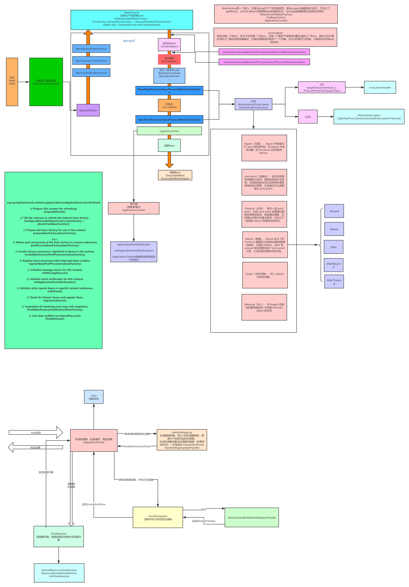
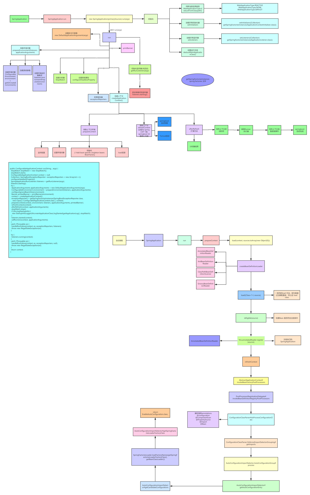

## Spring AOP

JDK动态代理实现
```text
Proxy：Proxy是所有动态代理的父类，它提供了一个静态方法来创建动态代理的class对象和实例；
InvocationHandler：每个动态代理实例都有一个关联的InvocationHandler。 
在代理实例上调用方法时，方法调用将被转发到InvocationHandler的invoke方法；
```

Cglib 动态代理实现
```text
1、CGLIB(Code Generation Library)是一个基于ASM的字节码生成库，它允许我们在运行时对字节码进行修改和动态生成。CGLIB通过继承方式实现代理;
2、Enhancer：来指定要代理的目标对象、实际处理代理逻辑的对象，最终通过调用create()方法得到代理对象，对这个对象所有非final方法的调用都会转发给MethodInterceptor;
3、MethodInterceptor：动态代理对象的方法调用都会转发到intercept方法进行增强；
```

1、JDK原生动态代理是java原生支持的，不需要任何外部依赖，但它只能基于接口进行代理；

2、Cglib通过继承的方式进行代理，无论目标对象有没有实现接口都可以进行代理，但是无法处理fianl的情况；




.png)


## Spring 设计模式

### 1. IOC DI

控制反转(IoC)和依赖注入(DI)
IoC(Inversion of Control,控制翻转) 是Spring 中一个非常非常重要的概念，它不是什么技术，而是一种解耦的设计思想。它的主要目的是借助于“第三方”(Spring 中的 IOC 容器) 实现具有依赖关系的对象之间的解耦(IOC容易管理对象，你只管使用即可)，从而降低代码之间的耦合度。IOC 是一个原则，而不是一个模式，以下模式（但不限于）实现了IoC原则

### 工厂设计模式
BeanFactory

### 单例设计模式
singletonObjects
earlySingletonObjects
registerSingleton

#### 三级缓存

Spring 解决循环依赖的核心就是提前暴露对象，而提前暴露的对象就是放置于第二级缓存中。下表是三级缓存的说明：

```text

1. singletonObjects 一级缓存，存放完整的 Bean

2. earlySingletonObjects二级缓存，存放提前暴露的Bean，Bean 是不完整的，未完成属性注入和执行 init 方法

3. singletonFactories三级缓存，存放的是 Bean 工厂，主要是生产 Bean，存放到二级缓存中。
（Bean 都已经实例化了，为什么还需要一个生产 Bean 的工厂呢？
这里实际上是跟 AOP 有关，如果项目中不需要为 Bean 进行代理，
那么这个 Bean 工厂就会直接返回一开始实例化的对象，如果需要使用 AOP 进行代理，
那么这个工厂就会发挥重要的作用了
）
```


Spring 是如何通过上面介绍的三级缓存来解决循环依赖的呢？这里只用 A，B 形成的循环依赖来举例：

```text

1. 实例化 A，此时 A 还未完成属性填充和初始化方法（@PostConstruct）的执行，A 只是一个半成品。
2. 为 A 创建一个 Bean 工厂，并放入到  singletonFactories 中。
3. 发现 A 需要注入 B 对象，但是一级、二级、三级缓存均未发现对象 B。
4. 实例化 B，此时 B 还未完成属性填充和初始化方法（@PostConstruct）的执行，B 只是一个半成品。
5. 为 B 创建一个 Bean 工厂，并放入到  singletonFactories 中。
6. 发现 B 需要注入 A 对象，此时在一级、二级未发现对象 A，但是在三级缓存中发现了对象 A，从三级缓存中得到对象 A，并将对象 A 放入二级缓存中，同时删除三级缓存中的对象 A。（注意，此时的 A 还是一个半成品，并没有完成属性填充和执行初始化方法）
7. 将对象 A 注入到对象 B 中。
7. 对象 B 完成属性填充，执行初始化方法，并放入到一级缓存中，同时删除二级缓存中的对象 B。（此时对象 B 已经是一个成品）
8. 对象 A 得到对象 B，将对象 B 注入到对象 A 中。（对象 A 得到的是一个完整的对象 B）
9. 对象 A 完成属性填充，执行初始化方法，并放入到一级缓存中，同时删除二级缓存中的对象 A。

```

Spring 一开始提前暴露的并不是实例化的 Bean，而是将 Bean 包装起来的 ObjectFactory。为什么要这么做呢？

这实际上涉及到 AOP，如果创建的 Bean 是有代理的，那么注入的就应该是代理 Bean，而不是原始的 Bean。

但是 Spring 一开始并不知道 Bean 是否会有循环依赖，

通常情况下（没有循环依赖的情况下），Spring 都会在完成填充属性，

并且执行完初始化方法之后再为其创建代理。但是，如果出现了循环依赖的话，

Spring 就不得不为其提前创建代理对象，否则注入的就是一个原始对象，而不是代理对象


Spring 需要三级缓存的目的是为了在没有循环依赖的情况下，延迟代理对象的创建，使 Bean 的创建符合 Spring 的设计原则


#### 循环依赖

spring对循环依赖的处理有三种情况：

1. 构造器的循环依赖：这种依赖spring是处理不了的，直 接抛出BeanCurrentlylnCreationException异常。
2. 单例模式下的setter循环依赖：通过“三级缓存”处理循环依赖。
3. 非单例循环依赖：无法处理。

spring单例对象的初始化大略分为三步：

createBeanInstance：实例化，其实也就是调用对象的构造方法实例化对象
populateBean：填充属性，这一步主要是多bean的依赖属性进行填充
initializeBean：调用spring xml中的init 方法。


### 代理设计模式
Spring AOP & AspectJ

### 模板方法
jdbcTemplate、hibernateTemplate 

### 观察者模式
事件： ApplicationEvent ApplicationContextEvent
监听：ApplicationListener

### 适配器模式
HandlerMappingAdapter MethodBeforeAdviceInterceptor

### 装饰者模式


Spring AOP 和 AspectJ AOP 有什么区别?
Spring AOP 属于运行时增强，而 AspectJ 是编译时增强。 Spring AOP 基于代理(Proxying)，而 AspectJ 基于字节码操作(Bytecode Manipulation)。


